# RL基本原理

强化学习的两类思路：

一个是基于值，另一个是基于策略：


### 时序差分(Temporal Difference)TD算法

我们的目的就是去找到一种方法能够`估计`在一个状态下做出动作，他的一个价值。


蒙特卡洛：是一长串多步估计，没有去考虑。

我玩完这一局游戏，我这里面不是有很多随机性吗，但我玩完它这个就确定下来，你没有去考虑它那么多期望、随机性，你就是相当于做了一个很多采样，我们知道很多变量它本身就有方差，如果把很多变量的方差叠加起来，他这个方差肯定是会很大的，但是因为你采取了这么一整条轨迹，我可以对它的return做一个很精确的一个计算，所以偏差可能会小。


时序差分：相比于蒙特卡洛，他的方差会比较小，但是他的偏差可能就会比较大，因为它就是对一步做了一个估计。


TD算法有两种应用：一种叫SARSA，一种叫Q-learning


# 动手学强化学习

## 基础篇

关注回报的期望，并将其定义为价值（value），这就是强化学习中智能体学习的优化目标。

**占用度量**：归一化的占用度量用于衡量在一个智能体决策与一个动态环境的交互过程中，采样到**一个具体的状态动作对**（state-action pair）的**概率分布**。

* 强化学习的一大难点就在于，智能体看到的数据分布是随着智能体的学习而不断发生改变的。

* 由于奖励建立在状态动作对之上，一个策略对应的价值其实就是一个占用度量下对应的奖励的期望，因此寻找最优策略对应着寻找最优占用度量。

有监督学习任务，我们的目标是找到一个最优的模型函数，使其在训练数据集上最小化一个给定的损失函数。在训练数据独立同分布的假设下，这个优化目标表示**最小化**模型在整个数据分布上的泛化误差（generalization error），用简要的公式可以概括为：


强化学习任务的最终优化目标是**最大化**智能体策略在和动态环境交互过程中的价值。策略的价值可以等价转换成**奖励函数在策略的占用度量上的期望**，即：


* 有监督学习和强化学习的优化目标相似，即都是在**优化某个数据分布下的一个分数值的期望**。

* 二者**优化的途径是不同的**:

  `有监督学习`直接通过优化模型对于数据特征的输出来优化目标，即`修改目标函数而数据分布不变`；

  `强化学习`则通过改变策略来调整智能体和环境交互数据的分布，进而优化目标，即`修改数据分布而目标函数不变`。

一般有监督学习和强化学习的范式之间的区别为：

- 一般的有监督学习关注寻找一个模型，使其在给定数据分布下得到的损失函数的期望最小；

- 强化学习关注寻找一个智能体策略，使其在与动态环境交互的过程中产生最优的数据分布，即最大化该分布下一个给定奖励函数的期望。

### 2.多臂老虎机（multi-armed bandit，MAB）问题

与强化学习不同，多臂老虎机`不存在状态信息`，只有动作和奖励，算是最简单的“和环境交互中的学习”的一种形式。

多臂老虎机中的**探索与利用**（exploration vs. exploitation）问题一直以来都是一个特别经典的问题，理解它能够帮助我们学习强化学习。

估计期望奖励更新算法流程：


第四步的增量式的期望更新公式如下：


如果将所有数求和再除以次数，其缺点是每次更新的时间复杂度和空间复杂度均为O(n),而采用增量式更新，时间复杂度和空间复杂度均为O(1)。


#### ε-贪心算法

以概率ε随机选择一根拉杆（探索）

选择以往经验中期望奖励估值最大的那根拉杆（利用）1-ε


随着探索次数的不断增加，我们对各个动作的奖励估计得越来越准，此时我们就没必要继续花大力气进行探索。

具体实现中令ε随时间衰减，即探索的概率将会不断降低。

#### 上置信界算法（upper confidence bound，UCB）

上置信界算法便选取期望奖励上界最大的动作


不确定性度量U(a)

#### 汤普森采样算法

之前我们知道了 “用抽样选最优拉杆”，但得先知道 “每台老虎机的赢钱概率大概是多少”，还得拉一次就更新一次这个概率 —— 这段就是讲 “怎么记录 + 更新每台老虎机的赢钱概率”。

**核心点 1：用 Beta 分布当 “概率记录本”**

不用管 “Beta 分布” 的复杂数学，你可以把它理解成：**专门用来表示 “某台老虎机赢钱概率的可能性范围” 的工具**。

比如某台机器的 Beta 分布，能体现 “它赢钱概率是 30%？还是 50%？哪种可能性更大”。

**核心点 2：怎么用 “拉拉杆的输赢记录” 填这个 “记录本”**

假设你拉了某台老虎机`k次`：

- 其中`m₁次赢了`（奖励是 1）

- m₂次输了（奖励是 0）

  （其实 k 就是 m₁+m₂，比如拉 5 次，赢 3 次输 2 次，k=5，m₁=3，m₂=2）

这台老虎机的 “赢钱概率范围”，就用**参数是 (m₁+1, m₂+1) 的 Beta 分布**来表示。

比如上面的例子，参数就是 (3+1, 2+1)=(4,3)—— 这个 Beta 分布就能反映 “这台机实际赢钱概率的可能性”。

**核心点 3：怎么更新这个 “记录本”**

每次拉这台老虎机，都记录 “赢了还是输了”：

- 要是赢了，就把 m₁加 1，参数里的第一个数也跟着加 1；
- 要是输了，就把 m₂加 1，参数里的第二个数也跟着加 1。

拉的次数越多，这个 Beta 分布就越接近这台老虎机的**真实赢钱概率**（相当于 “记录本” 越记越准）。


不同颜色的曲线（Q1 粉、Q2 蓝、Q3 绿）：对应**不同的老虎机（不同拉杆）**的 “赢钱概率可能性分布”（也就是之前说的 Beta 分布）。

你看每条曲线旁边的点（比如 Q1 的点在 0.5 附近，Q3 的点在 0.75 附近），其实是**从这台老虎机的概率分布里 “抽的一个样本”**（比如从 Q3 的分布里抽到了 0.75 这个赢钱概率）。

汤普森采样就是：从每台机器的曲线里抽一个样本，选样本里赢钱概率最大的那台（比如这次 Q3 的样本最大，就拉 Q3 对应的老虎机）。

#### 总结

多臂老虎机问题与强化学习的一大区别在于其与环境的交互并不会改变环境，即多臂老虎机的每次交互的结果和以往的动作无关，所以可看作**无状态的强化学习**（stateless reinforcement learning）。


### 3.马尔可夫决策过程（MDP）

**马尔可夫决策过程**（Markov decision process，MDP）是强化学习的重要概念。

如果要用强化学习去解决一个实际问题，第一步要做的事情就是把这个实际问题抽象为一个马尔可夫决策过程，也就是明确马尔可夫决策过程的各个组成要素。

本章将从马尔可夫过程出发，一步一步地进行介绍，最后引出马尔可夫决策过程。

#### 马尔可夫过程（马尔可夫链）

##### 随机过程

**随机过程**（stochastic process）是概率论的“动力学”部分。概率论的研究对象是静态的随机现象，而随机过程的研究对象是随时间演变的随机现象（例如天气随时间的变化、城市交通随时间的变化）。

##### 马尔可夫性质

当且仅当某时刻的状态只取决于上一时刻的状态时，一个随机过程被称为具有**马尔可夫性质**（Markov property），用公式表示为


`需要明确的是，具有马尔可夫性并不代表这个随机过程就和历史完全没有关系`。通过这种链式的关系，历史的信息被传递到了现在。马尔可夫性可以大大简化运算，因为只要当前状态可知，所有的历史信息都不再需要了，利用当前状态信息就可以决定未来。

##### 马尔可夫过程（马尔可夫链）

**马尔可夫过程**（Markov process）指具有马尔可夫性质的随机过程，也被称为**马尔可夫链**（Markov chain）。

通常用元组描述一个马尔可夫过程，S是有限数量的状态集合，P是**状态转移矩阵**（state transition matrix)。


#### 马尔可夫奖励过程

在马尔可夫过程的基础上加入奖励函数r和折扣因子γ，就可以得到**马尔可夫奖励过程**（Markov reward process）一个马尔可夫奖励过程由构成


##### 回报


核心是实现**折扣累计回报**的递推计算，反向遍历 + 递推公式是高效实现的关键。


##### 价值函数

在马尔可夫奖励过程中，一个状态的期望回报（即从这个状态出发的未来累积奖励的期望）被称为这个状态的**价值**（value）。所有状态的价值就组成了**价值函数**（value function），价值函数的输入为某个状态，输出为这个状态的价值。

一方面，即时奖励的期望正是奖励函数的输出；


`状态 s 的价值 = 当前状态的即时奖励期望 + 未来所有可能转移到的状态的价值的折扣期望`


因此，整个向量 V 作为未知量，会同时出现在方程的左右两边 —— 左边是我们要求的价值，右边是计算价值时用到的未来价值，而未来价值就是我们要求的价值本身。


#### 马尔可夫决策过程

讨论到的马尔可夫过程和马尔可夫奖励过程都是自发改变的随机过程；而如果有一个外界的“刺激”来共同改变这个随机过程，就有了**马尔可夫决策过程**（Markov decision process，MDP）。

我们将这个来自外界的刺激称为**智能体**（agent）的动作，在马尔可夫奖励过程（MRP）的基础上加入动作，就得到了马尔可夫决策过程（MDP）。


##### 策略

顾一下在 MRP 中的价值函数，在 MDP 中也同样可以定义类似的价值函数。但此时的价值函数与策略有关，这意为着对于两个不同的策略来说，它们在同一个状态下的价值也很可能是不同的。这很好理解，因为不同的策略会采取不同的动作，从而之后会遇到不同的状态，以及获得不同的奖励，所以它们的累积奖励的期望也就不同，即状态价值不同。

##### 状态价值函数


##### 动作价值函数


##### 贝尔曼期望方程

在贝尔曼方程中加上“期望”二字是为了与接下来的贝尔曼最优方程进行区分。我们通过简单推导就可以分别得到两个价值函数的**贝尔曼期望方程**（Bellman Expectation Equation）：


价值函数和贝尔曼方程是强化学习非常重要的组成部分，之后的一些强化学习算法都是据此推导出来的，读者需要明确掌握！


接下来我们编写代码来表示图 3-4 中的马尔可夫决策过程，并定义两个策略。第一个策略是一个完全随机策略，即在每个状态下，智能体会以同样的概率选取它可能采取的动作。例如，在下，智能体会以 0.5 和 0.5 的概率选取动作“保持”和“前往”。第二个策略是一个提前设定的一个策略。

于是，一个很自然的想法是：给定一个 MDP 和一个策略，我们是否可以将其转化为一个 MRP？答案是肯定的。我们可以将策略的动作选择进行**边缘化**（marginalization)，就可以得到没有动作的 MRP 了。具体来说，对于某一个状态，我们根据策略所有动作的概率进行加权，得到的奖励和就可以认为是一个 MRP 在该状态下的奖励，即：


#### 蒙特卡洛方法

```python
# 对所有采样序列计算所有状态的价值
def MC(episodes, V, N, gamma):
    for episode in episodes:
        G = 0
        for i in range(len(episode) - 1, -1, -1):  #一个序列从后往前计算
            (s, a, r, s_next) = episode[i]
            G = r + gamma * G
            N[s] = N[s] + 1
            V[s] = V[s] + (G - V[s]) / N[s]


timestep_max = 20
# 采样1000次,可以自行修改
episodes = sample(MDP, Pi_1, timestep_max, 1000)
gamma = 0.5
V = {"s1": 0, "s2": 0, "s3": 0, "s4": 0, "s5": 0}
N = {"s1": 0, "s2": 0, "s3": 0, "s4": 0, "s5": 0}
MC(episodes, V, N, gamma)
print("使用蒙特卡洛方法计算MDP的状态价值为\n", V)
```

采样 1000 条轨迹：`episodes = sample(...)`，样本量越大，根据「大数定律」，价值估计结果越接近 MDP 的真实状态价值（误差越小）。

方法类型：这段代码是**每次访问蒙特卡洛（Every-Visit MC）**，轨迹中每个状态每出现一次，就更新一次价值，样本利用率高于首次访问 MC。


#### 占用度量

我们还可以定义策略的**占用度量**（occupancy measure）。


注意：以上提到的“合法”占用度量是指存在一个策略使智能体与 MDP 交互产生的状态动作对被访问到的概率。

接下来我们编写代码来近似估计占用度量。这里我们采用近似估计，即设置一个较大的采样轨迹长度的最大值，然后采样很多次，用状态动作对出现的频率估计实际概率。

占用度量的核心价值是**量化某个策略下，特定（状态 - 动作对）被 “使用” 的频繁程度**

#### 最优策略


最优策略都有相同的状态价值函数，我们称之为**最优状态价值函数**，表示为：


同理，我们定义**最优动作价值函数**:


这与在普通策略下的状态价值函数和动作价值函数之间的关系是一样的。另一方面，最优状态价值是选择此时使最优动作价值最大的那一个动作时的状态价值：


##### 贝尔曼最优方程


#### 总结

本章从零开始介绍了马尔可夫决策过程的基础概念知识，并讲解了如何通过求解贝尔曼方程得到状态价值的解析解以及如何用蒙特卡洛方法估计各个状态的价值。马尔可夫决策过程是强化学习中的基础概念，`强化学习中的环境就是一个马尔可夫决策过程`。我们接下来将要介绍的强化学习算法通常都是在求解马尔可夫决策过程中的最优策略。


### 4.动态规划算法

动态规划的基本思想是将待求解问题分解成若干个子问题，先求解子问题，然后从这些子问题的解得到目标问题的解。动态规划会保存已解决的子问题的答案，在求解目标问题的过程中，需要这些子问题答案时就可以直接利用，避免重复计算。

基于动态规划的强化学习算法主要有两种：一是**策略迭代**（policy iteration），二是**价值迭代**（value iteration）。其中，策略迭代由两部分组成：**策略评估**（policy evaluation）和**策略提升**（policy improvement）。

**策略迭代中的策略评估**使用`贝尔曼期望方程`来得到一个策略的`状态价值函数`，这是一个动态规划的过程；而**价值迭代**直接使用`贝尔曼最优方程`来进行动态规划，得到最终的`最优状态价值`。


#### 悬崖漫步环境

悬崖漫步是一个非常经典的强化学习环境，它要求一个智能体从起点出发，避开悬崖行走，最终到达目标位置。如图 4-1 所示，有一个 4×12 的网格世界，每一个网格表示一个状态。智能体的起点是左下角的状态，目标是右下角的状态，智能体在每一个状态都可以采取 4 种动作：上、下、左、右。如果智能体采取动作后触碰到边界墙壁则状态不发生改变，否则就会相应到达下一个状态。环境中有一段悬崖，智能体掉入悬崖或到达目标状态都会结束动作并回到起点，也就是说掉入悬崖或者达到目标状态是终止状态。智能体每走一步的奖励是 −1，掉入悬崖的奖励是 −100。


#### 策略迭代算法

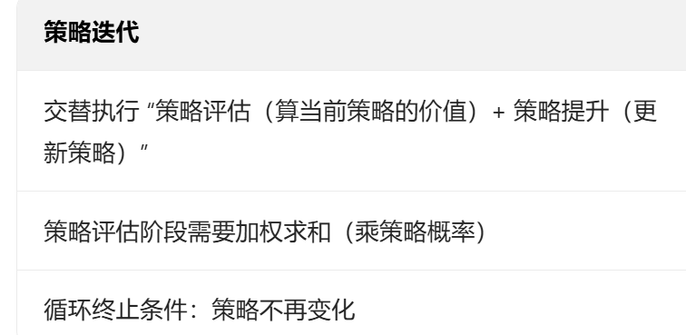


##### 策略评估

策略评估这一过程用来计算一个策略的状态价值函数。回顾一下之前学习的贝尔曼期望方程：


更一般的，考虑所有的状态，就变成了用上一轮的状态价值函数来计算当前这一轮的状态价值函数，即

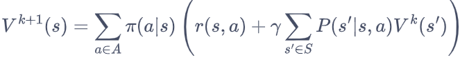

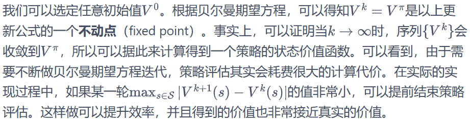

##### 策略提升

使用策略评估计算得到当前策略的状态价值函数之后，我们可以据此来改进该策略。

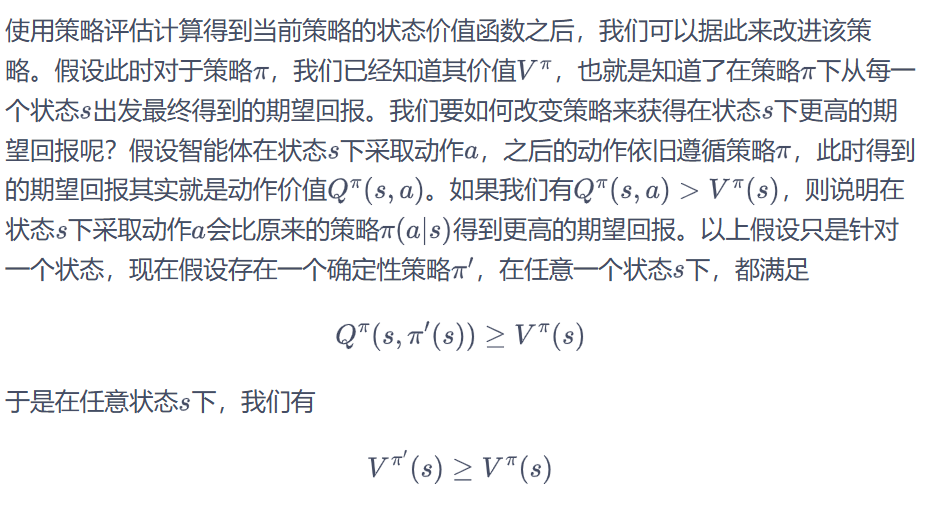这便是**策略提升定理**（policy improvement theorem)。

于是我们可以直接贪心地在每一个状态选择动作价值最大的动作，也就是

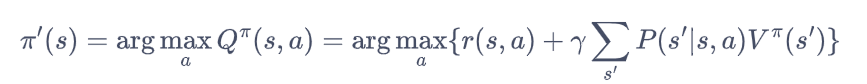

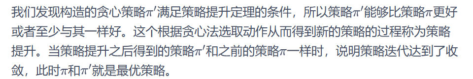

**策略提升定理的证明**通过以下推导过程可以证明，使用上述提升公式得到的`新策略在每个状态的价值不低于原策略在该状态的价值`。

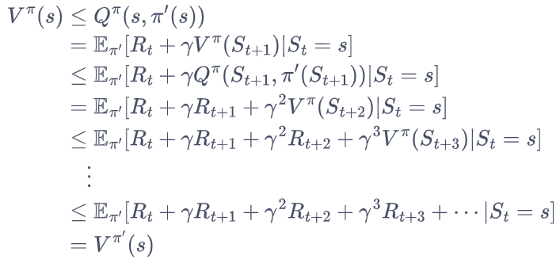

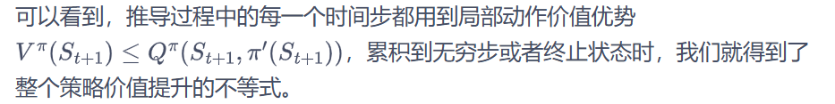

##### 策略迭代算法

策略迭代算法的过程如下：对当前的策略进行策略评估，得到其状态价值函数，然后根据该状态价值函数进行策略提升以得到一个更好的新策略，接着继续评估新策略、提升策略……直至最后收敛到最优策略（收敛性证明参见 4.7 节）：

**策略评估（Policy Evaluation）**：在当前策略下，精确计算每个状态的价值函数 `V(s)`。

**策略提升（Policy Improvement）**：用当前价值函数更新策略，让策略变得更优。

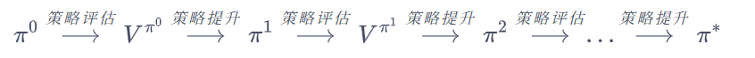

结合策略评估和策略提升，我们得到以下策略迭代算法：

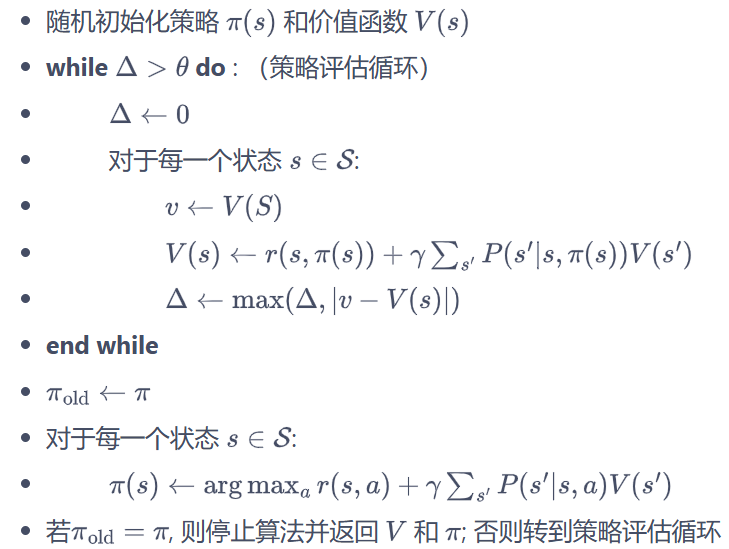

#### 价值迭代算法

从上面的代码运行结果中我们能发现，策略迭代中的策略评估需要进行很多轮才能收敛得到某一策略的状态函数，这需要很大的计算量，尤其是在状态和动作空间比较大的情况下。

可以被认为是一种策略评估只进行了一轮更新的策略迭代算法。需要注意的是，价值迭代中不存在显式的策略，我们只维护一个状态价值函数。

价值迭代可以看成一种动态规划过程，它利用的是贝尔曼最优方程：

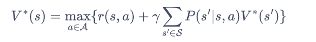

将其写成迭代更新的方式为：

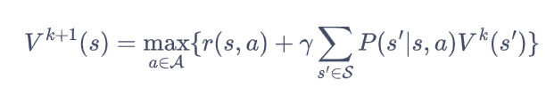

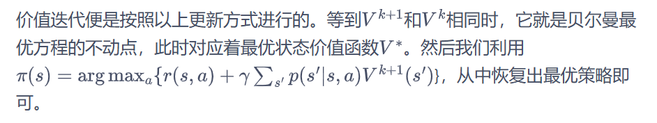

价值迭代算法流程如下：

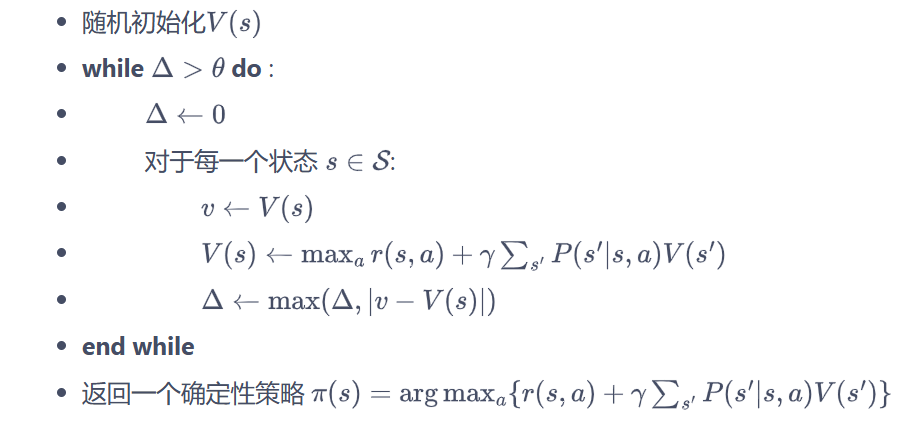


#### 冰湖环境

除了悬崖漫步环境，本章还准备了另一个环境——**冰湖**（Frozen Lake）。冰湖环境的状态空间和动作空间是有限的，我们在该环境中也尝试一下策略迭代算法和价值迭代算法，以便更好地理解这两个算法。

冰湖是 OpenAI Gym 库中的一个环境。OpenAI Gym 库中包含了很多有名的环境，例如 Atari 和 MuJoCo，并且支持我们定制自己的环境。

```
策略评估进行25轮后完成
策略提升完成
策略评估进行58轮后完成
策略提升完成
状态价值：
 0.069  0.061  0.074  0.056
 0.092  0.000  0.112  0.000
 0.145  0.247  0.300  0.000
 0.000  0.380  0.639  0.000
策略：
<ooo ooo^ <ooo ooo^
<ooo **** <o>o ****
ooo^ ovoo <ooo ****
**** oo>o ovoo EEEE
```

这个最优策略很看上去比较反直觉，其原因是这是一个智能体会随机滑向其他状态的冰冻湖面。例如，在目标左边一格的状态，采取向右的动作时，它有可能会滑到目标左上角的位置，从该位置再次到达目标会更加困难，所以此时采取向下的动作是更为保险的，并且有一定概率能够滑到目标。我们再来尝试一下价值迭代算法。

```
价值迭代一共进行60轮
状态价值：
 0.069  0.061  0.074  0.056
 0.092  0.000  0.112  0.000
 0.145  0.247  0.300  0.000
 0.000  0.380  0.639  0.000
策略：
<ooo ooo^ <ooo ooo^
<ooo **** <o>o ****
ooo^ ovoo <ooo ****
**** oo>o ovoo EEEE
```


#### 小结

本章讲解了强化学习中两个经典的动态规划算法：策略迭代算法和价值迭代算法，它们都能用于求解最优价值和最优策略。动态规划的主要思想是利用贝尔曼方程对所有状态进行更新。需要注意的是，在利用贝尔曼方程进行状态更新时，我们会用到马尔可夫决策过程中的奖励函数和状态转移函数。如果智能体无法事先得知奖励函数和状态转移函数，就只能通过和环境进行交互来采样（状态-动作-奖励-下一状态）这样的数据，我们将在之后的章节中讲解如何求解这种情况下的最优策略。


### 5.时序差分算法

#### 简介

第 4 章介绍的动态规划算法要求马尔可夫决策过程是已知的，即要求与智能体交互的环境是完全已知的（例如迷宫或者给定规则的网格世界）。在此条件下，智能体其实并不需要和环境真正交互来采样数据，直接用动态规划算法就可以解出最优价值或策略。这就好比对于有监督学习任务，如果直接显式给出了数据的分布公式，那么也可以通过在期望层面上直接最小化模型的泛化误差来更新模型参数，并不需要采样任何数据点。

但这在大部分场景下并不现实，机器学习的主要方法都是在数据分布未知的情况下针对具体的数据点来对模型做出更新的。对于大部分强化学习现实场景（例如电子游戏或者一些复杂物理环境），其马尔可夫决策过程的状态转移概率是无法写出来的，也就`无法直接进行动态规划`。

在这种情况下，`智能体只能和环境进行交互，通过采样到的数据来学习`，这类学习方法统称为**无模型的强化学习**（model-free reinforcement learning）。

不同于动态规划算法，**无模型的强化学习算法**`不需要事先知道环境的奖励函数和状态转移函数`，而是**直接使用和环境交互的过程中采样到的数据来学习**，这使得它可以被应用到一些简单的实际场景中。

本章将要讲解无模型的强化学习中的两大经典算法：Sarsa 和 Q-learning，它们都是基于**时序差分**（temporal difference，TD）的强化学习算法。

同时，本章还会引入一组概念：在线策略学习和离线策略学习。通常来说，`在线策略学习`要求使用在**当前策略下采样得到的样本**进行学习，一旦策略被更新，当前的样本就被放弃了，就好像在水龙头下用自来水洗手；`离线策略学习`使用**经验回放池**将之前采样得到的样本收集起来再次利用，就好像使用脸盆接水后洗手。

因此，`离线策略学习`往往能够更好地利用历史数据，并具有**更小的样本复杂度**（算法达到收敛结果需要在环境中采样的样本数量），这使其被更广泛地应用。

#### 时序差分方法

**时序差分**是一种用来**估计一个策略的价值函数**的方法，它结合了蒙特卡洛和动态规划算法的思想。时序差分方法和蒙特卡洛的相似之处在于可以从样本数据中学习，不需要事先知道环境；和`动态规划的相似之处`在于根据贝尔曼方程的思想，`利用后续状态的价值估计`来更新`当前状态的价值估计`。

蒙特卡洛的核心思想，就像**通过多次重复做一件事，用平均结果来估计真实情况**。

回顾一下蒙特卡洛方法对价值函数的增量更新方式：

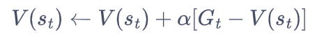

蒙特卡洛的设计原则是 **“用已经发生的完整经验来学习”**，它拒绝任何 “对未来的估计”，只相信已经结束的、确定的事实。

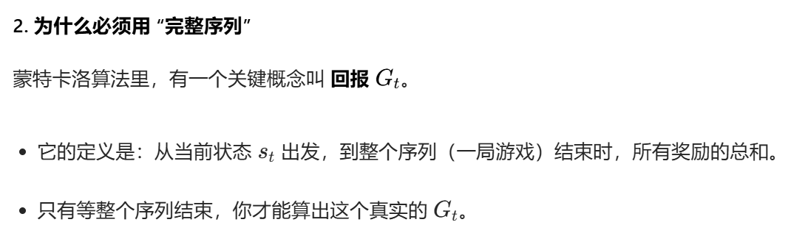

蒙特卡洛方法必须要等整个序列结束之后才能计算得到这一次的回报，而时序差分方法只需要当前步结束即可进行计算。

具体来说，时序差分算法用当前获得的奖励加上下一个状态的价值估计来作为在当前状态会获得的回报，即：

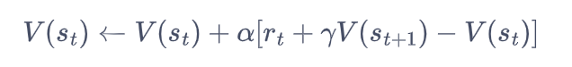

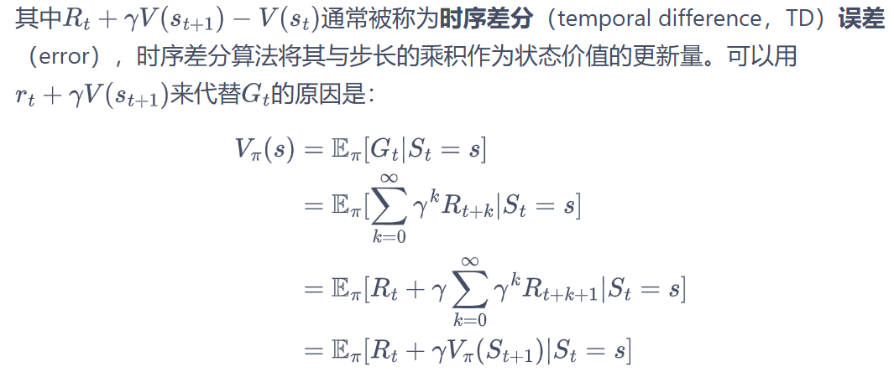

状态价值的期望等于 “当前奖励 + 下一个状态价值的折扣期望”。

因此蒙特卡洛方法将上式第一行作为更新的目标，而时序差分算法将上式最后一行作为更新的目标。

于是，在用策略和环境交互时，每采样一步，我们就可以用时序差分算法来更新状态价值估计。时序差分算法用到了**V**(St+1)的估计值，可以证明它最终收敛到策略Π的价值函数，我们在此不对此进行展开说明。


#### Sarsa 算法

既然我们可以用时序差分方法来估计价值函数，那一个很自然的问题是，我们能否用类似策略迭代的方法来进行强化学习。

策略评估已经可以通过时序差分算法实现，那么在不知道奖励函数和状态转移函数的情况下该怎么进行策略提升呢？答案是可以直接用时序差分算法来估计动作价值函数Q:

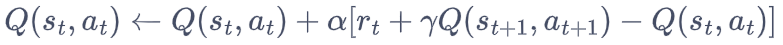

然后我们用贪婪算法来选取在某个状态下动作价值最大的那个动作，即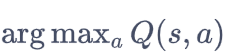。

这样似乎已经形成了一个完整的强化学习算法：用贪婪算法根据动作价值选取动作来和环境交互，再根据得到的数据用时序差分算法更新`动作价值估计`。

然而这个简单的算法存在两个需要进一步考虑的问题。第一，如果要用时序差分算法来准确地估计策略的状态价值函数，我们`需要用极大量的样本来进行更新`。但实际上我们可以忽略这一点，直接用一些样本来评估策略，然后就可以更新策略了。`误差的积累需要大量样本 “平均掉”`

因为 TD 的每一步更新都依赖 “有误差的估计”，单个样本的信息非常有限，甚至可能引入噪声。

- 比如你玩马里奥，某一步跳到平台上拿到了 + 10 分，但下一个状态 st+1 的价值估计其实是不准的（因为它也是之前用 TD 更新出来的）。
- 这一次更新会给 V(st) 带来偏差，但如果我们重复玩很多次（用大量样本），这些随机的误差就会被**平均掉**，`让价值估计逐渐收敛到真实值`。

==但实际上我们可以忽略这一点，直接用一些样本来评估策略，然后就可以更新策略了。==

每走一步、收集一个样本，就立刻更新价值函数，然后基于最新的价值去调整策略。

这些算法在实际场景中（比如游戏、机器人控制）都能快速找到优秀的策略，证明了 “不用等大量样本” 的做法是可行的。这其实是**广义策略迭代**（generalized policy iteration）的思想。


第二，如果在策略提升中一直根据贪婪算法得到一个确定性策略，可能会导致某些状态动作对永远没有在序列中出现，以至于无法对其动作价值进行估计，进而无法保证策略提升后的策略比之前的好。我们在第 2 章中对此有详细讨论。简单常用的解决方案是不再一味使用贪婪算法，而是采用一个-贪婪策略：有的概率采用动作价值最大的那个动作，另外有的概率从动作空间中随机采取一个动作，其公式表示为：

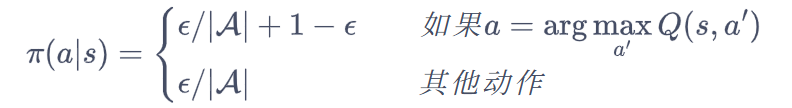

现在，我们就可以得到一个实际的基于时序差分方法的强化学习算法。这个算法被称为 Sarsa，因为它的动作价值更新用到了当前状态、当前动作、获得的奖励、下一个状态和下一个动作，将这些符号拼接后就得到了算法名称。Sarsa 的具体算法如下:

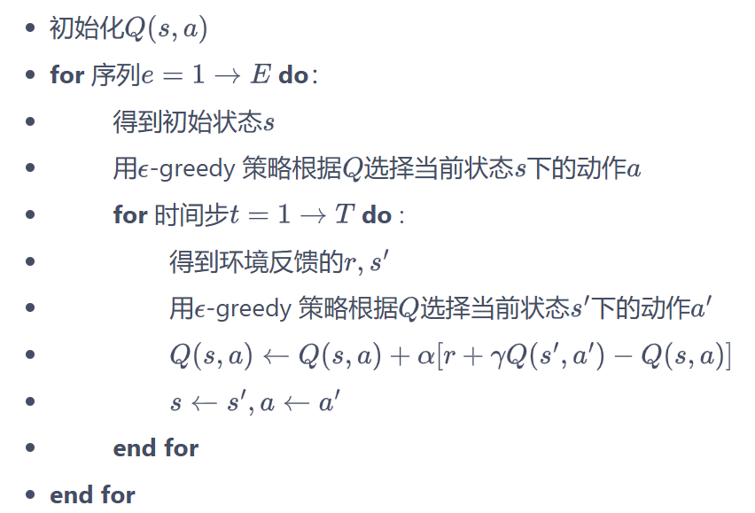

##### 逐行拆解（结合游戏例子）

###### 🔹 初始化 Q(s,a)

- 意思：最开始，你对所有 “状态 - 动作” 对的价值完全没概念，所以先把所有 Q(s,a) 都设为 0。
- 游戏例子：刚打开新游戏，你不知道 “在起点走” 和 “在起点跳” 哪个更好，就默认它们价值都是 0。

###### 外层循环：`for 序列e = 1 → E do`

- 意思：我们要完整地玩 E 局游戏（比如玩 100 局），每一局都从头开始。

- 得到初始状态 **s**

  - 游戏例子：每局开始，你都站在 “起点” 这个初始状态。

  

- 用**ε**-greedy 策略选择动作**a**

  - 意思：这是 “探索 + 利用” 的平衡策略：
    - 大部分时候（比如 90% 概率），选当前价值最高的动作（**利用**已知的好选择）。
    - 偶尔（比如 10% 概率），随机选一个动作（**探索**新的可能性）。
  - 游戏例子：在起点时，Q 值都是 0，所以随机选了 “走” 这个动作。

###### 🔹 内层循环：`for 时间步t = 1 → T do`

- 意思：这是单局游戏里的每一步，直到游戏结束（比如掉坑或通关）。

- 得到环境反馈的**r,s′**

  - 意思：你执行动作 a 后，环境会给你一个即时奖励 r，同时让你进入新状态 s′。
  - 游戏例子：你 “走” 了一步，吃到 1 个金币（奖励 r=+5），并进入了 “金币位置” 这个新状态 s′。

- 用**ε**-greedy 策略选择新动作**a′**

  - 意思：在新状态 s′ 下，同样用 ε-greedy 选下一个动作。
  - 游戏例子：在 “金币位置”，Q 值都是 0，随机选了 “跳” 这个动作 a′。

- 更新**Q(s,a)**的核心公式

  Q(s,a)←Q(s,a)+α[r+γQ(s′,a′)−Q(s,a)]

  我们拆解成游戏里的数字（假设 α=0.1，γ=0.9）：

  - 初始 起点走
  - 计算 TD 目标：金币位置跳
  - 计算 TD 误差：5−0=5
  - 更新 Q 值：起点走
  - 意思：现在 “起点 - 走” 的价值从 0 变成了 0.5，因为它让你拿到了 5 分。

- **s←s′,a←a′**

  - 意思：把当前状态和动作更新为新的 s′ 和 a′，准备下一步。
  - 游戏例子：现在你的状态变成 “金币位置”，动作变成 “跳”，继续玩下一步。

###### 结束内层循环 & 外层循环

- 意思：当一局游戏结束（比如掉坑），就跳出内层循环，开始下一局游戏，重复整个流程。
- 玩的局数越多，Q 值就越准，你选的动作也会越来越厉害，最终能稳定拿到高分。

###### Sarsa 的核心特点

1. **在线学习**：用来选动作的策略（ε-greedy）和用来更新价值的策略是同一个。
2. **一步更新**：不用等整局结束，走一步就更新一次 Q 值，效率很高。
3. **探索与利用平衡**：通过 ε-greedy 保证你不会一直用老动作，会偶尔尝试新动作。


```python
import matplotlib.pyplot as plt
import numpy as np
from tqdm import tqdm  # tqdm是显示循环进度条的库


class CliffWalkingEnv:
    def __init__(self, ncol, nrow):
        self.nrow = nrow
        self.ncol = ncol
        self.x = 0  # 记录当前智能体位置的横坐标
        self.y = self.nrow - 1  # 记录当前智能体位置的纵坐标

    def step(self, action):  # 外部调用这个函数来改变当前位置
        # 4种动作, change[0]:上, change[1]:下, change[2]:左, change[3]:右。坐标系原点(0,0)
        # 定义在左上角
        change = [[0, -1], [0, 1], [-1, 0], [1, 0]]
        self.x = min(self.ncol - 1, max(0, self.x + change[action][0]))
        self.y = min(self.nrow - 1, max(0, self.y + change[action][1]))
        next_state = self.y * self.ncol + self.x
        reward = -1
        done = False
        if self.y == self.nrow - 1 and self.x > 0:  # 下一个位置在悬崖或者目标
            done = True
            if self.x != self.ncol - 1:
                reward = -100
        return next_state, reward, done

    def reset(self):  # 回归初始状态,坐标轴原点在左上角
        self.x = 0
        self.y = self.nrow - 1
        return self.y * self.ncol + self.x
```


==二维坐标转一维状态值==：

```python
next_state = self.y * self.ncol + self.x
```

 是强化学习的常用技巧

返回行动结果:

给外部算法返回 3 个关键信息：`next_state`（新状态）、`reward`（即时奖励）、`done`（任务是否结束），供算法更新 Q 值。

重置方法：`reset(self)`

这个方法的作用是**把智能体重置到初始位置，开始新一局任务**,把`x`和`y`恢复到初始值（左下角起点），然后返回初始位置的一维状态值。。


```python
class Sarsa:
    """ Sarsa算法 """
    def __init__(self, ncol, nrow, epsilon, alpha, gamma, n_action=4):
        self.Q_table = np.zeros([nrow * ncol, n_action])  # 初始化Q(s,a)表格
        self.n_action = n_action  # 动作个数
        self.alpha = alpha  # 学习率
        self.gamma = gamma  # 折扣因子
        self.epsilon = epsilon  # epsilon-贪婪策略中的参数
    def take_action(self, state):  # 选取下一步的操作,具体实现为epsilon-贪婪
    if np.random.random() < self.epsilon:
        action = np.random.randint(self.n_action)
    else:
        action = np.argmax(self.Q_table[state])
    return action

def best_action(self, state):  # 用于打印策略
    Q_max = np.max(self.Q_table[state])
    a = [0 for _ in range(self.n_action)]
    for i in range(self.n_action):  # 若两个动作的价值一样,都会记录下来
        if self.Q_table[state, i] == Q_max:
            a[i] = 1
    return a

def update(self, s0, a0, r, s1, a1):
    td_error = r + self.gamma * self.Q_table[s1, a1] - self.Q_table[s0, a0]
    self.Q_table[s0, a0] += self.alpha * td_error
```

核心变量：`self.Q_table`（Q 值表）

- 这是一个`numpy`二维数组，形状为 `[状态数, 动作数]`，其中「状态数 = nrow * ncol」（对应环境的二维坐标转一维状态）。

* 举例：4 行 12 列的悬崖行走环境，Q 值表形状为 `[48, 4]`（48 个状态，每个状态 4 个动作），`Q_table[0, 3]` 就表示「初始状态（状态 0）下，选择 “右” 动作（动作 3）的价值」。


```python
def update(self, s0, a0, r, s1, a1):    td_error = r + self.gamma * self.Q_table[s1, a1] - self.Q_table[s0, a0]    self.Q_table[s0, a0] += self.alpha * td_error
```

入参说明（对应 Sarsa 的 “一步试错” 数据）：

- `s0`：当前状态（执行动作前的状态）。
- `a0`：当前动作（在`s0`下执行的动作）。
- `r`：即时奖励（执行`a0`后得到的奖励）。
- `s1`：新状态（执行`a0`后进入的状态）。
- `a1`：新动作（在`s1`下用 ε- 贪心选好的下一个动作）。

逻辑拆解（对应 Sarsa 的核心更新公式）：

1. 计算TD 误差：

   ```python
   td_error = r + self.gamma * self.Q_table[s1, a1] - self.Q_table[s0, a0]
   ```

   - 对应公式：误差
   - 含义：“当前动作的实际价值（当前奖励 + 下一个状态 - 动作的折扣价值）” 与 “之前估计的价值” 之间的差距，差距越大，Q 值更新幅度越大。

注意：Sarsa 是**在线算法**，这里用到了下一个状态`s1`对应的实际动作`a1`，这是它和 Q-learning 的核心区别。

更新 Q 值：`self.Q_table[s0, a0] += self.alpha * td_error`

- 对应公式：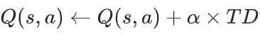误差
- 含义：让`Q(s0,a0)`向 “实际价值” 靠近，`alpha`（学习率）控制靠近的幅度，避免更新过快导致震荡。


#### 多步 Sarsa 算法

蒙特卡洛方法利用**当前状态之后每一步的奖励**而不使用任何价值估计，时序差分算法只利用一步奖励和下一个状态的价值估计。那它们之间的区别是什么呢？总的来说，蒙特卡洛方法是**无偏**（unbiased）的，但是具有比较大的方差，因为每一步的状态转移都有不确定性，而每一步状态采取的动作所得到的不一样的奖励最终都会加起来，这会极大影响最终的价值估计；时序差分算法具有非常小的方差，因为只关注了一步状态转移，用到了一步的奖励，但是它是有偏的，因为用到了下一个状态的价值估计而不是其真实的价值。那有没有什么方法可以结合二者的优势呢？答案是**多步时序差分**！多步时序差分的意思是使用步的奖励，然后使用之后状态的价值估计。用公式表示，将

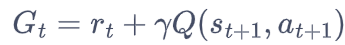

替换成

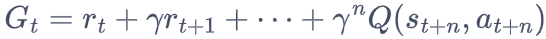

于是，相应存在一种多步 Sarsa 算法，它把 Sarsa 算法中的动作价值函数的更新公式（参见 5.3 节）

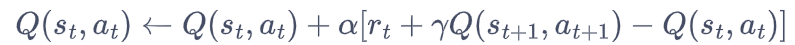

替换成

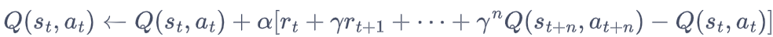

我们接下来用代码实现多步（n步）Sarsa 算法。在 Sarsa 代码的基础上进行修改，引入多步时序差分计算。

```python
# 步骤2：若缓存列表长度达到n，进行n步更新（核心逻辑）
if len(self.state_list) == self.n:  # 若保存的数据可以进行n步更新
    G = self.Q_table[s1, a1]  # 得到Q(s_{t+n}, a_{t+n})
    for i in reversed(range(self.n)):
        G = self.gamma * G + self.reward_list[i]  # 不断向前计算每一步的回报
```

#### Q-learning 算法

除了 Sarsa，还有一种非常著名的基于时序差分算法的强化学习算法——Q-learning。Q-learning 和 Sarsa 的最大区别在于 Q-learning 的时序差分更新方式为

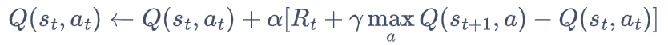

Q-learning 算法的具体流程如下：

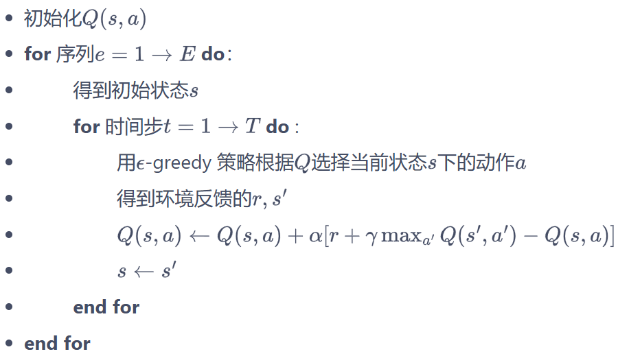

**Sarsa 是 “在线（on-policy）” 算法，更新时用的是真实选的下一个动作；而 Q-learning 是 “离线（off-policy）” 算法，更新时用的是 “下一个状态里价值最高的动作”，不管实际会不会选它**。

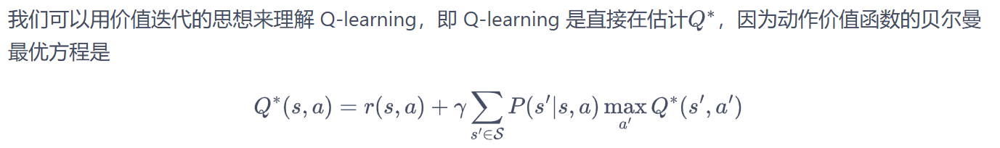

而 Sarsa 估计当前**ε-贪婪**策略的动作价值函数。

需要强调的是，Q-learning 的更新并非必须使用当前贪心策略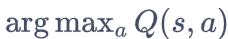采样得到的数据，因为给定任意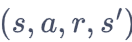都可以直接根据更新公式来更新，为了探索，我们通常使用一个-贪婪策略来与环境交互。

#### 在线策略算法与离线策略算法

我们称采样数据的策略为**行为策略**（behavior policy），称用这些数据来更新的策略为**目标策略**（target policy）。在线策略（on-policy）算法表示行为策略和目标策略是同一个策略；而离线策略（off-policy）算法表示行为策略和目标策略不是同一个策略。

Sarsa 是典型的在线策略算法，而 Q-learning 是典型的离线策略算法。判断二者类别的一个重要手段是看计算时序差分的价值目标的数据是否来自当前的策略，如图 5-1 所示。具体而言：

- 对于 Sarsa，它的更新公式必须使用来自当前策略采样得到的五元组，因此它是在线策略学习方法；

- 对于 Q-learning，它的更新公式使用的是四元组来更新当前状态动作对的价值，数据中的和是给定的条件，和皆由环境采样得到，该四元组并不需要一定是当前策略采样得到的数据，也可以来自行为策略，因此它是离线策略算法。

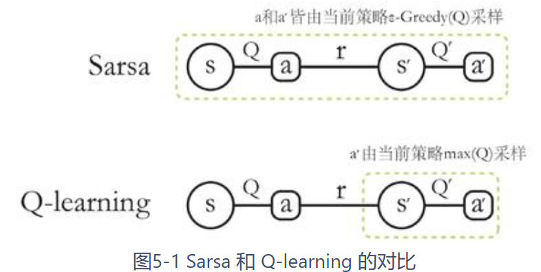

2. Sarsa（在线算法）的过马路例子

假设你正在学习过马路，Sarsa 的方式是：

1. **真实走一步**：你在马路边（状态`s`），用 ε- 贪心选了 “小步往前走”（动作`a`）。

2. **得到反馈**：走了一步后，没被车撞（奖励`r=+1`），到了马路中间（新状态`s'`）。

3. **再真实选下一步**：在马路中间，你又用 ε- 贪心选了 “继续小步走”（新动作`a'`）。

4. 更新经验：你会用这一整套真实经历（

   ```
   s,a,r,s',a'
   ```
   
   五元组）来更新 “马路边 - 小步走” 的价值。

   - 你的经验是：“我在马路边选了小步走，到了中间，然后又选了继续走，所以这个动作的价值是`r + γ*Q(s',a')`”。
   - 你只相信自己真实走过的每一步，不参考任何 “想象中的最优走法”。
   

所以 Sarsa 是**在线算法**：它的更新依赖 “自己真实走出来的五元组”，每一步都是你实际执行的动作，非常保守、安全。

------

3. Q-learning（离线算法）的过马路例子

同样是学习过马路，Q-learning 的方式是：

1. **真实走一步**：你在马路边（状态`s`），用 ε- 贪心选了 “小步往前走”（动作`a`）。

2. **得到反馈**：走了一步后，没被车撞（奖励`r=+1`），到了马路中间（新状态`s'`）。

3. **想象最优走法**：你不关心下一步自己真实会选什么动作，而是直接看 “马路中间” 这个状态下，所有动作里价值最高的那个（比如 “快速跑过马路”，动作`a'`）。

4. 更新经验：你会用 “真实走的一步 + 想象的最优下一步”（

   ```
   s,a,r,s'
   ```
   
   四元组）来更新 “马路边 - 小步走” 的价值。

   - 你的经验是：“我在马路边选了小步走，到了中间，而中间最好的动作是快速跑，所以这个动作的价值是`r + γ*maxQ(s',a')`”。
   - 你参考了 “理想中的最优走法”，哪怕你自己真实下一步可能不会这么选。
   

所以 Q-learning 是**离线算法**：它的更新只需要 “真实走的四元组”，下一步的动作是 “想象中的最优动作”，不需要是你真实选的，更激进、追求理论最优。

接下来仍然在悬崖漫步环境下来实现 Q-learning 算法。

```py
class QLearning:
    """ Q-learning算法 """
    def __init__(self, ncol, nrow, epsilon, alpha, gamma, n_action=4):
        self.Q_table = np.zeros([nrow * ncol, n_action])  # 初始化Q(s,a)表格
        self.n_action = n_action  # 动作个数
        self.alpha = alpha  # 学习率
        self.gamma = gamma  # 折扣因子
        self.epsilon = epsilon  # epsilon-贪婪策略中的参数
        def take_action(self, state):  #选取下一步的操作
    if np.random.random() < self.epsilon:
        action = np.random.randint(self.n_action)
    else:
        action = np.argmax(self.Q_table[state])
    return action

def best_action(self, state):  # 用于打印策略
    Q_max = np.max(self.Q_table[state])
    a = [0 for _ in range(self.n_action)]
    for i in range(self.n_action):
        if self.Q_table[state, i] == Q_max:
            a[i] = 1
    return a

def update(self, s0, a0, r, s1):
    td_error = r + self.gamma * self.Q_table[s1].max(
    ) - self.Q_table[s0, a0]
    self.Q_table[s0, a0] += self.alpha * td_error
```

逐句拆解更新逻辑

1. 计算 TD 误差：`td_error = r + self.gamma * self.Q_table[s1].max() - self.Q_table[s0, a0]`

   - 先拆各个部分的含义：
     - `self.Q_table[s1].max()`：获取新状态`s1`下，所有动作的 Q 值中的**最大值**（对应公式里的`max_{a'} Q(s',a')`），这是 Q-learning 的核心 —— 不关心真实选的动作，只取 “理想中的最优动作” 的 Q 值。
     - `self.gamma * self.Q_table[s1].max()`：对未来最优 Q 值打折扣（`gamma`是折扣因子，控制未来奖励的权重）。
     - `r + self.gamma * self.Q_table[s1].max()`：这是 Q-learning 的 “目标 Q 值”—— 当前奖励 + 未来最优状态的折扣 Q 值，代表 “这个动作的理想最优价值”。
     - `self.Q_table[s0, a0]`：这是当前「状态 s0 - 动作 a0」的 “当前 Q 值”—— 代表 “我们之前对这个动作的价值估计”。
     - `TD误差`：目标 Q 值 - 当前 Q 值，代表 “我们之前的估计和理想最优价值的差距”，差距越大，Q 值更新幅度越大。

比如你在起点（s0）选了 “右”（a0），得到奖励 - 1（r），到了新状态 s1，Q-learning 不管你下一步真实选什么，只看 s1 状态下最好的动作值多少钱，然后用这个 “理想价值” 来修正 “起点 - 右” 的价值。

需要注意的是，打印出来的回报是行为策略在环境中交互得到的，而不是 Q-learning 算法在学习的目标策略的真实回报。

我们把目标策略的行为打印出来后，发现其更偏向于走在悬崖边上，这与 Sarsa 算法得到的比较保守的策略相比是更优的。 但是仔细观察 Sarsa 和 Q-learning 在训练过程中的回报曲线图，我们可以发现，在一个序列中 Sarsa 获得的期望回报是高于 Q-learning 的。这是因为在训练过程中智能体采取基于当前函数的-贪婪策略来平衡探索与利用，Q-learning 算法由于沿着悬崖边走，会以一定概率探索“掉入悬崖”这一动作，而 Sarsa 相对保守的路线使智能体几乎不可能掉入悬崖。

#### 小结

本章介绍了无模型的强化学习中的一种非常重要的算法——时序差分算法。时序差分算法的核心思想是用对未来动作选择的价值估计来更新对当前动作选择的价值估计，这是强化学习中的核心思想之一。

值得注意的是，尽管离线策略学习可以让智能体基于经验回放池中的样本来学习，但需要保证智能体在学习的过程中可以不断和环境进行交互，将采样得到的最新的经验样本加入经验回放池中，从而使经验回放池中有一定数量的样本和当前智能体策略对应的数据分布保持很近的距离。

如果不允许智能体在学习过程中和环境进行持续交互，而是完全基于一个给定的样本集来直接训练一个策略，这样的学习范式被称为**离线强化学习**（offline reinforcement learning），第 18 章将会介绍离线强化学习的相关知识。


### 6.Dyna-Q

在强化学习中，“模型”通常指与智能体交互的环境模型，即对环境的状态转移概率和奖励函数进行建模。根据是否具有环境模型，强化学习算法分为两种：**基于模型的强化学习**（model-based reinforcement learning）和**无模型的强化学习**（model-free reinforcement learning）。

无模型的强化学习根据智能体与环境交互采样到的数据直接进行策略提升或者价值估计，第 5 章讨论的两种时序差分算法，即 Sarsa 和 Q-learning 算法，便是两种无模型的强化学习方法，本书在后续章节中将要介绍的方法也大多是无模型的强化学习算法。

`在基于模型的强化学习中`，模型可以是事先知道的，也可以是根据智能体与环境交互采样到的数据学习得到的，然后用这个模型帮助策略提升或者价值估计。

第 4 章讨论的两种动态规划算法，即策略迭代和价值迭代，则是基于模型的强化学习方法，在这两种算法中环境模型是事先已知的。本章即将介绍的 **Dyna-Q 算法**也是非常基础的基于模型的强化学习算法，不过它的环境模型是**通过采样数据估计得到**的。

强化学习算法有两个重要的评价指标：一个是`算法收敛后的策略`在**初始状态下**的==期望回报==，另一个是==样本复杂度==，即算法达到收敛结果需要在真实环境中采样的样本数量。

基于模型的强化学习算法由于具有一个环境模型，智能体可以额外和环境模型进行交互，对真实环境中样本的需求量往往就会减少，因此通常会比无模型的强化学习算法具有更低的样本复杂度。

但是，环境模型可能并不准确，不能完全代替真实环境，因此基于模型的强化学习算法收敛后其策略的期望回报可能不如无模型的强化学习算法。


**Dyna-Q 算法**，它是 Q-learning 的 “加强版”。

Q-learning 是 “边和环境互动边学习”，而 Dyna-Q 是 “边和环境互动，边在脑子里模拟环境来复盘学习”。

Dyna-Q 算法是一个经典的基于模型的强化学习算法。

如图 6-1 所示，Dyna-Q 使用一种叫做 Q-planning 的方法来基于模型生成一些模拟数据，然后用模拟数据和真实数据一起改进策略。

Q-planning 每次选取一个曾经访问过的状态，采取一个曾经在该状态下执行过的动作，通过模型得到转移后的状态以及奖励，并根据这个模拟数据，用 Q-learning 的更新方式来更新动作价值函数。

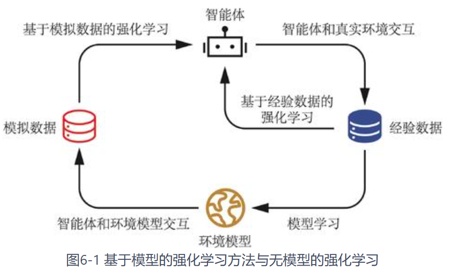


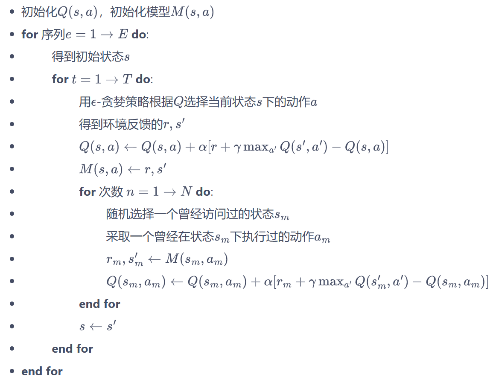

> 更新 Q 值：`Q(s,a) ← Q(s,a) + α[r + γ max_{a'} Q(s',a') - Q(s,a)]`

- **意思**：更新你的 “做菜笔记”，==用真实环境的反馈来修正步骤的价值==（这一步和 Q-learning 完全一样）。

> 模拟学习循环：`for 次数n = 1 → N do`

这是 Dyna-Q 最核心的部分，也是它和 Q-learning 的唯一区别 ——**“复盘学习”**。

一句话总结:

Dyna-Q 就像 “**学做菜时，不仅要亲手做，还要在脑子里反复复盘过去的步骤**”。

亲手做（真实环境互动）保证经验是对的，脑子里复盘（模型模拟学习）让经验被反复利用，学得更快。

在**每次与环境进行交互执行一次 Q-learning 之后**，Dyna-Q 会做==n==次 **Q-planning**。其中 Q-planning 的次数==N==是一个事先可以选择的超参数，`当N为 0 时`就是普通的 Q-learning。

上述 Dyna-Q 算法是执行在一个离散并且确定的环境中，所以当看到一条经验数据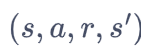时，可以直接对模型做出更新，即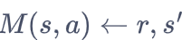。

**直接更新模型**：因为环境是**确定的**，所以只要你见过一次 `(s,a)` 对应的 `(r,s')`，就可以确定：**以后每次在 s 状态下执行 a 动作，得到的 r 和 s' 都是完全一样的**。

所以你可以直接把模型 `M(s,a)` 设置成这个 `(r,s')`，==不用像随机环境那样需要多次观察来统计平均==

比如：你在 “有鸡蛋和锅” 状态下执行 “打鸡蛋”，得到了 “+1 分” 和 “碗里有蛋液”，那你就可以直接在模型里记下 `M(有鸡蛋和锅, 打鸡蛋) = (+1, 碗里有蛋液)`，以后模拟时用这个值就 100% 准确。

> 因为 Dyna-Q 假设环境是 “离散 + 确定” 的，所以它的模型 `M(s,a)` 可以做得非常简单 —— 只要存下每一条见过的经验就行，不用复杂的统计或概率估计。

这也是为什么在之前的伪代码里，模型更新只需要 `M(s,a) ← r,s'` 这么简单的一步，不用像随机环境那样需要加权平均或其他复杂操作。

在 “离散 + 确定” 的环境里，**“见过一次就等于永远正确”**，所以 Dyna-Q 可以直接把每次的真实经验存进模型，用来模拟复盘，不用反复验证。


#### Dyna-Q 代码实践

```python
import matplotlib.pyplot as plt
import numpy as np
from tqdm import tqdm
import random
import time

class CliffWalkingEnv:
    def __init__(self, ncol, nrow):
        self.nrow = nrow
        self.ncol = ncol
        self.x = 0  # 记录当前智能体位置的横坐标
        self.y = self.nrow - 1  # 记录当前智能体位置的纵坐标
def step(self, action):  # 外部调用这个函数来改变当前位置
    # 4种动作, change[0]:上, change[1]:下, change[2]:左, change[3]:右。坐标系原点(0,0)
    # 定义在左上角
    change = [[0, -1], [0, 1], [-1, 0], [1, 0]]
    self.x = min(self.ncol - 1, max(0, self.x + change[action][0]))
    self.y = min(self.nrow - 1, max(0, self.y + change[action][1]))
    next_state = self.y * self.ncol + self.x
    reward = -1
    done = False
    if self.y == self.nrow - 1 and self.x > 0:  # 下一个位置在悬崖或者目标
        done = True
        if self.x != self.ncol - 1:
            reward = -100
    return next_state, reward, done

def reset(self):  # 回归初始状态,起点在左上角
    self.x = 0
    self.y = self.nrow - 1
    return self.y * self.ncol + self.x
```

然后我们在 Q-learning 的代码上进行简单修改，实现 Dyna-Q 的主要代码。最主要的修改是加入了环境模型`model`，用一个字典表示，每次在真实环境中收集到新的数据，就把它加入字典。根据字典的性质，若该数据本身存在于字典中，便不会再一次进行添加。


```python
class DynaQ:
    """ Dyna-Q算法 """
    def __init__(self,
                 ncol,
                 nrow,
                 epsilon,
                 alpha,
                 gamma,
                 n_planning,
                 n_action=4):
        self.Q_table = np.zeros([nrow * ncol, n_action])  # 初始化Q(s,a)表格
        self.n_action = n_action  # 动作个数
        self.alpha = alpha  # 学习率
        self.gamma = gamma  # 折扣因子
        self.epsilon = epsilon  # epsilon-贪婪策略中的参数    
    self.n_planning = n_planning  #执行Q-planning的次数, 对应1次Q-learning
    self.model = dict()  # 环境模型

def take_action(self, state):  # 选取下一步的操作
    if np.random.random() < self.epsilon:
        action = np.random.randint(self.n_action)
    else:
        action = np.argmax(self.Q_table[state])
    return action

def q_learning(self, s0, a0, r, s1):
    td_error = r + self.gamma * self.Q_table[s1].max(
    ) - self.Q_table[s0, a0]
    self.Q_table[s0, a0] += self.alpha * td_error

def update(self, s0, a0, r, s1):
    self.q_learning(s0, a0, r, s1)
    self.model[(s0, a0)] = r, s1  # 将数据添加到模型中
    for _ in range(self.n_planning):  # Q-planning循环
        # 随机选择曾经遇到过的状态动作对
        (s, a), (r, s_) = random.choice(list(self.model.items()))
        self.q_learning(s, a, r, s_)
```

 核心学习方法：`q_learning`（和纯 Q-learning 完全一致）

```python
def q_learning(self, s0, a0, r, s1):
    td_error = r + self.gamma * self.Q_table[s1].max() - self.Q_table[s0, a0]
    self.Q_table[s0, a0] += self.alpha * td_error
```

- 逻辑：这就是纯 Q-learning 的 Q 值更新方法，逐句解释（回顾）：
  1. 计算 TD 误差：`目标Q值（当前奖励+未来最优Q值） - 当前Q值`。
  2. 更新当前「状态 - 动作」对的 Q 值，用学习率`alpha`控制更新幅度。
  3. 核心亮点：Dyna-Q 把 Q-learning 的更新逻辑封装成独立方法，既用于真实环境学习，也用于模拟复盘学习，实现代码复用。

> 核心增强方法：`update`（真实学习 + 模拟复盘，Dyna-Q 的核心！）

包含两个关键步骤：真实环境学习、Q-planning 模拟复盘，

```python
def update(self, s0, a0, r, s1):    # 步骤1：真实环境学习（和Q-learning一样，调用q_learning方法更新Q值）    
	self.q_learning(s0, a0, r, s1)
```

第一步：真实环境学习

- 调用`q_learning`方法，用真实环境返回的`(s0, a0, r, s1)`更新 Q 表，这一步和纯 Q-learning 完全一致。
- 作用：保证学习的经验是 “真实有效的”，不会因为模拟复盘而偏离真实环境。

```python
    \# 步骤2：将真实经验存入模型（填充记忆库，为后续复盘做准备）    
    self.model[(s0, a0)] = r, s1  # 字典的键是(s0,a0)，值是(r,s1)，直接覆盖（因为环境是确定的，一次经验即永久正确）
```

第二步：存储真实经验到模型

- 逻辑：将真实环境得到的「状态 - 动作 - 奖励 - 新状态」存入`self.model`字典。
- 关键：因为悬崖行走环境是**离散确定环境**，同一个`(s0, a0)`对应的`(r, s1)`永远不变，所以直接用`=`赋值覆盖即可，无需复杂统计。

第三步：Q-planning 模拟复盘（Dyna-Q 的核心增强点）

- 循环次数：`self.n_planning`，即每次真实学习后，要复盘的次数。
- 步骤 3.1：随机抽取过往经验
  - `list(self.model.items())`：将字典的键值对转换成列表，方便随机选择。
  - `random.choice()`：从列表中随机抽取一个元素，得到`(s,a)`（过往的状态 - 动作）和`(r,s_)`（对应的过往反馈）。
  - 大白话：从 “记忆库” 里随便翻出一条以前的真实经验，比如 “上次在起点选了向右，得到奖励 - 1，到了右边一格”。
- 步骤 3.2：用模拟经验更新 Q 表
  - 直接调用`q_learning`方法，传入抽取的模拟经验`(s, a, r, s_)`，更新 Q 表。
  - 大白话：用翻出来的过往经验，再重新学习一次，加深对这个动作价值的理解，相当于 “复盘巩固”。
- 核心作用：不用和真实环境互动，就能反复利用过往经验学习，大幅提高学习效率，减少真实试错的次数。

下面是 Dyna-Q 算法在悬崖漫步环境中的训练函数，它的输入参数是 Q-planning 的步数。

```python
def DynaQ_CliffWalking(n_planning):
    ncol = 12
    nrow = 4
    env = CliffWalkingEnv(ncol, nrow)
    epsilon = 0.01
    alpha = 0.1
    gamma = 0.9
    agent = DynaQ(ncol, nrow, epsilon, alpha, gamma, n_planning)
    num_episodes = 300  # 智能体在环境中运行多少条序列
return_list = []  # 记录每一条序列的回报
for i in range(10):  # 显示10个进度条
    # tqdm的进度条功能
    with tqdm(total=int(num_episodes / 10),
              desc='Iteration %d' % i) as pbar:
        for i_episode in range(int(num_episodes / 10)):  # 每个进度条的序列数
            episode_return = 0
            state = env.reset()
            done = False
            while not done:
                action = agent.take_action(state)
                next_state, reward, done = env.step(action)
                episode_return += reward  # 这里回报的计算不进行折扣因子衰减
                agent.update(state, action, reward, next_state)
                state = next_state
            return_list.append(episode_return)
            if (i_episode + 1) % 10 == 0:  # 每10条序列打印一下这10条序列的平均回报
                pbar.set_postfix({
                    'episode':
                    '%d' % (num_episodes / 10 * i + i_episode + 1),
                    'return':
                    '%.3f' % np.mean(return_list[-10:])
                })
            pbar.update(1)
return return_list
```

`return_list`：空列表，用于存储每一局训练的总回报（每一局结束后，把`episode_return`添加进去）。

外层循环`for i in range(10)`：将 300 局训练分成 10 个批次，每个批次 30 局，对应一个进度条，方便清晰查看训练进度（避免一个超长进度条，提升可读性）。

`tqdm`：进度条工具，`total=int(num_episodes/10)`指定每个进度条的总步数（30），`desc='Iteration %d' % i`设置进度条标题（显示当前批次）。

内层单局训练循环（核心，每一局的完整流程）:

```python
for i_episode in range(int(num_episodes / 10)):  # 每个进度条对应30局，循环30次    
    episode_return = 0  # 初始化当前局的总回报（总奖励）    
    state = env.reset()  # 重置环境，将智能体放回起点，返回初始状态    
    done = False  # 初始化任务结束标志，False表示未结束
```


```python
    while not done:  # 单局内的步骤循环，直到任务结束（done=True）        
        action = agent.take_action(state)  # 步骤1：智能体根据当前状态选动作（ε-贪心）        
        next_state, reward, done = env.step(action)  # 步骤2：执行动作，获取环境反馈（新状态、奖励、是否结束）        
        episode_return += reward  # 步骤3：累加当前步奖励，更新当前局总回报（不折扣，仅统计实际总奖励）        
        agent.update(state, action, reward, next_state)  # 步骤4：核心！调用DynaQ的update方法，完成「真实学习+模拟复盘」        
        state = next_state  # 步骤5：更新当前状态，为下一步循环做准备
```

这是单局训练的核心循环，逐步骤解释（重点讲和 Q-learning 的异同）：

1. 选动作：`agent.take_action(state)`，和 Q-learning 一致，用 ε- 贪心选动作。
2. 执行动作：`env.step(action)`，调用环境的步骤方法，获取反馈，和 Q-learning 一致。
3. 累加回报：`episode_return += reward`，统计当前局的总奖励，和 Q-learning 一致（注意：这里没有用折扣因子，只是统计实际拿到的总奖励，用于评估学习效果）。
4. 智能体更新：agent.update(...)，这是唯一和 Q-learning 的差异点：
   - 调用的是`DynaQ`类的`update`方法，内部会完成 “真实 Q-learning 更新 +`n_planning`次模拟复盘”。
   - 而纯 Q-learning 调用的是`QLearning`类的`update`方法，仅完成真实 Q-learning 更新。
   - 其余参数（`state, action, reward, next_state`）完全一致，流程兼容。
5. 更新状态：`state = next_state`，和 Q-learning 一致，无需更新动作（因为 Dyna-Q 继承了 Q-learning 的离线特性，不依赖下一个真实动作）。


接下来对结果进行可视化，通过调整参数，我们可以观察 Q-planning 步数对结果的影响（另见彩插图 3）。若 Q-planning 步数为 0，Dyna-Q 算法则退化为 Q-learning。

```python
np.random.seed(0)
random.seed(0)
n_planning_list = [0, 2, 20]
for n_planning in n_planning_list:
    print('Q-planning步数为：%d' % n_planning)
    time.sleep(0.5) # 暂停0.5秒，让打印信息和后续进度条不重叠，提升可读性
    return_list = DynaQ_CliffWalking(n_planning) # 调用训练函数，获取对应复盘步数的回报列表
    episodes_list = list(range(len(return_list)))# 生成局数列表（对应x轴）
    plt.plot(episodes_list,
             return_list,
             label=str(n_planning) + ' planning steps')
plt.legend()
plt.xlabel('Episodes')
plt.ylabel('Returns')
plt.title('Dyna-Q on {}'.format('Cliff Walking'))
plt.show()
```

`np.random.seed(0)`：固定`numpy`库的随机数生成器种子（Dyna-Q 的 Q 表初始化、ε- 贪心的随机探索都用到了`numpy`的随机方法）。

`random.seed(0)`：固定 Python 内置`random`库的随机数生成器种子（Dyna-Q 的 Q-planning 环节，从`model`中随机抽取经验用到了`random.choice()`）。

- 核心作用：**让实验结果可复现**，无论你运行多少次这段代码，得到的 3 条学习曲线都完全一致，方便对比和分析，这是强化学习实验中的标准操作。

新手提示：如果不固定随机种子，每次运行代码的随机探索和随机复盘都会不同，曲线也会波动，无法准确对比不同`n_planning`的效果。

定义要对比的 Q-planning 步数列表:n_planning_list = [0, 2, 20]

逻辑：定义一个包含 3 个值的列表，分别对应 3 种复盘策略：

1. `n_planning=0`：每次真实学习后，不进行任何模拟复盘，**等价于纯 Q-learning**（作为基准对比组）。
2. `n_planning=2`：每次真实学习后，复盘 2 次，轻度增强学习效率。
3. `n_planning=20`：每次真实学习后，复盘 20 次，重度增强学习效率。

选择逻辑：覆盖 “无复盘”“少量复盘”“大量复盘” 三种场景，能清晰展示复盘步数对学习效果的影响趋势。

`episodes_list`：x 轴数据（训练局数）。

`return_list`：y 轴数据（每局总回报）。

`label=str(n_planning) + ' planning steps'`：为当前曲线添加标签，后续在图例中展示，方便区分不同曲线对应的复盘步数。

```python
plt.legend()  # 显示图例（对应每条曲线的label，区分不同复盘步数） 
plt.xlabel('Episodes')  # 设置x轴标签：训练局数 
plt.ylabel('Returns')  # 设置y轴标签：每局总回报 
plt.title('Dyna-Q on {}'.format('Cliff Walking'))  # 设置图表标题：Dyna-Q在悬崖行走环境上的效果 
plt.show()  # 显示绘制完成的图表
```

`plt.legend()`：显示图例，图例中的内容就是`plt.plot()`中设置的`label`，能清晰区分 3 条曲线分别对应哪种复盘步数，这是多曲线对比图的必备步骤。

`plt.xlabel()`/`plt.ylabel()`：设置坐标轴标签，让图表更规范，读者能快速理解 x 轴和 y 轴的含义。

`plt.title()`：设置图表标题，明确图表的核心内容（Dyna-Q 在悬崖行走环境上的学习效果对比）。

`plt.show()`：弹出图表窗口，展示最终绘制的 3 条对比曲线，这是`matplotlib`绘图的最后一步，用于显示结果。

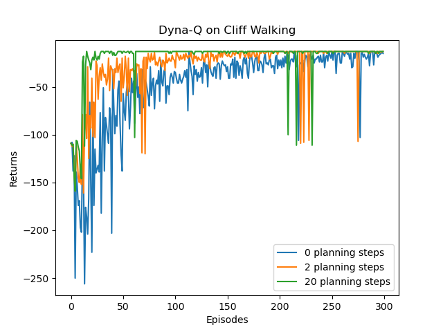

从上述结果中我们可以很容易地看出，随着 Q-planning 步数的增多，Dyna-Q 算法的收敛速度也随之变快。当然，并不是在所有的环境中，都是 Q-planning 步数越大则算法收敛越快，这取决于环境是否是确定性的，以及环境模型的精度。在上述悬崖漫步环境中，状态的转移是完全确定性的，构建的环境模型的精度是最高的，所以可以通过增加 Q-planning 步数来直接降低算法的样本复杂度。

**构建的环境模型精度是最高的**

因为环境是确定的，Dyna-Q 的`model`字典只要存下一次真实经验（比如 “起点→右→奖励 - 1→右边一格”），就永远是 100% 准确的，不会有任何误差。

**降低算法的样本复杂度**

样本复杂度是指算法收敛到最优策略需要的**真实环境互动次数**。因为 Q-planning 用的是模拟经验（不需要和真实环境互动），增加复盘步数就相当于用更多 “模拟做菜” 来代替 “真实做菜”，从而减少需要的真实试错次数。

#### 小结 

本章讲解了一个经典的基于模型的强化学习算法 Dyna-Q，并且通过调整在悬崖漫步环境下的 Q-planning 步数，直观地展示了 Q-planning 步数对于收敛速度的影响。我们发现基于模型的强化学习算法 Dyna-Q 在以上环境中获得了很好的效果，但这些环境比较简单，模型可以直接通过经验数据得到。如果环境比较复杂，状态是连续的，或者状态转移是随机的而不是决定性的，如何学习一个比较准确的模型就变成非常重大的挑战，这直接影响到基于模型的强化学习算法能否应用于这些环境并获得比无模型的强化学习更好的效果。


## 进阶篇

### DQN 算法

在第 5 章讲解的 Q-learning 算法中，我们以矩阵的方式建立了一张存储每个状态下所有动作值的表格。

表格中的**每一个动作价值Q (s,a)**表示在状态s下选择动作a然后继续遵循某一策略,预期能够得到的期望回报。

然而，这种用`表格存储动作价值`的做法只在环境的==状态和动作都是离散的==，并且==空间都比较小==的情况下适用，我们之前进行代码实战的几个环境都是如此（如悬崖漫步）。

当状态或者动作数量非常大的时候，这种做法就不适用了。例如，当状态是一张 RGB 图像时，假设图像大小是210x160x3，此时一共有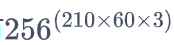种状态，在计算机中存储这个数量级的值表格是不现实的。更甚者，当状态或者动作连续的时候，就有无限个状态动作对，我们更加无法使用这种表格形式来记录各个状态动作对的值。【一张 RGB 图像的每个像素由 “红（R）、绿（G）、蓝（B)” 三个颜色通道组成，而每个通道的亮度值通常用**8 位二进制数**-256，0-255来表示】

单个像素的颜色组合数就是：`256（红的可能值） × 256（绿的可能值） × 256（蓝的可能值） = 256³`。

因为每个像素的颜色都是独立的，整幅图像的 “状态数” 就是所有像素的颜色可能性的乘积：

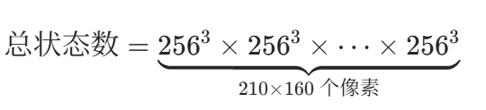

对于这种情况，我们需要用函数拟合的方法来估计Q值，即将这个复杂的Q值表格视作数据，使用一个参数化的函数Qθ来拟合这些数据。很显然，这种函数拟合的方法存在一定的精度损失，因此被称为近似方法。我们今天要介绍的 DQN 算法便可以用来解决连续状态下离散动作的问题。

#### CartPole 环境

以图 7-1 中所示的所示的车杆（[CartPole](https://github.com/openai/gym/wiki/CartPole-v0)）环境为例，它的`状态值就是连续的，动作值是离散的`。


图 7-1 CartPole环境示意图

在车杆环境中，有一辆小车，智能体的任务是通过左右移动保持车上的杆竖直，若杆的倾斜度数过大，或者车子离初始位置左右的偏离程度过大，或者坚持时间到达 200 帧，则游戏结束。

智能体的状态是一个维数为 4 的向量，每一维都是连续的，其动作是离散的，动作空间大小为 2，详情参见表 7-1 和表 7-2。在游戏中每坚持一帧，智能体能获得分数为 1 的奖励，坚持时间越长，则最后的分数越高，坚持 200 帧即可获得最高的分数。

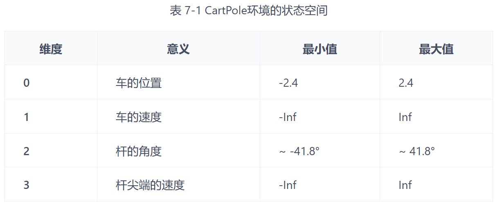

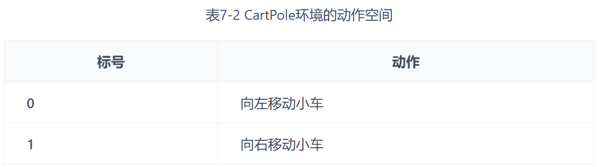


#### DQN

现在我们想在类似车杆的环境中得到动作价值函数Q(s,a), 

由于状态每一维度的值都是连续的，无法使用表格记录，因此一个常见的解决方法便是使用**函数拟合**（function approximation）的思想。由于神经网络具有强大的表达能力，因此我们可以用一个神经网络来表示函数Q。

若动作是连续（无限）的，神经网络的输入是状态s和动作a，然后输出一个标量，表示在状态s下采取动作a能获得的价值。

若动作是离散（有限）的，除了可以采取动作连续情况下的做法，我们还可以只将状态s输入到神经网络中，使其同时输出每一个动作的Q值。通常 DQN（以及 Q-learning）只能处理动作离散的情况，因为在函数Q的更新过程中有max~a~这一操作。

假设神经网络用来拟合函数w的参数是 ，即每一个状态s下所有可能动作a的Q值我们都能表示为Q~w~(s,a)。

我们将用于拟合函数函数的神经网络称为**Q 网络**，如图 7-2 所示。

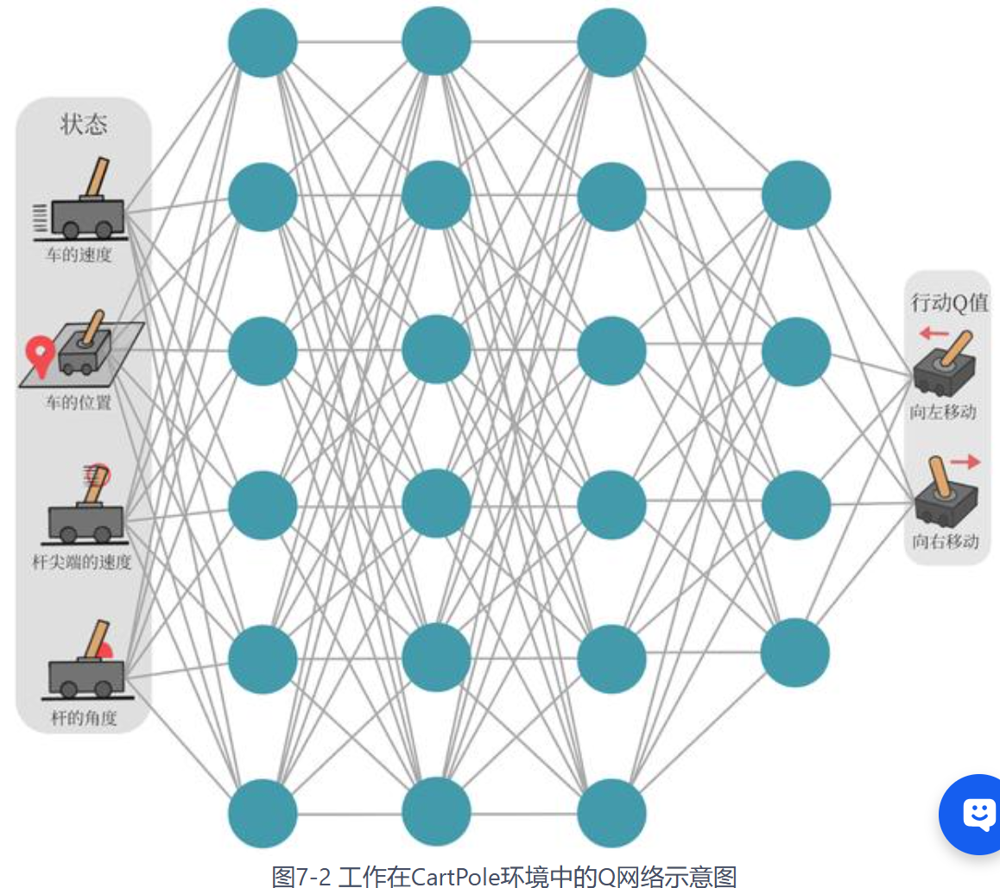

那么 Q 网络的损失函数是什么呢？我们先来回顾一下 Q-learning 的更新规则（参见 5.5 节）：

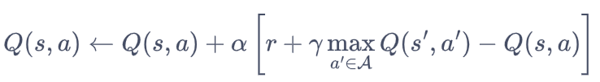

上述公式用**时序差分**（temporal difference，TD）学习目标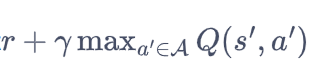来增量式更新，也就是说要使Q(s,a)和 TD 目标靠近。

于是，对于一组数据，我们可以很自然地将 Q 网络的损失函数构造为均方误差的形式：

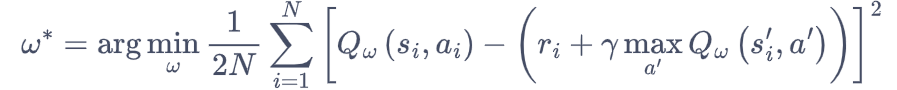

至此，我们就可以将 Q-learning 扩展到神经网络形式——**深度 Q 网络**（deep Q network，DQN）算法。

由于 DQN 是离线策略算法，因此我们在收集数据的时候可以使用一个ε-贪婪策略来平衡探索与利用，将收集到的数据存储起来，在后续的训练中使用。DQN 中还有两个非常重要的模块——**经验回放**和**目标网络**，它们能够帮助 DQN 取得稳定、出色的性能。

##### 经验回放

在一般的有监督学习中，假设训练数据是独立同分布的，我们每次训练神经网络的时候从训练数据中随机采样一个或若干个数据来进行梯度下降，随着学习的不断进行，每一个训练数据会被使用多次。在原来的 Q-learning 算法中，每一个数据只会用来更新一次值。为了更好地将 Q-learning 和深度神经网络结合，DQN 算法采用了**经验回放**（experience replay）方法，具体做法为维护一个**回放缓冲区**，将每次从环境中采样得到的四元组数据（状态、动作、奖励、下一状态）存储到回放缓冲区中，训练 Q 网络的时候再从回放缓冲区中随机采样若干数据来进行训练。

这么做可以起到以下两个作用。

（1）使样本满足独立假设。在 MDP 中交互采样得到的数据本身不满足独立假设，因为这一时刻的状态和上一时刻的状态有关。非独立同分布的数据对训练神经网络有很大的影响，会使神经网络拟合到最近训练的数据上。采用经验回放可以打破样本之间的相关性，让其满足独立假设。

（2）提高样本效率。每一个样本可以被使用多次，十分适合深度神经网络的梯度学习。

> 独立同分布（i.i.d.，Independent and Identically Distributed）就是指：
>
> 你拿到的每一个样本（每一道题），**既和其他样本没有关联**，又**都是用同一个规则生成的**。
>
> 比如：从一副洗好的扑克牌里，每次抽一张牌，然后放回去再洗牌。
>
> - 独立：每次抽牌的结果和上一次无关（因为洗了牌）。
> - 同分布：每次抽牌都是从同一副牌里抽，每张牌被抽到的概率都是 1/54。

>非独立同分布的数据对训练神经网络有很大的影响，会使神经网络拟合到最近训练的数据上。
>
>用驾考例子解释：
>
>- 如果你的驾考题是**按顺序刷的**（比如先刷 100 道 “交通标志” 题，再刷 100 道 “扣分规则” 题），这就是 “非独立同分布”（题和题之间有顺序关联，生成规则变了）。
>- 神经网络刷完 100 道交通标志题后，会把交通标志的规律学得很好，但当你刷扣分规则题时，它会 “拟合到最近的扣分规则题”，把之前学的交通标志知识覆盖掉，学不到通用的驾考规律。
>
>经验回放的解决办法：
>
>从本子里**随机抽题**（比如一会儿抽交通标志题，一会儿抽扣分规则题），打破了题目的顺序关联，让每道题都变成独立的，满足神经网络 “独立同分布” 的学习要求，这样神经网络才能学到通用的规律，而不是只记最近的题。


##### 目标网络

DQN 算法最终更新的目标是让Q~w~(s,a)逼近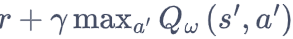，由于 TD 误差目标本身就包含神经网络的输出，因此在更新网络参数的同时目标也在不断地改变，这非常容易造成神经网络训练的不稳定性。

为了解决这一问题，DQN 便使用了**目标网络**（target network）的思想：既然训练过程中 Q 网络的不断更新会导致目标不断发生改变，不如暂时先将 TD 目标中的 Q 网络固定住。为了实现这一思想，我们需要利用两套 Q 网络。

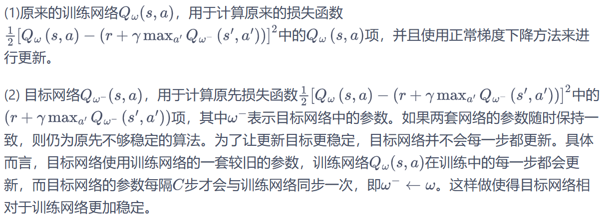

综上所述，DQN 算法的具体流程如下：

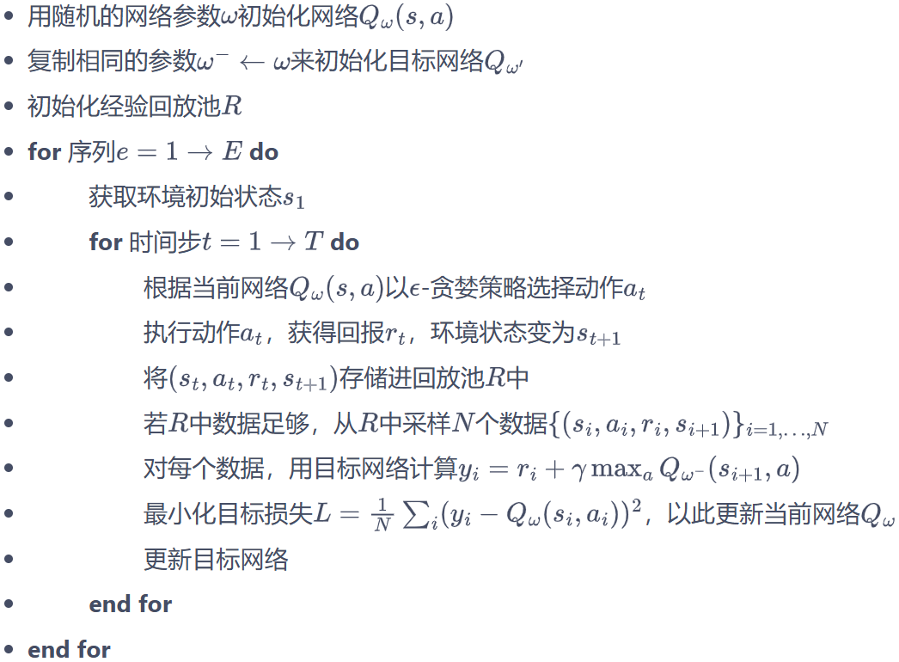

>1. 当前网络 **Qω(s,a)**
>
>    → 你自己（练车的学员）
>
>   - 负责实时判断路况、选择怎么开车（选动作），并不断修正自己的驾驶策略（更新网络参数）。
>
>2. 目标网络 **Qω−(s,a)**
>
>    → 你的教练
>
>   - 他的驾驶策略相对稳定，不会天天变，用来给你提供 “标准答案”（计算目标 Q 值），每隔一段时间才会根据你的进步更新一次。
>
>3. 经验回放池 **R**
>
>    → 你的 “练车日志本”
>
>   - 每次练车的 “路况 - 操作 - 教练反馈 - 下一个路况”，都会记在这个本子里，用来后续复习巩固。
>
>------
>
>逐行拆解伪代码（学车版）
>
>🔹 初始化环节（练车前的准备）
>
>```
>用随机的网络参数ω初始化网络Q_ω(s,a)
>```
>
>👉 大白话：你刚开始练车，还没什么经验，驾驶习惯是随机的（比如偶尔猛踩油门、偶尔急刹车），相当于 “初始驾驶水平是随机的”。
>
>```
>复制相同的参数ω⁻ ← ω来初始化目标网络Q_ω⁻
>```
>
>👉 大白话：教练一开始用和你一样的初始经验来指导你，相当于 “教练的初始驾驶水平和你一样，后续会慢慢更新”。
>
>```
>初始化经验回放池R
>```
>
>👉 大白话：准备一个空白的练车日志本，用来记录每次练车的细节。
>
>------
>
>🔹 外层循环：`for 序列e = 1 → E do`
>
>👉 大白话：你要完整地练 `E` 次路线（比如练 100 次完整的科目三路线），每次都从起点开始。
>
>```
>获取环境初始状态s₁
>```
>
>👉 大白话：每次练车开始，你都回到路线的起点（比如 “科目三起点，车头朝向正前方”）。
>
>------
>
>🔹 内层循环：`for 时间步t = 1 → T do`
>
>👉 大白话：这是你练一次路线里的每一个驾驶步骤（比如 “起步→变道→过路口→停车”，共 `T` 步）。
>
>```
>根据当前网络Q_ω(s,a)以ε-贪婪策略选择动作a_t
>```
>
>👉 大白话：你根据自己当前的驾驶经验（当前网络）来选动作：
>
>- 大部分时候（`1-ε` 概率）：按你认为的最佳方式开（比如 “过路口减速”）。
>- 偶尔（`ε` 概率）：瞎试试新操作（比如 “过路口加速”），用来探索新的驾驶方式（平衡 “利用经验” 和 “探索新方法”）。
>
>```
>执行动作a_t，获得回报r_t，环境状态变为s_{t+1}
>```
>
>👉 大白话：你执行了这个驾驶动作（比如 “减速过路口”），教练给你反馈（比如 “做得好，加 1 分” 或 “压线了，扣 10 分”），然后你开到了下一个路况（比如 “路口后的直行车道”）。
>
>```
>将(s_t, a_t, r_t, s_{t+1})存储进回放池R中
>```
>
>👉 大白话：把这次的 “路况（路口）- 操作（减速）- 反馈（+1 分）- 下一个路况（直行车道）” 记到你的练车日志本里。
>
>```
>若R中数据足够，从R中采样N个数据{(s_i,a_i,r_i,s_{i+1})}_{i=1,...,N}
>```
>
>👉 大白话：等日志本里的记录足够多（比如超过 100 条），就从里面**随机抽 N 条旧记录**（比如抽 5 条）来复习（而不是只看刚发生的新记录）。
>
>```
>对每个数据，用目标网络计算y_i = r_i + γ max_a Q_{ω⁻}(s_{i+1}, a)
>```
>
>👉 大白话：对每条抽出来的旧记录，让教练（目标网络）根据 “下一个路况”，给出他认为的**最佳操作的得分**（目标 Q 值）。
>
>- 比如旧记录是 “路口→减速→+1 分→直行车道”，教练会说：“在直行车道这个路况下，最佳操作是‘保持匀速’，得分是 0.9 分”，所以目标得分 `y_i = 1 + 0.9×0.9 = 1.81`（`γ` 是折扣因子，相当于教练对未来得分的重视程度）。
>
>```
>最小化目标损失L = 1/N ∑_i (y_i - Q_ω(s_i, a_i))²，以此更新当前网络Q_ω
>```
>
>👉 大白话：对比你当时的操作得分（`Q_ω(s_i, a_i)`）和教练的目标得分（`y_i`），计算差距（损失），然后修正自己的驾驶策略（比如 “原来减速过路口的得分应该更高，以后过路口要更稳”），让自己的得分越来越接近教练的标准答案。
>
>```
>更新目标网络
>```
>
>👉 大白话：每隔一段时间（比如练完 10 次路线），教练把他的驾驶策略更新成你当前的最新水平（相当于 “教练也在学习你的进步，更新自己的标准答案”），避免教练的标准太旧。


#### DQN 代码实践

从 DQN 算法开始，我们将会用到`rl_utils`库，它包含一些专门为本书准备的函数，如绘制移动平均曲线、计算优势函数等，不同的算法可以一起使用这些函数。为了能够调用`rl_utils`库，请从本书的[GitHub 仓库](https://github.com/boyu-ai/Hands-on-RL/blob/main/rl_utils.py)下载`rl_utils.py`文件。

```python
import random #R
import gym
import numpy as np#R
import collections#R
from tqdm import tqdm
import torch#Q
import torch.nn.functional as F# 包含ReLU等激活函数 #Q
import matplotlib.pyplot as plt
import rl_utils
```

首先定义经验回放池的类，主要包括加入数据、采样数据两大函数。

```python
class ReplayBuffer:
    ''' 经验回放池 '''
    def __init__(self, capacity):
        self.buffer = collections.deque(maxlen=capacity)  # 队列,先进先出
def add(self, state, action, reward, next_state, done):  # 将数据加入buffer
    self.buffer.append((state, action, reward, next_state, done))

def sample(self, batch_size):  # 从buffer中采样数据,数量为batch_size
    transitions = random.sample(self.buffer, batch_size)
    state, action, reward, next_state, done = zip(*transitions)
    return np.array(state), action, reward, np.array(next_state), done

def size(self):  # 目前buffer中数据的数量
    return len(self.buffer)
```

初始化一个有最大容量限制的队列，作为经验存储容器。

提供`add`方法：把智能体的单次经验（状态、动作、奖励等）存入仓库。

提供`sample`方法：从仓库中**随机抽取指定数量的批量经验**（==核心==，满足独立同分布）。

提供`size`方法：查询仓库当前存储的经验数量（用于判断是否足够采样训练）。

1.类定义与初始化方法：`__init__`（准备一个有容量限制的 “仓库”）

核心亮点：用`collections.deque`实现队列，自动处理 “仓库满了删旧经验” 的逻辑，无需手动编写清理代码，高效简洁。

```py
import collections 
import random 
import numpy as np 
class ReplayBuffer:    ''' 经验回放池 '''    
def __init__(self, capacity):        self.buffer = collections.deque(maxlen=capacity)  # 队列,先进先出
```

依赖库：用到了`collections.deque`（双端队列），这是 Python 内置的高效队列结构，比普通列表更适合 “添加元素 + 自动删旧元素” 的场景。为什么不用普通列表？普通列表`append`（末尾添加）很快，但删除头部元素很慢，而`deque`的自动清理是高效的`O(1)`时间复杂度，适合大量经验的存储和清理。

2. 添加经验方法：`add`（把单次经验存入仓库）

方法参数：这是强化学习中标准的**经验五元组**，记录了智能体的一次完整互动：

- `state`：当前状态（比如 CartPole 的 4 个数值：小车位置、速度等）。
- `action`：智能体在当前状态下执行的动作（比如 CartPole 的 “左” 或 “右”）。
- `reward`：执行动作后获得的即时奖励（比如 CartPole 的 “+1”，表示杆子没倒）。
- `next_state`：执行动作后进入的下一个状态（比如小车移动后的新位置、杆子的新角度）。
- `done`：是否结束当前局（`True`表示杆子倒了 / 小车出界，`False`表示继续）。

3. 随机采样方法：`sample`（核心！从仓库抽批量经验用于训练）

```python
def sample(self, batch_size):  # 从buffer中采样数据,数量为batch_size
        transitions = random.sample(self.buffer, batch_size)
        state, action, reward, next_state, done = zip(*transitions)
        return np.array(state), action, reward, np.array(next_state), done
```

`transitions = random.sample(self.buffer, batch_size)`：

- `random.sample(列表/队列, 采样数量)`：从队列中**随机抽取`batch_size`个不重复的元素**（比如`batch_size=32`，就是随机抽 32 条经验）。
- 核心作用：打破经验的顺序关联（比如原本是 “步骤 1→步骤 2→步骤 3” 的连续经验，随机抽取后变成 “步骤 5→步骤 2→步骤 9”），满足神经网络需要的 ** 独立同分布（iid）** 假设，让训练更稳定。

`state, action, reward, next_state, done = zip(*transitions)`：

- 这是新手最容易困惑的一句，我们拆成两步理解：
  - 第一步：`*transitions`：对`transitions`进行**解包**。`transitions`是一个列表，每个元素是一个 “五元组（s,a,r,s',done）”，解包后相当于把所有五元组作为独立参数传给`zip`。
  - 第二步：`zip(...)`：对解包后的所有五元组进行**按位置打包**。把所有五元组的第 1 个元素（`state`）打包成一个元组，第 2 个元素（`action`）打包成一个元组，以此类推。
- 大白话：把摸出来的 32 张卡片，按 “状态、动作、奖励” 等分类整理，比如把所有卡片上的 “状态” 收集到一起，“动作” 收集到一起，方便后续给神经网络喂数据。

`return np.array(state), action, reward, np.array(next_state), done`：

- 把`state`和`next_state`转换成`numpy`数组：因为后续神经网络训练需要接收`numpy`数组格式的输入，而`action`、`reward`、`done`保持元组即可（后续可按需转换）。
- 返回整理好的 5 组数据，直接用于 DQN 的网络训练（计算损失、更新网络参数）。

4. 查询数量方法：`size`（判断是否足够采样）

```python
    def size(self):  # 目前buffer中数据的数量
        return len(self.buffer)
```

非常简单，返回队列当前的元素数量（即已存储的经验条数）。

核心作用：在 DQN 训练中，需要先判断`buffer.size() >= batch_size`（比如经验数≥32），才会开始采样训练，避免经验不足时采样出错。


然后定义一个只有一层隐藏层的 Q 网络。

```python
class Qnet(torch.nn.Module):
    ''' 只有一层隐藏层的Q网络 '''
    def __init__(self, state_dim, hidden_dim, action_dim):
        super(Qnet, self).__init__()# 调用父类Module的初始化方法，必须有
        self.fc1 = torch.nn.Linear(state_dim, hidden_dim)# 第一层全连接层（输入→隐藏）
        self.fc2 = torch.nn.Linear(hidden_dim, action_dim)# 第二层全连接层（隐藏→输出）
    def forward(self, x):
        x = F.relu(self.fc1(x))  # 隐藏层使用ReLU激活函数
        return self.fc2(x)
```

类定义与继承：`class Qnet(torch.nn.Module):`

继承`torch.nn.Module`：PyTorch 中所有神经网络都必须继承这个基类，它提供了网络参数管理、设备迁移、训练模式切换等核心功能，没有它就无法正常训练网络。

`super(Qnet, self).__init__()`：必须调用父类的初始化方法，初始化`Module`中的核心属性（比如网络参数列表`parameters()`），少了这句话会报错。

全连接层（`torch.nn.Linear`）：也叫 “线性层”，是最基础的神经网络层，作用是对输入数据进行**线性变换**（`y = Wx + b`，W 是权重矩阵，b 是偏置项）。

- `self.fc1`：输入层→隐藏层，输入维度是`state_dim`（比如 4），输出维度是`hidden_dim`（比如 128），相当于把 4 维的状态数据，转换成 128 维的中间特征。
- `self.fc2`：隐藏层→输出层，输入维度是`hidden_dim`（比如 128），输出维度是`action_dim`（比如 2），相当于把 128 维的中间特征，转换成 2 个动作对应的 Q 值。

大白话类比：把网络想象成一个 “价值评估机器”：

- `fc1`：把 “4 个状态指标”（小车位置、速度等）交给 128 个 “数据处理员工”，每个员工输出一个处理后的特征。
- `fc2`：把 128 个员工的处理结果，汇总成 “2 个动作的价值评分”（左移的 Q 值、右移的 Q 值）。

补充：全连接层的权重和偏置会被自动初始化，并且会在后续训练中通过梯度下降更新，无需手动设置。

2. 前向传播方法：`forward`（核心！定义数据计算流程）

```python
def forward(self, x):
        x = F.relu(self.fc1(x))  # 隐藏层使用ReLU激活函数# 隐藏层使用ReLU激活函数，引入非线性
        return self.fc2(x)# 输出层直接返回结果，不使用激活函数
```

这是神经网络的核心方法，定义了输入数据`x`如何通过网络层计算得到输出，逐句拆解：

1. 输入`x`：是`torch.Tensor`（张量）格式的环境状态，形状为`[批量大小, state_dim]`（比如`[32, 4]`，表示 32 个样本，每个样本 4 维状态）。

2. ```
   x = F.relu(self.fc1(x))
   ```

   ：

   - 第一步：`self.fc1(x)`：将输入`x`传入第一层全连接层，进行线性变换，得到隐藏层的线性输出（形状为`[32, 128]`）。
   - 第二步：`F.relu(...)`：对线性输出应用 ReLU 激活函数，进行非线性变换（只保留正向信号，负向信号置 0）。
   - 核心作用：**引入非线性**。如果没有激活函数，多层全连接层等价于一层线性层，无法学习复杂的非线性关系（比如 “小车速度快且杆子角度大时，右移的 Q 值更高” 这种复杂规律）。
   - 大白话：128 个 “数据处理员工” 的输出，经过 “ReLU 筛选器”，只保留有用的正向信号，过滤掉没用的负向信号。

   

3. ```
   return self.fc2(x)
   ```

   ：

   - 将 ReLU 处理后的隐藏层输出（形状`[32, 128]`）传入第二层全连接层，进行线性变换，得到输出结果（形状`[32, 2]`）。
   - 输出层不使用激活函数：因为 Q 值可以是任意实数（正数、负数），而 ReLU 会过滤负数值，sigmoid 会把值限制在 0~1 之间，都不适合 Q 值的输出，所以直接返回线性层结果。
   - 输出结果含义：每个样本对应`action_dim`个 Q 值，比如`[32, 2]`的输出中，每个样本的 2 个值分别对应 “左移” 和 “右移” 的 Q 值。

有了这些基本组件之后，接来下开始实现 DQN 算法:

```python
class DQN:
''' DQN算法 '''
    def __init__(self, state_dim, hidden_dim, action_dim, learning_rate, gamma,
                 epsilon, target_update, device):
        self.action_dim = action_dim
        self.q_net = Qnet(state_dim, hidden_dim,
                          self.action_dim).to(device)  # Q网络

        # 目标网络
​        self.target_q_net = Qnet(state_dim, hidden_dim,
​                                 self.action_dim).to(device)
        # 使用Adam优化器
​        self.optimizer = torch.optim.Adam(self.q_net.parameters(),
​                                          lr=learning_rate)
​        self.gamma = gamma  # 折扣因子
​        self.epsilon = epsilon  # epsilon-贪婪策略
​        self.target_update = target_update  # 目标网络更新频率
​        self.count = 0  # 计数器,记录更新次数
​        self.device = device
def take_action(self, state):  # epsilon-贪婪策略采取动作
    if np.random.random() < self.epsilon:
        action = np.random.randint(self.action_dim)
    else:
        state = torch.tensor([state], dtype=torch.float).to(self.device)
        action = self.q_net(state).argmax().item()
    return action

def update(self, transition_dict):
    states = torch.tensor(transition_dict['states'],
                          dtype=torch.float).to(self.device)
    actions = torch.tensor(transition_dict['actions']).view(-1, 1).to(
        self.device)
    rewards = torch.tensor(transition_dict['rewards'],
                           dtype=torch.float).view(-1, 1).to(self.device)
    next_states = torch.tensor(transition_dict['next_states'],
                               dtype=torch.float).to(self.device)
    dones = torch.tensor(transition_dict['dones'],
                         dtype=torch.float).view(-1, 1).to(self.device)

    q_values = self.q_net(states).gather(1, actions)  # Q值
    # 下个状态的最大Q值
    max_next_q_values = self.target_q_net(next_states).max(1)[0].view(
        -1, 1)
    q_targets = rewards + self.gamma * max_next_q_values * (1 - dones
                                                            )  # TD误差目标
    dqn_loss = torch.mean(F.mse_loss(q_values, q_targets))  # 均方误差损失函数
    self.optimizer.zero_grad()  # PyTorch中默认梯度会累积,这里需要显式将梯度置为0
    dqn_loss.backward()  # 反向传播更新参数
    self.optimizer.step()

    if self.count % self.target_update == 0:
        self.target_q_net.load_state_dict(
            self.q_net.state_dict())  # 更新目标网络
    self.count += 1
```

1. 类的初始化方法：`__init__`（初始化双网络、优化器和超参数）

关键解释：

1. 双网络初始化：`q_net`和`target_q_net`都是`Qnet`的实例，结构完全一致，初始参数也相同（因为`Qnet`的权重是随机初始化的，两个网络初始化后参数一致）。
2. `to(device)`：将网络移到指定设备（比如`cuda:0`表示 GPU，`cpu`表示 CPU），后续所有数据也要移到该设备，否则会报错（数据和网络必须在同一设备上计算）。
3. Adam 优化器：深度学习中常用的优化器，比传统梯度下降更高效，这里**只传入`self.q_net.parameters()`**，表示只更新当前 Q 网络的参数，目标网络的参数不参与梯度更新。
4. `target_update`：目标网络的更新频率（比如传入 100，表示每更新 100 次当前网络，就把目标网络的参数替换成当前网络的参数）。
5. `self.count`：计数器，记录`update`方法被调用的次数，用于触发目标网络的更新。

2. 选动作方法：`take_action`（ε- 贪心策略，基于当前 Q 网络）

```python
 def take_action(self, state):  # epsilon-贪婪策略采取动作
        if np.random.random() < self.epsilon:
            action = np.random.randint(self.action_dim)
        else:
            state = torch.tensor([state], dtype=torch.float).to(self.device)
            action = self.q_net(state).argmax().item()
        return action
```

关键解释（和传统 Q-learning 的 ε- 贪心对比，核心逻辑一致，实现细节不同）：

1. 探索环节：和之前一致，用`np.random.randint`随机选择一个动作，不依赖网络。

2. 利用环节：这是 DQN 和传统 Q-learning 的核心区别（用网络替代 Q 表格）：

   - ```
     torch.tensor([state], dtype=torch.float).to(self.device)
     ```

     ：将输入的

     ```
     state
     ```

     （通常是列表 / 数组）转换成 PyTorch 张量：

     - 加`[]`：将一维状态（比如 CartPole 的 4 维数组）转换成二维张量（形状`[1, 4]`），因为`Qnet`的输入要求有「批量维度」（即使只有一个样本，也要保留批量维度）。
     - `dtype=torch.float`：设置张量数据类型为浮点型，符合网络输入要求。
     - `to(self.device)`：将张量移到和网络相同的设备上，避免设备不匹配报错。

   - `self.q_net(state)`：传入当前 Q 网络，得到该状态下所有动作的 Q 值（形状`[1, action_dim]`，比如`[1, 2]`）。

   - `argmax()`：取 Q 值最大的动作索引（对应最优动作）。

   - `item()`：将张量类型的结果转换成普通 Python 整数，方便返回和后续环境交互。

3. 大白话：大部分时候，学员（当前 Q 网络）根据自己的经验选最优动作；偶尔，随机瞎选，探索新的可能性。

3. 核心更新方法：`update`（双网络更新、损失计算、反向传播，核心中的核心）

```python
def update(self, transition_dict):
        states = torch.tensor(transition_dict['states'],
                              dtype=torch.float).to(self.device)
        actions = torch.tensor(transition_dict['actions']).view(-1, 1).to(
            self.device)
        rewards = torch.tensor(transition_dict['rewards'],
                               dtype=torch.float).view(-1, 1).to(self.device)
        next_states = torch.tensor(transition_dict['next_states'],
                                   dtype=torch.float).to(self.device)
        dones = torch.tensor(transition_dict['dones'],
                             dtype=torch.float).view(-1, 1).to(self.device)
```

关键解释：

- `transition_dict`：从经验回放池`sample`后整理的经验字典，包含`states`（批量状态）、`actions`（批量动作）等 5 组数据，每组数据的长度都是`batch_size`（比如 32）。

- 张量转换：将所有数据转换成张量，移到指定设备，保证和网络计算兼容。

- ```
  view(-1, 1)
  ```

  ：调整张量形状为「列向量」（形状

  ```
  [batch_size, 1]
  ```

  ，比如

  ```
  [32, 1]
  ```

  ）：

  - 作用：保证后续计算时，维度匹配（比如`actions`和`q_values`的维度一致，才能进行`gather`操作）。
  - `-1`：表示自动计算该维度的大小，只需要指定第二个维度为 1，无需手动计算`batch_size`。

- `dones`转换成`torch.float`：因为后续要参与数值计算（`1 - dones`），所以需要浮点型。


```python
# 第二步：计算当前Q值（q_values）：当前状态下，实际执行的动作对应的Q值
q_values = self.q_net(states).gather(1, actions)  # Q值
```

关键解释（新手重点理解`gather`函数）：

- `self.q_net(states)`：传入当前 Q 网络，得到批量状态下所有动作的 Q 值（形状`[batch_size, action_dim]`，比如`[32, 2]`）。

- ```
  gather(1, actions)
  ```

  ：核心函数，作用是「从所有动作的 Q 值中，提取出

  实际执行的动作

  对应的 Q 值」：

  - 第一个参数`1`：表示按「列」维度进行提取（即按动作维度提取）。
  - 第二个参数`actions`：表示要提取的动作索引（形状`[32, 1]`）。

  

- 结果：`q_values`的形状是`[32, 1]`，每个元素对应一个样本「当前状态 - 实际动作」对的 Q 值（这是我们要优化的对象）。

- 大白话：从学员（当前 Q 网络）的评分中，只提取出 “当时实际做的动作” 的评分，而不是所有动作的评分。

```python
# 第三步：计算下个状态的最大Q值（max_next_q_values）：基于目标网络计算（稳定的标准答案）
max_next_q_values = self.target_q_net(next_states).max(1)[0].view(-1, 1)
```

关键解释：

- `self.target_q_net(next_states)`：传入**目标 Q 网络**，得到批量下一状态下所有动作的 Q 值（形状`[32, 2]`）—— 这里不用当前 Q 网络，是为了保证目标 Q 值的稳定性（教练的标准不变）。
- `max(1)`：按「列」维度取最大值（即每个状态下所有动作的最大 Q 值），返回一个元组`(最大值, 最大值索引)`。
- `[0]`：取元组中的第一个元素（即最大 Q 值本身，忽略索引），形状为`[32]`。
- `view(-1, 1)`：调整形状为`[32, 1]`，和`q_values`维度匹配，方便后续计算。
- 大白话：教练（目标网络）对 “下一个路况” 进行评分，给出最优动作的最高评分。

```python
# 第四步：计算目标Q值（q_targets）：TD误差的目标值（标准答案）    
q_targets = rewards + self.gamma * max_next_q_values * (1 - dones)
```

关键解释（核心公式，对应 DQN 的目标 Q 值计算）：

- 公式拆解：`目标Q值 = 即时奖励 + 折扣因子 × 下一状态最大Q值 × （1 - 是否结束）`

- ```
  (1 - dones)
  ```

  ：核心修正项，作用是「如果回合结束（

  ```
  done=True
  ```

  ，即

  ```
  dones=1
  ```

  ），则未来奖励不计入」：

  - 当`done=True`（比如 CartPole 杆子倒了）：`1 - dones=0`，后面的未来奖励项被置 0，目标 Q 值就等于即时奖励，避免计算无效的未来奖励。
  - 当`done=False`（回合继续）：`1 - dones=1`，正常计算未来奖励的折现值。

- 大白话：标准答案 = 当时的教练反馈（即时奖励） + 教练预估的未来最优奖励（折扣后），如果游戏结束，就只算当时的反馈。


```python
# 第五步：计算损失函数（均方误差MSE）    
dqn_loss = torch.mean(F.mse_loss(q_values, q_targets))
```

关键解释：

- `F.mse_loss(q_values, q_targets)`：计算`q_values`（当前 Q 值）和`q_targets`（目标 Q 值）之间的**均方误差**（每个样本的误差平方），形状为`[32, 1]`。
- `torch.mean()`：对所有样本的均方误差取平均值，得到整个批量的平均损失（标量）。
- 损失的含义：当前 Q 网络的预测值（`q_values`）和标准答案（`q_targets`）之间的差距，差距越小，说明网络学得越好。


```python
# 第六步：反向传播，更新当前Q网络的参数
self.optimizer.zero_grad()  # PyTorch中默认梯度会累积,这里需要显式将梯度置为0
        dqn_loss.backward()  # 反向传播更新参数
        self.optimizer.step()
```

关键解释（PyTorch 训练的固定流程）：

- `self.optimizer.zero_grad()`：清空上一次训练的梯度，避免梯度累积导致更新错误（比如上一次的梯度会影响本次的更新）。
- `dqn_loss.backward()`：反向传播算法，从损失值出发，计算当前 Q 网络所有可训练参数（`fc1`、`fc2`的权重和偏置）的梯度。
- `self.optimizer.step()`：Adam 优化器根据计算出的梯度，更新当前 Q 网络的参数（即 “学员根据差距修正自己的经验”）。
- 注意：目标 Q 网络的参数不会被更新，它的参数只有在后续同步时才会变化。


```python
 # 第七步：定期更新目标网络（同步当前Q网络的参数）
if self.count % self.target_update == 0:
            self.target_q_net.load_state_dict(
                self.q_net.state_dict())  # 更新目标网络
        self.count += 1
```

关键解释：

- `self.count % self.target_update == 0`：判断计数器是否是目标网络更新频率的倍数（比如每 100 次更新当前网络，同步一次目标网络）。

- ```
  self.target_q_net.load_state_dict(self.q_net.state_dict())
  ```

  ：核心同步操作：

  - `self.q_net.state_dict()`：获取当前 Q 网络的所有参数（权重、偏置），以字典形式存储。
  - `load_state_dict()`：将当前 Q 网络的参数加载到目标 Q 网络中，实现两个网络的参数同步（即 “教练更新自己的教学标准，和学员的最新水平保持一致”）。

- `self.count += 1`：计数器加 1，记录本次更新。

- 大白话：每过一段时间，教练就把学员的最新经验复制过来，更新自己的教学标准，保证标准答案的时效性。


一切准备就绪，开始训练并查看结果。我们之后会将这一训练过程包装进`rl_utils`库中，方便之后要学习的算法的代码实现。

```python
lr = 2e-3
num_episodes = 500
hidden_dim = 128
gamma = 0.98
epsilon = 0.01
target_update = 10
buffer_size = 10000
minimal_size = 500
batch_size = 64
device = torch.device("cuda") if torch.cuda.is_available() else torch.device(
    "cpu")

env_name = 'CartPole-v0'
env = gym.make(env_name)
random.seed(0)
np.random.seed(0)
env.seed(0)
torch.manual_seed(0)
replay_buffer = ReplayBuffer(buffer_size)
state_dim = env.observation_space.shape[0]
action_dim = env.action_space.n
agent = DQN(state_dim, hidden_dim, action_dim, lr, gamma, epsilon,
            target_update, device)

return_list = []
for i in range(10):
    with tqdm(total=int(num_episodes / 10), desc='Iteration %d' % i) as pbar:
        for i_episode in range(int(num_episodes / 10)):
            episode_return = 0
            state = env.reset()
            done = False
            while not done:
                action = agent.take_action(state)
                next_state, reward, done, _ = env.step(action)
                replay_buffer.add(state, action, reward, next_state, done)
                state = next_state
                episode_return += reward

                # 当buffer数据的数量超过一定值后,才进行Q网络训练

​                if replay_buffer.size() > minimal_size:
​                    b_s, b_a, b_r, b_ns, b_d = replay_buffer.sample(batch_size)
​                    transition_dict = {
​                        'states': b_s,
​                        'actions': b_a,
​                        'next_states': b_ns,
​                        'rewards': b_r,
​                        'dones': b_d
​                    }
​                    agent.update(transition_dict)
​            return_list.append(episode_return)
​            if (i_episode + 1) % 10 == 0:
​                pbar.set_postfix({
​                    'episode':
​                    '%d' % (num_episodes / 10 * i + i_episode + 1),
​                    'return':
​                    '%.3f' % np.mean(return_list[-10:])
​                })
​            pbar.update(1)
```

**`gym`**：OpenAI 推出的强化学习环境库，`CartPole-v0`是其中的经典简单环境，我们用它来练手。

**`tqdm`**：Python 的进度条工具，用于可视化训练进度，方便观察训练是否在正常进行。

**CartPole 的奖励机制**：每一步杆子保持不倒，就会获得`+1`的奖励，局的总奖励（`episode_return`）就是智能体存活的步数，总奖励越高，说明智能体表现越好（理想状态下最高可以达到 200）。

```py
import gym import random import numpy as np import torch from tqdm import tqdm # 假设之前的ReplayBuffer、Qnet、DQN类已经提前定义
```

第一部分：超参数设置（训练的 “配置项”，每个都有明确作用）

```python
lr = 2e-3
num_episodes = 500
hidden_dim = 128
gamma = 0.98
epsilon = 0.01
target_update = 10
buffer_size = 10000
minimal_size = 500
batch_size = 64
device = torch.device("cuda") if torch.cuda.is_available() else torch.device(
    "cpu")
```

关键解释：

- 超参数的取值：这些是针对 CartPole 环境的经典合理取值，新手不用修改，先跑通再调参。
- `2e-3`：科学计数法，等价于`0.002`，深度学习中学习率通常取这个量级（太大容易训练震荡，太小收敛太慢）。
- `minimal_size = 500`：核心作用是 “先收集足够经验，再开始训练”，避免一开始经验太少，采样的样本没有代表性，导致训练不稳定。
- 设备自动选择：`torch.cuda.is_available()`判断是否有可用 GPU，GPU 能大幅提升训练速度，没有则自动切换到 CPU，保证代码的可移植性。

2. 第二部分：环境与各类组件初始化（训练前的 “准备工作”）

```python
env_name = 'CartPole-v0'
env = gym.make(env_name)
random.seed(0)
np.random.seed(0)
env.seed(0)
torch.manual_seed(0)
replay_buffer = ReplayBuffer(buffer_size)# 初始化经验回放池（容量10000）
state_dim = env.observation_space.shape[0]
action_dim = env.action_space.n
agent = DQN(state_dim, hidden_dim, action_dim, lr, gamma, epsilon,
            target_update, device)
```

关键解释：

- `gym.make(env_name)`：创建指定名称的环境实例，后续通过`env`和游戏环境交互。
- 设置随机种子：`random`、`np`、`env`、`torch`的种子都设为 0，目的是**让所有随机操作的结果固定**（比如 ε- 贪心的随机探索、网络初始化的权重、环境的随机初始状态），这样每次运行代码，训练结果都一致，方便调试和对比（如果不设种子，每次运行结果都不一样，难以判断调参是否有效）。
- 从环境获取维度：
  - `env.observation_space.shape[0]`：获取环境状态空间的维度（CartPole 的状态是 4 维数组，所以`shape[0]=4`）。
  - `env.action_space.n`：获取环境的可选动作数（CartPole 只有 2 个动作，所以`n=2`）。
  - 优势：这是通用方法，换其他环境（比如`MountainCar-v0`）时，无需手动修改`state_dim`和`action_dim`，代码兼容性更强。
- `agent = DQN(...)`：初始化我们之前定义的 DQN 智能体，传入所有必要参数，智能体准备就绪。

3. 第三部分：核心训练循环（最关键，智能体的 “学习过程”）

```python
return_list = []
for i in range(10):
    with tqdm(total=int(num_episodes / 10), desc='Iteration %d' % i) as pbar:
        for i_episode in range(int(num_episodes / 10)):
            episode_return = 0
            state = env.reset()
            done = False
            while not done:
                action = agent.take_action(state)
                next_state, reward, done, _ = env.step(action)
                replay_buffer.add(state, action, reward, next_state, done)
                state = next_state
                episode_return += reward
                # 当buffer数据的数量超过一定值后,才进行Q网络训练
                if replay_buffer.size() > minimal_size:
                    b_s, b_a, b_r, b_ns, b_d = replay_buffer.sample(batch_size)
                    transition_dict = {
                        'states': b_s,
                        'actions': b_a,
                        'next_states': b_ns,
                        'rewards': b_r,
                        'dones': b_d
                    }
                    agent.update(transition_dict)
            return_list.append(episode_return)
            if (i_episode + 1) % 10 == 0:
                pbar.set_postfix({
                    'episode':
                    '%d' % (num_episodes / 10 * i + i_episode + 1),
                    'return':
                    '%.3f' % np.mean(return_list[-10:])
                })
            pbar.update(1)
```

关键解释（分层细化）：

##### （1） 外层迭代循环（`for i in range(10)`）

- 目的：将 500 局游戏分成 10 个批次，每个批次 50 局，方便用`tqdm`显示进度条（如果直接 500 局，进度条太长，不易观察）。
- `with tqdm(...) as pbar`：创建上下文管理器，自动管理进度条，循环结束后进度条自动关闭，无需手动清理。

##### （2） 内层局循环（`for i_episode in range(50)`）

- 每个迭代处理 50 局游戏，每一局都是一次独立的 “小车顶杆子” 尝试。
- `episode_return = 0`：每一局开始前，重置总奖励计数器（记录该局存活的步数）。
- `state = env.reset()`：重置环境到初始状态（比如小车在中间，杆子竖直），返回初始状态数据。
- `done = False`：重置局结束标记，开始新一局的互动。

##### （3） 局内互动循环（`while not done`）—— 每一步的核心操作

这是智能体和环境互动、收集经验、学习的核心，逐句解释：

1. `action = agent.take_action(state)`：调用之前`DQN`类的`take_action`方法，用 ε- 贪心策略选择动作（99% 选最优，1% 随机探索）。

2. ```
   next_state, reward, done, _ = env.step(action)
   ```

   ：执行选中的动作，获取环境的 4 个反馈：

   - `next_state`：执行动作后的新状态（小车移动后的位置、杆子的新角度）。
   - `reward`：执行动作后的即时奖励（杆子没倒，奖励`+1`）。
   - `done`：是否结束该局（`True`表示杆子倒了 / 小车出界，`False`表示继续）。
   - `_`：额外信息（CartPole 中无有效信息，用下划线忽略）。

3. `replay_buffer.add(...)`：将本次互动的 “五元组经验” 存入经验回放池（积累经验，后续用于训练）。

4. `state = next_state`：更新当前状态为新状态，为下一步动作做准备（相当于 “小车移动到新位置，准备下一步操作”）。

5. `episode_return += reward`：累加奖励（该局存活步数 + 1）。

6. ```
   if replay_buffer.size() > minimal_size
   ```

   ：判断经验池是否积累了足够的经验（>500 条），只有满足条件才开始训练：

   - 原因：经验不足时，采样的样本没有代表性，训练效果差，甚至会导致网络震荡，所以先 “攒经验”，再 “学经验”。
   - 采样经验→构建字典→调用`agent.update`：这三步衔接之前的`ReplayBuffer`和`DQN`类，完成一次 Q 网络的训练（计算损失、反向传播、更新参数、定期同步目标网络）。
   - 注意：**每一步都可能触发一次网络训练**（只要经验足够），而不是每一局只训练一次，这样能让智能体更快学习。

##### （4） 局结束后的操作

1. `return_list.append(episode_return)`：将该局的总奖励存入列表，后续用于分析训练效果（比如绘制奖励曲线，看是否逐渐上升）。

2. ```
   pbar.set_postfix(...)
   ```

   ：每 10 局更新一次进度条的附加信息，显示两个关键内容：

   - `episode`：当前完成的总局数（方便知道训练进度）。
   - `return`：最近 10 局的平均奖励（比单局奖励更能反映智能体的稳定表现，平均奖励越高，说明智能体越稳定，学得越好）。

3. `pbar.update(1)`：进度条前进 1 步，表示完成了 1 局游戏。

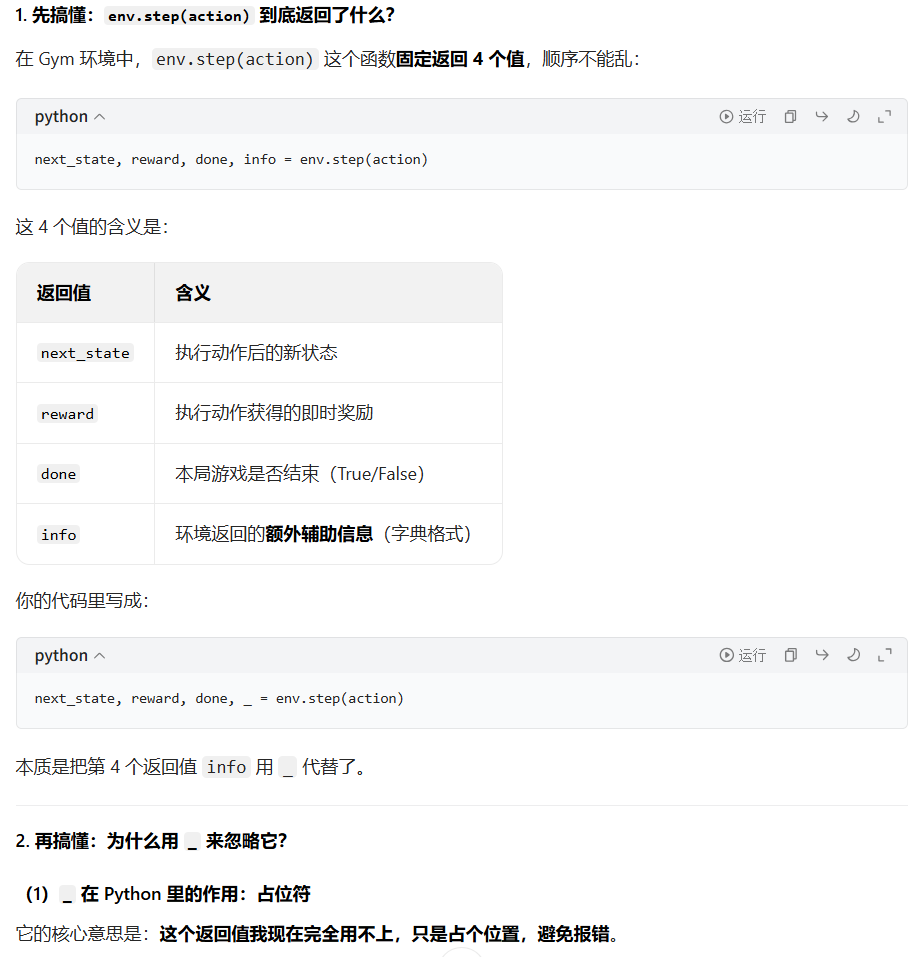


```python
episodes_list = list(range(len(return_list)))
plt.plot(episodes_list, return_list)
plt.xlabel('Episodes')
plt.ylabel('Returns')
plt.title('DQN on {}'.format(env_name))
plt.show()

mv_return = rl_utils.moving_average(return_list, 9)
plt.plot(episodes_list, mv_return)
plt.xlabel('Episodes')
plt.ylabel('Returns')
plt.title('DQN on {}'.format(env_name))
plt.show()
```

`return_list`：记录了每一局游戏的总奖励（比如 500 局，就有 500 个数值），是绘图的「y 轴数据」。

`env_name`：环境名称（CartPole-v0），用于设置图表标题。

第一部分：绘制「原始奖励折线图」

```python
episodes_list = list(range(len(return_list)))
plt.plot(episodes_list, return_list)
plt.xlabel('Episodes')
plt.ylabel('Returns')
plt.title('DQN on {}'.format(env_name))
plt.show()
```

#### 逐句关键解释：

1. `episodes_list = list(range(len(return_list)))`

- `len(return_list)`：获取总训练局数（比如 500 局，返回 500）。
- `range(len(return_list))`：生成一个从 0 到 499 的整数序列（对应第 0 局到第 499 局）。
- `list(...)`：把序列转换成列表，作为图表的「x 轴数据」（每一个 x 值对应一局游戏）。
- 大白话：给每一局的奖励 “编个号”，方便在图表上按顺序排列。

1. `plt.plot(episodes_list, return_list)`

- `plt.plot(x轴数据, y轴数据)`：matplotlib 的核心绘图函数，用于绘制「折线图」。
- 这里 x 轴是 “局数”，y 轴是 “该局的总奖励”，绘制后会得到一条「原始奖励曲线」。
- 原始曲线的特点：**波动很大**（因为智能体有 ε- 贪心探索，偶尔会随机选动作导致局提前结束，奖励骤降；也可能偶尔超水平发挥，奖励骤升）。

1. `plt.xlabel()` / `plt.ylabel()` / `plt.title()`

- 这三个函数是给图表加 “注释”，让别人能看懂图表的含义，也让图表更美观规范。
- `format(env_name)`：把环境名（CartPole-v0）填入标题中，实现标题的动态生成（换其他环境时，标题会自动更新）。

1. `plt.show()`

- 核心作用：**显示绘制好的图表**（如果没有这句话，matplotlib 只会在内存中生成图表，不会在屏幕上显示）。
- 执行这句话后，你会看到一个弹出的窗口，里面是原始奖励折线图。

第二部分：绘制「滑动平均奖励折线图」（核心！更易判断训练效果）

这是可视化的关键，因为原始曲线波动太大，很难看出整体学习趋势，而「滑动平均」能平滑波动，清晰展现智能体的进步轨迹。

```python
mv_return = rl_utils.moving_average(return_list, 9)
plt.plot(episodes_list, mv_return)
plt.xlabel('Episodes')
plt.ylabel('Returns')
plt.title('DQN on {}'.format(env_name))
plt.show()
```

#### 逐句关键解释：

1. `mv_return = rl_utils.moving_average(return_list, 9)`

- 先搞懂：什么是「滑动平均」？

  用大白话讲：**取 “最近 N 局” 的奖励平均值，作为当前局的 “平滑奖励”，然后像 “滑动窗口” 一样，逐局往后计算**。

  这里`9`就是「窗口大小」，表示每次取最近 9 局的奖励计算平均值。

  举例：第 10 局的平滑奖励 = 第 2 局到第 10 局的奖励平均值；第 11 局的平滑奖励 = 第 3 局到第 11 局的奖励平均值，以此类推。

- 再搞懂：`rl_utils.moving_average()`

  - `rl_utils`：是一个常用的**强化学习工具库**（里面封装了滑动平均、结果保存等实用函数，很多教程都会用到）。

  - `moving_average(原始数据, 窗口大小)`：核心功能是对原始数据进行平滑处理，过滤波动噪声，让曲线更平缓。

  - 为什么窗口大小是9？

    选择奇数窗口（5、9、11）更平稳，9是合理取值：太小（比如 3）平滑效果差，太大（比如 21）会让曲线滞后，无法及时反映学习趋势。

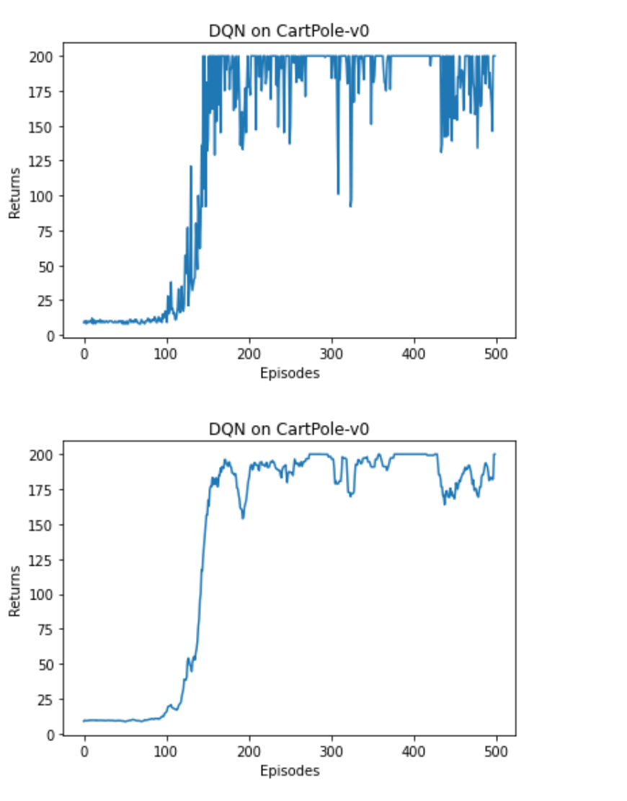

可以看到，DQN 的性能在 100 个序列后很快得到提升，最终收敛到策略的最优回报值 200。我们也可以看到，在 DQN 的性能得到提升后，它会持续出现一定程度的震荡，这主要是神经网络过拟合到一些局部经验数据后由运算带来的影响。


#### 以图像为输入的 DQN 算法

在本书前面章节所述的强化学习环境中，我们都使用非图像的状态作为输入（例如车杆环境中车的坐标、速度），但是在一些视频游戏中，智能体并不能直接获取这些状态信息，而只能直接获取屏幕中的图像。要让智能体和人一样玩游戏，我们需要让智能体学会以图像作为状态时的决策。

我们可以利用 7.4 节的 DQN 算法，将卷积层加入其网络结构以提取图像特征，最终实现以图像为输入的强化学习。以图像为输入的 DQN 算法的代码与 7.4 节的代码的不同之处主要在于 Q 网络的结构和数据输入。

DQN 网络通常会将最近的几帧图像一起作为输入，从而感知环境的动态性。接下来我们实现以图像为输入的 DQN 算法，但由于代码需要运行较长的时间，我们在此便不展示训练结果。


```python
class ConvolutionalQnet(torch.nn.Module):
    ''' 加入卷积层的Q网络 '''
    def __init__(self, action_dim, in_channels=4):
        super(ConvolutionalQnet, self).__init__()
        self.conv1 = torch.nn.Conv2d(in_channels, 32, kernel_size=8, stride=4)
        self.conv2 = torch.nn.Conv2d(32, 64, kernel_size=4, stride=2)
        self.conv3 = torch.nn.Conv2d(64, 64, kernel_size=3, stride=1)
        self.fc4 = torch.nn.Linear(7 * 7 * 64, 512)
        self.head = torch.nn.Linear(512, action_dim)		
    def forward(self, x):
        x = x / 255
        x = F.relu(self.conv1(x))
        x = F.relu(self.conv2(x))
        x = F.relu(self.conv3(x))
        x = F.relu(self.fc4(x))
        return self.head(x)
```


1. 类定义与初始化方法：`__init__`（构建卷积 + 全连接的网络结构）

```python
class ConvolutionalQnet(torch.nn.Module):
    ''' 加入卷积层的Q网络 '''
    def __init__(self, action_dim, in_channels=4):
        super(ConvolutionalQnet, self).__init__()
        self.conv1 = torch.nn.Conv2d(in_channels, 32, kernel_size=8, stride=4)
        self.conv2 = torch.nn.Conv2d(32, 64, kernel_size=4, stride=2)
        self.conv3 = torch.nn.Conv2d(64, 64, kernel_size=3, stride=1)
        self.fc4 = torch.nn.Linear(7 * 7 * 64, 512)
        self.head = torch.nn.Linear(512, action_dim)
```

关键解释：

##### （1）初始化参数说明

- `action_dim`：动作维度（可选动作数，如 Atari 游戏的 “上、下、左、右”），和之前的 Qnet 一致。
- `in_channels=4`：输入图像的通道数，默认 4（对应强化学习中常用的 “堆叠 4 帧画面”，捕捉运动信息，比如球的移动方向），可根据场景调整（如灰度图设为 1）。

##### （2）卷积层（`torch.nn.Conv2d`）核心参数解读（新手重点）

每个卷积层的参数格式：`Conv2d(输入通道数, 输出通道数, 卷积核大小, 步长)`

- 「输入通道数」：上一层的输出通道数（第一层对应`in_channels`，后续对应前一层的输出通道数）。
- 「输出通道数」：卷积核的数量（如 32 表示用 32 个不同的卷积核，提取 32 种不同特征），数量越多，提取的特征越丰富。
- 「kernel_size（卷积核大小）」：卷积核的边长（如 8 表示 8×8 的正方形卷积核），用于遍历图像提取局部特征。
- 「stride（步长）」：卷积核每次滑动的像素数（如 4 表示每次移动 4 个像素），步长越大，输出图像尺寸越小，计算效率越高。

##### （3）三层卷积层的作用（由浅入深提取特征）

- 第 1 层（`conv1`）：8×8 卷积核、步长 4，把输入图像缩小，提取**初级特征**（如画面的边缘、明暗纹理）。
- 第 2 层（`conv2`）：4×4 卷积核、步长 2，进一步缩小图像，提取**中级特征**（如游戏中的球拍、砖块轮廓）。
- 第 3 层（`conv3`）：3×3 卷积核、步长 1，微调特征，提取**高级特征**（如 “球拍在画面左侧”“球正在下落” 这类语义信息）。

##### （4）全连接层的输入维度（`7*7*64`）解读

- 经过三层卷积后，原本的 Atari 游戏画面（210×160）会被缩小为`7×7`的特征图（这是行业内的经典配置，无需手动计算，记住结果即可）。
- 第三层卷积的输出是「64 个 7×7 的特征图」，展平成一维向量后，维度就是`7*7*64=3136`，这就是`fc4`的输入维度。
- `self.fc4`：把 3136 维的特征向量整合为 512 维，`self.head`再把 512 维特征转换成`action_dim`维的 Q 值，和之前的 Qnet 输出逻辑一致。


2. 前向传播方法：`forward`（定义图像从输入到输出 Q 值的计算流程）

```python
def forward(self, x):
        x = x / 255
        x = F.relu(self.conv1(x))
        x = F.relu(self.conv2(x))
        x = F.relu(self.conv3(x))
        x = F.relu(self.fc4(x))
        return self.head(x)
```

关键解释（逐句拆解）：

1. `x = x / 255`：**像素归一化**，这是处理图像的必备步骤：

- 图像像素值的范围是 0~255，数值差距较大，直接输入网络会导致梯度波动，训练不稳定。
- 除以 255 后，像素值被压缩到 0~1 区间，数据分布更均匀，能大幅加快网络收敛速度。

1. 卷积层 + ReLU 激活：`F.relu(self.convX(x))`

- 和之前全连接层的 ReLU 作用一致，**引入非线性**，让网络能学习复杂的视觉特征关联（比如 “球在球拍上方时，向上移动的 Q 值更高”）。
- 每一层卷积后都必须加激活函数，否则多层卷积等价于一层线性变换，无法提取复杂特征。

1. `x = F.relu(self.fc4(x))`：

- 卷积层输出的是「4 维张量」（形状：`[批量大小, 64, 7, 7]`），传入全连接层时，PyTorch 会**自动将其展平为一维向量**（形状：`[批量大小, 3136]`），无需手动调用`view()`。
- 经过`fc4`整合后，特征向量变为 512 维，再用 ReLU 激活过滤无效特征。

1. `return self.head(x)`：输出层直接返回 Q 值，不使用激活函数（Q 值可以是任意实数，无需限制范围），和之前的 Qnet 一致。


#### 小结

本章讲解了 DQN 算法，其主要思想是用一个神经网络来表示最优策略的函数，然后利用 Q-learning 的思想进行参数更新。

为了保证训练的稳定性和高效性，DQN 算法引入了经验回放和目标网络两大模块，使得算法在实际应用时能够取得更好的效果。

在 2013 年的 NIPS 深度学习研讨会上，DeepMind 公司的研究团队发表了 DQN 论文，首次展示了这一直接通过卷积神经网络接受像素输入来玩转各种雅达利（Atari）游戏的强化学习算法，由此拉开了深度强化学习的序幕。DQN 是深度强化学习的基础，掌握了该算法才算是真正进入了深度强化学习领域，本书中还有更多的深度强化学习算法等待读者探索。


