# RL基本原理

强化学习的两类思路：

一个是基于值，另一个是基于策略：

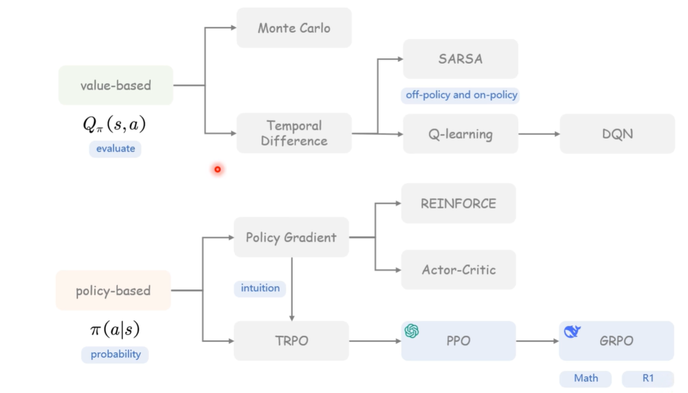

### 时序差分(Temporal Difference)TD算法

我们的目的就是去找到一种方法能够`估计`在一个状态下做出动作，他的一个价值。

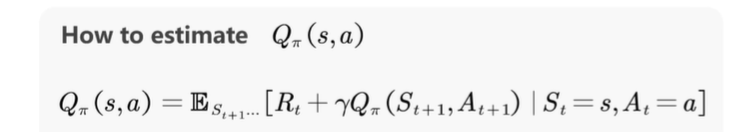


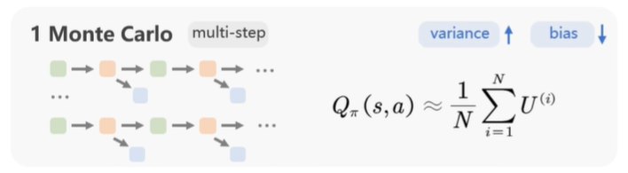

蒙特卡洛：是一长串多步估计，没有去考虑。

我玩完这一局游戏，我这里面不是有很多随机性吗，但我玩完它这个就确定下来，你没有去考虑它那么多期望、随机性，你就是相当于做了一个很多采样，我们知道很多变量它本身就有方差，如果把很多变量的方差叠加起来，他这个方差肯定是会很大的，但是因为你采取了这么一整条轨迹，我可以对它的return做一个很精确的一个计算，所以偏差可能会小。

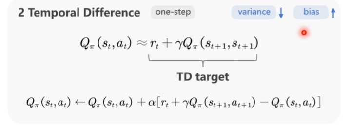

时序差分：相比于蒙特卡洛，他的方差会比较小，但是他的偏差可能就会比较大，因为它就是对一步做了一个估计。


TD算法有两种应用：一种叫SARSA，一种叫Q-learning


# 动手学强化学习

## 基础篇

关注回报的期望，并将其定义为价值（value），这就是强化学习中智能体学习的优化目标。

**占用度量**：归一化的占用度量用于衡量在一个智能体决策与一个动态环境的交互过程中，采样到**一个具体的状态动作对**（state-action pair）的**概率分布**。

* 强化学习的一大难点就在于，智能体看到的数据分布是随着智能体的学习而不断发生改变的。

* 由于奖励建立在状态动作对之上，一个策略对应的价值其实就是一个占用度量下对应的奖励的期望，因此寻找最优策略对应着寻找最优占用度量。

有监督学习任务，我们的目标是找到一个最优的模型函数，使其在训练数据集上最小化一个给定的损失函数。在训练数据独立同分布的假设下，这个优化目标表示**最小化**模型在整个数据分布上的泛化误差（generalization error），用简要的公式可以概括为：

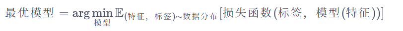

强化学习任务的最终优化目标是**最大化**智能体策略在和动态环境交互过程中的价值。策略的价值可以等价转换成**奖励函数在策略的占用度量上的期望**，即：


* 有监督学习和强化学习的优化目标相似，即都是在**优化某个数据分布下的一个分数值的期望**。

* 二者**优化的途径是不同的**:

  `有监督学习`直接通过优化模型对于数据特征的输出来优化目标，即`修改目标函数而数据分布不变`；

  `强化学习`则通过改变策略来调整智能体和环境交互数据的分布，进而优化目标，即`修改数据分布而目标函数不变`。

一般有监督学习和强化学习的范式之间的区别为：

- 一般的有监督学习关注寻找一个模型，使其在给定数据分布下得到的损失函数的期望最小；

- 强化学习关注寻找一个智能体策略，使其在与动态环境交互的过程中产生最优的数据分布，即最大化该分布下一个给定奖励函数的期望。

### 多臂老虎机（multi-armed bandit，MAB）问题

与强化学习不同，多臂老虎机`不存在状态信息`，只有动作和奖励，算是最简单的“和环境交互中的学习”的一种形式。

多臂老虎机中的**探索与利用**（exploration vs. exploitation）问题一直以来都是一个特别经典的问题，理解它能够帮助我们学习强化学习。

估计期望奖励更新算法流程：

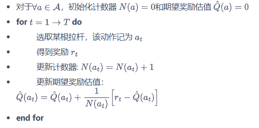

第四步的增量式的期望更新公式如下：

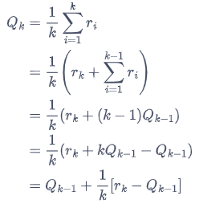

如果将所有数求和再除以次数，其缺点是每次更新的时间复杂度和空间复杂度均为O(n),而采用增量式更新，时间复杂度和空间复杂度均为O(1)。


#### ε-贪心算法

以概率ε随机选择一根拉杆（探索）

选择以往经验中期望奖励估值最大的那根拉杆（利用）1-ε

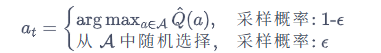

随着探索次数的不断增加，我们对各个动作的奖励估计得越来越准，此时我们就没必要继续花大力气进行探索。

具体实现中令ε随时间衰减，即探索的概率将会不断降低。

#### 上置信界算法（upper confidence bound，UCB）

上置信界算法便选取期望奖励上界最大的动作

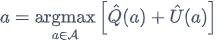

不确定性度量U(a)

#### 汤普森采样算法

之前我们知道了 “用抽样选最优拉杆”，但得先知道 “每台老虎机的赢钱概率大概是多少”，还得拉一次就更新一次这个概率 —— 这段就是讲 “怎么记录 + 更新每台老虎机的赢钱概率”。

**核心点 1：用 Beta 分布当 “概率记录本”**

不用管 “Beta 分布” 的复杂数学，你可以把它理解成：**专门用来表示 “某台老虎机赢钱概率的可能性范围” 的工具**。

比如某台机器的 Beta 分布，能体现 “它赢钱概率是 30%？还是 50%？哪种可能性更大”。

**核心点 2：怎么用 “拉拉杆的输赢记录” 填这个 “记录本”**

假设你拉了某台老虎机`k次`：

- 其中`m₁次赢了`（奖励是 1）

- m₂次输了（奖励是 0）

  （其实 k 就是 m₁+m₂，比如拉 5 次，赢 3 次输 2 次，k=5，m₁=3，m₂=2）

这台老虎机的 “赢钱概率范围”，就用**参数是 (m₁+1, m₂+1) 的 Beta 分布**来表示。

比如上面的例子，参数就是 (3+1, 2+1)=(4,3)—— 这个 Beta 分布就能反映 “这台机实际赢钱概率的可能性”。

**核心点 3：怎么更新这个 “记录本”**

每次拉这台老虎机，都记录 “赢了还是输了”：

- 要是赢了，就把 m₁加 1，参数里的第一个数也跟着加 1；
- 要是输了，就把 m₂加 1，参数里的第二个数也跟着加 1。

拉的次数越多，这个 Beta 分布就越接近这台老虎机的**真实赢钱概率**（相当于 “记录本” 越记越准）。

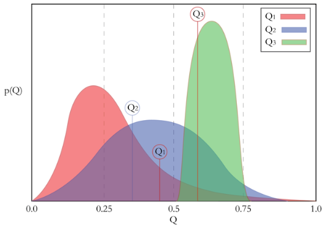

不同颜色的曲线（Q1 粉、Q2 蓝、Q3 绿）：对应**不同的老虎机（不同拉杆）**的 “赢钱概率可能性分布”（也就是之前说的 Beta 分布）。

你看每条曲线旁边的点（比如 Q1 的点在 0.5 附近，Q3 的点在 0.75 附近），其实是**从这台老虎机的概率分布里 “抽的一个样本”**（比如从 Q3 的分布里抽到了 0.75 这个赢钱概率）。

汤普森采样就是：从每台机器的曲线里抽一个样本，选样本里赢钱概率最大的那台（比如这次 Q3 的样本最大，就拉 Q3 对应的老虎机）。

#### 总结

多臂老虎机问题与强化学习的一大区别在于其与环境的交互并不会改变环境，即多臂老虎机的每次交互的结果和以往的动作无关，所以可看作**无状态的强化学习**（stateless reinforcement learning）。


### 马尔可夫决策过程（MDP）

**马尔可夫决策过程**（Markov decision process，MDP）是强化学习的重要概念。

如果要用强化学习去解决一个实际问题，第一步要做的事情就是把这个实际问题抽象为一个马尔可夫决策过程，也就是明确马尔可夫决策过程的各个组成要素。

本章将从马尔可夫过程出发，一步一步地进行介绍，最后引出马尔可夫决策过程。

#### 马尔可夫过程（马尔可夫链）

##### 随机过程

**随机过程**（stochastic process）是概率论的“动力学”部分。概率论的研究对象是静态的随机现象，而随机过程的研究对象是随时间演变的随机现象（例如天气随时间的变化、城市交通随时间的变化）。

##### 马尔可夫性质

当且仅当某时刻的状态只取决于上一时刻的状态时，一个随机过程被称为具有**马尔可夫性质**（Markov property），用公式表示为

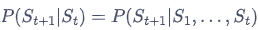

`需要明确的是，具有马尔可夫性并不代表这个随机过程就和历史完全没有关系`。通过这种链式的关系，历史的信息被传递到了现在。马尔可夫性可以大大简化运算，因为只要当前状态可知，所有的历史信息都不再需要了，利用当前状态信息就可以决定未来。

##### 马尔可夫过程（马尔可夫链）

**马尔可夫过程**（Markov process）指具有马尔可夫性质的随机过程，也被称为**马尔可夫链**（Markov chain）。

通常用元组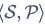描述一个马尔可夫过程，S是有限数量的状态集合，P是**状态转移矩阵**（state transition matrix)。


#### 马尔可夫奖励过程

在马尔可夫过程的基础上加入奖励函数r和折扣因子γ，就可以得到**马尔可夫奖励过程**（Markov reward process）一个马尔可夫奖励过程由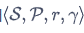构成


##### 回报

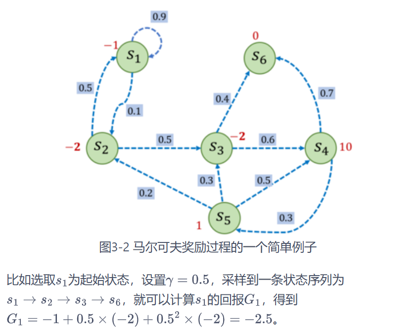

核心是实现**折扣累计回报**的递推计算，反向遍历 + 递推公式是高效实现的关键。


##### 价值函数

在马尔可夫奖励过程中，一个状态的期望回报（即从这个状态出发的未来累积奖励的期望）被称为这个状态的**价值**（value）。所有状态的价值就组成了**价值函数**（value function），价值函数的输入为某个状态，输出为这个状态的价值。

一方面，即时奖励的期望正是奖励函数的输出；


`状态 s 的价值 = 当前状态的即时奖励期望 + 未来所有可能转移到的状态的价值的折扣期望`


因此，整个向量 V 作为未知量，会同时出现在方程的左右两边 —— 左边是我们要求的价值，右边是计算价值时用到的未来价值，而未来价值就是我们要求的价值本身。

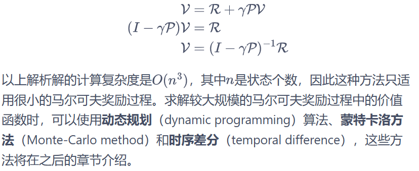


#### 马尔可夫决策过程

讨论到的马尔可夫过程和马尔可夫奖励过程都是自发改变的随机过程；而如果有一个外界的“刺激”来共同改变这个随机过程，就有了**马尔可夫决策过程**（Markov decision process，MDP）。

我们将这个来自外界的刺激称为**智能体**（agent）的动作，在马尔可夫奖励过程（MRP）的基础上加入动作，就得到了马尔可夫决策过程（MDP）。

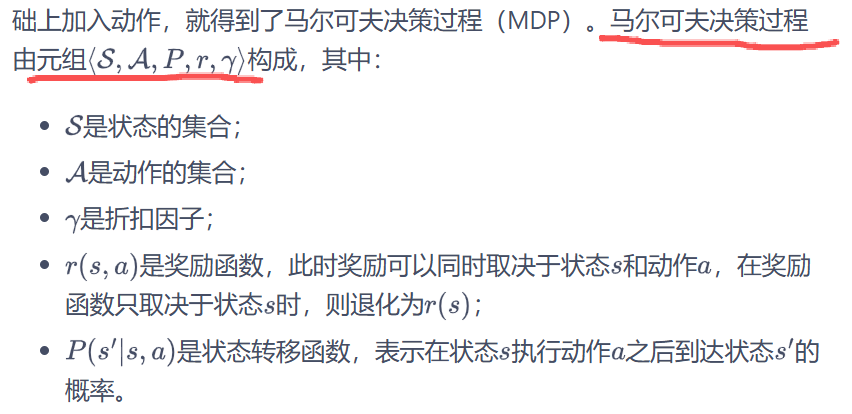

##### 策略

顾一下在 MRP 中的价值函数，在 MDP 中也同样可以定义类似的价值函数。但此时的价值函数与策略有关，这意为着对于两个不同的策略来说，它们在同一个状态下的价值也很可能是不同的。这很好理解，因为不同的策略会采取不同的动作，从而之后会遇到不同的状态，以及获得不同的奖励，所以它们的累积奖励的期望也就不同，即状态价值不同。

##### 状态价值函数

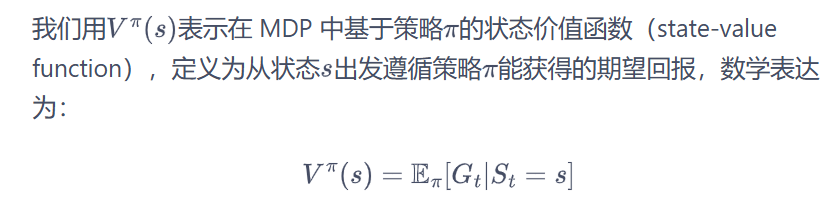

##### 动作价值函数


##### 贝尔曼期望方程

在贝尔曼方程中加上“期望”二字是为了与接下来的贝尔曼最优方程进行区分。我们通过简单推导就可以分别得到两个价值函数的**贝尔曼期望方程**（Bellman Expectation Equation）：

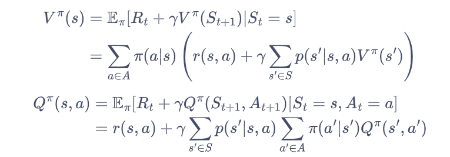

价值函数和贝尔曼方程是强化学习非常重要的组成部分，之后的一些强化学习算法都是据此推导出来的，读者需要明确掌握！

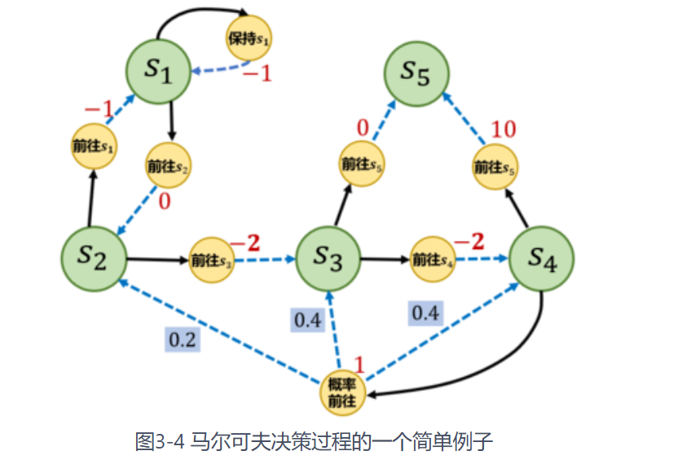

接下来我们编写代码来表示图 3-4 中的马尔可夫决策过程，并定义两个策略。第一个策略是一个完全随机策略，即在每个状态下，智能体会以同样的概率选取它可能采取的动作。例如，在下，智能体会以 0.5 和 0.5 的概率选取动作“保持”和“前往”。第二个策略是一个提前设定的一个策略。

于是，一个很自然的想法是：给定一个 MDP 和一个策略，我们是否可以将其转化为一个 MRP？答案是肯定的。我们可以将策略的动作选择进行**边缘化**（marginalization)，就可以得到没有动作的 MRP 了。具体来说，对于某一个状态，我们根据策略所有动作的概率进行加权，得到的奖励和就可以认为是一个 MRP 在该状态下的奖励，即：

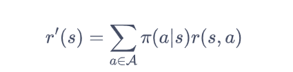

#### 蒙特卡洛方法

```python
# 对所有采样序列计算所有状态的价值
def MC(episodes, V, N, gamma):
    for episode in episodes:
        G = 0
        for i in range(len(episode) - 1, -1, -1):  #一个序列从后往前计算
            (s, a, r, s_next) = episode[i]
            G = r + gamma * G
            N[s] = N[s] + 1
            V[s] = V[s] + (G - V[s]) / N[s]


timestep_max = 20
# 采样1000次,可以自行修改
episodes = sample(MDP, Pi_1, timestep_max, 1000)
gamma = 0.5
V = {"s1": 0, "s2": 0, "s3": 0, "s4": 0, "s5": 0}
N = {"s1": 0, "s2": 0, "s3": 0, "s4": 0, "s5": 0}
MC(episodes, V, N, gamma)
print("使用蒙特卡洛方法计算MDP的状态价值为\n", V)
```

采样 1000 条轨迹：`episodes = sample(...)`，样本量越大，根据「大数定律」，价值估计结果越接近 MDP 的真实状态价值（误差越小）。

方法类型：这段代码是**每次访问蒙特卡洛（Every-Visit MC）**，轨迹中每个状态每出现一次，就更新一次价值，样本利用率高于首次访问 MC。


#### 占用度量

我们还可以定义策略的**占用度量**（occupancy measure）。

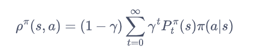


注意：以上提到的“合法”占用度量是指存在一个策略使智能体与 MDP 交互产生的状态动作对被访问到的概率。

接下来我们编写代码来近似估计占用度量。这里我们采用近似估计，即设置一个较大的采样轨迹长度的最大值，然后采样很多次，用状态动作对出现的频率估计实际概率。

占用度量的核心价值是**量化某个策略下，特定（状态 - 动作对）被 “使用” 的频繁程度**

#### 最优策略

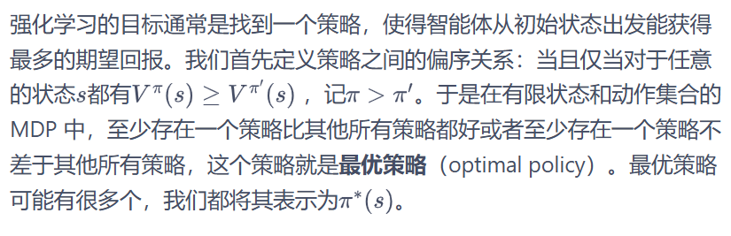

最优策略都有相同的状态价值函数，我们称之为**最优状态价值函数**，表示为：

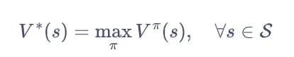

同理，我们定义**最优动作价值函数**:

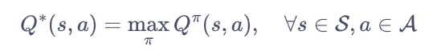

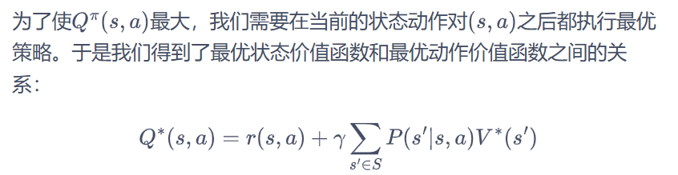

这与在普通策略下的状态价值函数和动作价值函数之间的关系是一样的。另一方面，最优状态价值是选择此时使最优动作价值最大的那一个动作时的状态价值：

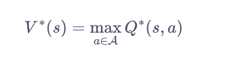

##### 贝尔曼最优方程

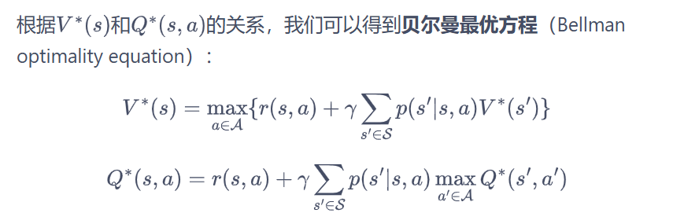

#### 总结

本章从零开始介绍了马尔可夫决策过程的基础概念知识，并讲解了如何通过求解贝尔曼方程得到状态价值的解析解以及如何用蒙特卡洛方法估计各个状态的价值。马尔可夫决策过程是强化学习中的基础概念，`强化学习中的环境就是一个马尔可夫决策过程`。我们接下来将要介绍的强化学习算法通常都是在求解马尔可夫决策过程中的最优策略。

