## ACORM阅读

### 理解任务：

为了更好地利用**动态角色分配**，我们提出了一种新颖的多智能体强化学习注意力引导对比角色表征学习框架(ACORM)。我们的主要见解是学习一种紧凑的角色表征，这种表征能够捕捉智能体的复杂行为模式，并利用该角色表示促进智能体之间的行为异质性、知识转移和熟练协作。首先，我们将学习目标形式化为角色与其表征之间的互信息最大化，以在给定智能体行为的情况下最大程度地减少角色不确定性，同时最小化保留与角色无关的信息。我们引入了一种对比学习方法来优化infONCE 损失，这是一种互信息下界。为了简洁地近似负样本对的分布，我们通过将智能体的轨迹编码到潜在空间中来提取其行为，并根据它们的潜在嵌入定期将所有智能体划分为若干个簇，不同簇中的点被配对为负样本。其次，在集中式训练过程中，我们采用注意力机制促使全局状态在价值分解中关注所学习到的角色表征。该注意力机制以一种巧妙的方式隐式地引导智能体协作。


### 动机：

共享策略参数对于将这些算法扩展到大规模智能体并加速协作学习至关重要(Fu等人，2022)。然而，人们普遍观察到，智能体往往会形成同质化的行为，这可能会阻碍多样化探索和复杂协作(Christianos 等人，2021)。一些方法(Li等人，2021;Jiang和Lu，2021;Liu等人，2023)试图通过区分每个智能体来促进个性化行为，但它们往往忽视了通过**隐性任务分配**实现有效团队组合的可能性。现实世界中的多智能体任务通常涉及具有**角色涌现**的**动态团队组合**(Shao等人，2022;Hu等人，2022)。1早期研究将角色概念引入多智能体系统(Dastani等人，2003;Sims等人，2008;Lhaksmana等人，2018)，`但它们通常需要先验领域知识来预先定义角色职责`。最近，ROMA(Wang等人，2020)仅根据当前观察结果来学习涌现角色，而RODE(Wang等人，2021)将每个角色与联合动作空间的固定子集相关联。COPA(Liu 等人，2021)通过在执行过程中向每个智能体分配团队构成的全局视图，实现动态角色分配。一些研究将任务分解为一系列技能(Liu等人，2022)或子任务(Yang等人，2022;Iqbal等人,2022)，并采用分层结构进行控制。总体而言，`现有的基于角色的方法仍存在一些不足`，例如`对角色涌现的复杂行为描述不够充分`、`忽视团队动态的演变`，或`放宽了CTDE约束`。


### 怎么做的？

首先，我们将`学习目标`形式化为`角色`与其`表示`之间的互信息最大化，以在给定智能体行为的情况下最大程度地减少角色不确定性，同时最小化保留与角色无关的信息。我们引入了一种对比学习方法来优化 infONCE 损失，这是一种互信息下界。为了简洁地近似负样本对的分布，我们通过将智能体的轨迹编码到潜在空间中来提取其行为，并根据它们的潜在嵌入定期将所有智能体划分为若干个簇，不同簇中的点被配对为负样本。其次，在集中式训练过程中，我们采用注意力机制促使全局状态在价值分解中关注已学习的角色表示。该注意力机制以一种巧妙的方式隐式地引导智能体协作。


**互信息（Mutual Information, MI）** 的定义：它是衡量一个随机变量包含另一个随机变量信息量的指标，反映了两个变量之间的依赖关系强弱，数值越大，说明从一个变量中能获取到关于另一个变量的信息越多。

**对比学习**是**自监督学习**的重要分支，核心是通过构建 “相似样本对” 与 “不相似样本对”，让模型学习区分样本间的相似性与差异性，从而自动挖掘数据的本质特征，无需人工标注的标签信息。

简单来说，对比学习的思路类似人类的认知方式：**通过对比事物之间的异同来理解事物的特征** —— 比如通过对比猫和狗的外形、动作差异，能更清晰地分辨两者；对比学习让模型做的就是类似的事，只不过处理的是数据样本（如图像、文本、语音）的特征表示。

**InfoNCE** 是对比学习中最常用的**损失函数**之一，全称为**Information Noise-Contrastive Estimation**，即信息噪声对比估计。它结合了**互信息最大化**与**噪声对比估计（NCE）** 的思想，核心是通过将 “正样本与锚样本的匹配” 视为目标事件，将 “负样本与锚样本的匹配” 视为噪声事件，让模型学会区分目标与噪声，从而实现样本特征的有效学习。

简单来说，InfoNCE 的本质是**把对比学习的 “拉近正样本、推远负样本” 目标，转化为一个分类概率的优化问题**：让模型对正样本对的相似度预测概率尽可能接近 1，对负样本对的相似度预测概率尽可能接近 0。

**CTDE** 是**Centralized Training with Decentralized Execution**的缩写，中文意为**中心化训练、分布式执行**，它是协同多智能体强化学习（MARL）中的核心训练范式，目前广泛应用于多智能体系统的模型训练中。其核心是拆分智能体的`学习`与`执行`阶段，兼具训练效果和执行灵活性。

训练阶段：借助全局或共享信息，每个智能体有独立的策略网络（Actor)和价值网络(Critic)，Critic会接收所有智能体的状态和动作信息，实现集中式评估。（通过中心化的评价网络或价值分解网络等，统筹优化每个智能体的策略参数）（解决环境非平稳

问题）

执行阶段：每个智能体仅根据自身观测和独立策略网络做决策，无需依赖其他智能体信息，实现分布式部署。（低延迟、高时效）


- **中心化训练**：训练阶段会借助全局或共享信息，比如所有智能体的联合状态、动作以及整体收益等。此时相当于有一个 “全局教练”，通过中心化的评价网络或价值分解网络等，统筹优化每个智能体的策略参数，还能解决多智能体学习中常见的收益分配不合理、训练不稳定等问题。例如在英雄联盟模拟训练中，系统会依据五名英雄的整体对战局势来调整每个英雄的技能释放、走位等策略。
- **分布式执行**：当训练完成后，每个智能体独立行动，仅依靠自身的局部观测信息做决策，不再依赖全局信息和中心控制器。比如训练好的五名英雄，在实际对战时，各自根据自己看到的战场视野，自主决定攻击、撤退等操作，无需再等待统一指令。

- **优点**：一方面能通过全局信息提升智能体间的协同性，让训练出的策略更具合理性；另一方面执行时无需同步的全局通信，适配传感器感知、通信能力有限的实际场景，可扩展性较强，比如智能电网中各节点设备的协同调度、交通系统中车辆的自主协调等场景都能适用。
- **缺点**：训练阶段因依赖全局数据汇总，容易拖慢训练速度；此外还可能出现 “懒智能体” 问题，即部分智能体过度依赖其他高性能智能体，自身不主动学习有效策略，最终导致执行时单个智能体的鲁棒性不足。


**信用分配**（Credit Assignment）是强化学习（RL）和多智能体强化学习（MARL）中的核心问题，指的是**在智能体完成任务并获得最终奖励后，将整体奖励合理地分配给任务过程中各个动作、状态或智能体，以此判断哪个环节（或哪个智能体）对最终结果的贡献更大**。简单来说，就是 “追溯功劳 / 过错”，明确谁的行为带来了奖励，谁的行为导致了惩罚。


消融实验：选择超参数的过程。（不会随便选超参数）

知识迁移（Knowledge Transfer）是机器学习（尤其是多智能体系统）中的核心概念，指**将一个任务、场景或智能体中学习到的知识（如经验、特征、策略），复用或适配到另一个新任务、新场景或其他智能体中，从而提升新任务的学习效率、减少重复训练成本**。简单说就是 “举一反三”，让已有的经验帮新任务少走弯路。


“heterogeneous behavior patterns” 可直译为 **“异质行为模式”**，核心指多个主体（如多智能体、人类群体）在行为表现上存在**显著差异、非同质化的特征集合**—— 简单说就是 “不同个体 / 角色有不一样的行为逻辑和表现方式”。


**时间步（Time Step）** 是将 “连续的时间过程” 拆分为 “离散、有序的基本单位”，用于精准描述系统状态随时间逐步演变的核心概念。简单来说，它就像时序场景中的 “节拍器”，每一个时间步对应一次完整的 “决策→交互→反馈” 循环。


1. **状态转移（State Transition）**：环境根据智能体的动作更新全局状态（如 “敌军血量减少”“智能体位置变化”），随后进入下一个时间步 \(t+1\)。


t-SNE（t-distributed Stochastic Neighbor Embedding）是一种**高维数据降维与可视化算法**，核心目标是将维度极高的数据（如几百 / 几千维的图像特征、文本向量、智能体行为特征）映射到 2D 或 3D 空间，同时尽可能保留数据在高维空间中的 “局部相似关系”—— 让原本相似的数据点在低维图上靠近，不相似的数据点远离，从而帮助人类直观理解高维数据的分布规律。


GRU（Gated Recurrent Unit，门控循环单元）是一种**处理时序数据的神经网络结构**，核心作用是**捕捉数据的时序依赖关系**—— 简单说，就是让模型能 “记住过去的信息，并结合过去和现在做决策”


### 方法

协作式多智能体任务（Dec-POMDP)，G = ⟨I，S，A，P，R，Ω，O，n，γ ⟩，其中I是n个智能体的有限集合，s ∈ S是全局状态， γ ∈ [0,1)是折扣因子。

在每个时间步，每个智能体i从Ω（s，i）中抽取一个观测值oi ∈ O，并选择一个局部动作ai ∈ A。

执行联合动作a = [a1 ，...，an] ⊤ ∈ An后，系统根据P（s′|s，a）转换到下一个状态s′，并获得所有智能体共享的奖励r = R（s，a）。

我们的核心思路是构建一种紧凑的角色表征模型，既能精准捕捉智能体的复杂行为模式，又能通过角色信息实现个体策略学习，同时为智能体间的协同运作提供有效指引。具有相似角色的智能体可通过更积极的知识转移实现更高的学习效率，同时通过区分不同角色来确保智能体的异质性。具体而言，我们提出以下角色定义及其表示方法：


以《星际争霸 II》为例，所获得的角色以团队为基础代表了多种策略，例如**集火**、**偷袭**和**吸引火力**。具有相似角色表征的智能体通过更积极的**信息共享**，能更高效地学习特定策略，而`注意力机制`则负责在团队中更具策略性地协调这些异质行为，并更清晰地提取角色。


我们引入互信息最大化方法来规范角色表征学习，并推导出一种对比学习目标，该目标以自监督方式优化智能体嵌入{e t i } n i=1，从而获得对比角色表征{zi t} n i=1（如图1(c)所示），具体细节将在第2.1节中详述。


### 2.1对比角色表征

两个问题：

（1）确保具有相似行为模式的智能体展现出更接近的角色表征

i)如何定义一个可行的指标来量化智能体行为之间的相似程度


（2）采用明显不同策略的智能体则彼此远离

ii）如何开发一种高效的方法来优化角色表征的区分度


**智能体嵌入**:为解决第一个问题，我们从每个智能体的轨迹中学习一个智能体嵌入eti，以提取具有上下文知识的复杂智能体行为，即 e t i = fϕ（o t i ，at i −1 ，et i −1），其中 ϕ 是一个共享的门控循环单元（GRU）编码器，o t i 是当前观察值，a t i −1 是上一个动作，e t i −1 是 GRU 的隐藏状态。自然而然地，所获得的智能体嵌入（agent embeddings）之间的距离可以作为衡量智能体之间行为差异性的度量标准。


**对比学习**：理想的判别性角色表征应依赖于与智能体行为模式相关的角色，同时在不同智能体身份间保持不变。为此，我们引入互信息来衡量角色与其表征之间的相互依赖关系。具体而言，互信息旨在量化当观测到一个随机变量时，另一个随机变量的不确定性降低程度。为解决第二个问题，我们提出`最大化角色与其表征之间的互信息`，并学习一个角色编码器，角色编码器能最大程度减少角色的不确定性，同时最小程度地保留角色无关的信息。角色编码器的学习目标是：

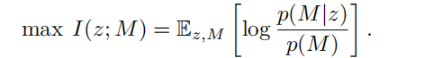

在实际应用中，直接优化互信息是难以处理的。受对比学习文献中的噪声对比估计的启发，通过定理1推导出了公式（1）的一个下界。

**定理1**：设M是遵循角色分布P(M)的一组角色，且|M|=K，M∈M是给定的角色。

设 e = fϕ（P t（o t ，at−1）），z ∼ fθ（z|e），h（e，z）= p p（（z z |e）），其中 P t（o t ，at−1）是智能体遵循给定策略的局部轨迹。

对于任意角色M∗ ∈M，令e∗表示由该角色M∗生成的智能体嵌入，此时我们有

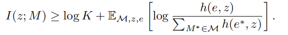

该定理的证明详见附录A。由于无法直接计算p(z)或p（z|e），我们转而采用噪声对比估计（NCE）和重要性采样技术，通过将目标值与随机采样的负值进行比较来实现。因此，我们使用得分函数S（z，z∗）的指数来近似h，该得分函数是两个样本的潜在编码之间的相似性度量。我们推导出一个易于处理的下界的采样版本，作为角色编码器的学习目标：

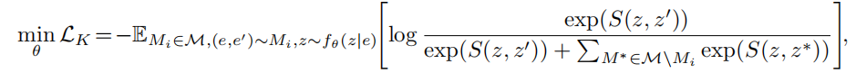

其中，M是训练角色的集合，e和e′是从角色Mi的数据集中采样的两个代理嵌入实例，而z和z′是e和e′的潜在表示。对于任何角色M∗ ∈ M\\Mi，z∗是角色M∗采样到的代理嵌入e∗的表示。根据文献，我们将（e，e′）Mi表示为正样本对，并将{（e，e∗）}M∗∈M\\Mi表示为负样本对。等式(3)中的目标是通过K分类损失函数对所有对中的正样本对进行分类优化。

最小化InfoNCE损失LK可最大化等式(2)中互信息的下界，且该下界随着K值增大而变得更紧。角色编码器应提取相同角色智能体嵌入中的共享特征以最大化正对分数，同时捕捉不同角色间的本质差异以降低负对分数。


**负对生成**。我们定期根据智能体嵌入向量，将所有n个智能体划分为K个簇{Cj}（j=1）。该方法自然地促使同一簇内的角色表征保持邻近性，同时与其他簇的智能体形成差异。

对于智能体i，我们将它的角色表征zi作为查询q，其他智能体的角色表征作为键K = {z1 ，...，zn}\\zi。与查询同簇的点i ∈ Cj被设置为正键{k+}，而来自与查询不同簇的点则被设置为负键{k−} = K\\{k+}。在实践中，我们使用双线性乘积（Laskin等，2020）作为等式(3)中的评分函数，并将查询与键之间的相似度计算作为q ⊤W k，其中W是一个可学习的参数矩阵。等式(3)中的InfoNCE损失被重新排列为：

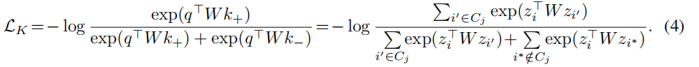

根据MoCo方法，我们维护一个查询编码器 θq 和一个键编码器 θk ，并使用动量更新来促进键表示的一致性。

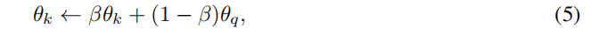

其中 β ∈[0,1)是动量系数，只有参数 θq 通过反向传播更新。


### 2.2注意力引导的角色协同

从智能体的局部信息中获取其对比角色表征后，我们在价值分解中引入注意力机制，以全局视角增强智能体在复杂角色空间中的协作。

注意力机制与我们的意图完美契合，它能促使全局状态关注学到的角色模式，从而在价值分解中实现更具表现力的信用分配。

由于角色表征是通过从历史轨迹中提取智能体行为来学习的，我们还使用了GRU来将历史状态（s 0 ，s 1  ，...，s t）编码为状态嵌入 τ t，以便于状态与角色表征之间的信息匹配。然后，我们将状态嵌入 τ ∈ R ds×d设为查询，将角色表征z = [z1 ，...，zn] ⊤ ∈ R n×d设为键和值，其中d是角色表征的维度，ds是状态嵌入的长度。

具体而言，我们通过加权组合方式计算角色表征的综合结果：

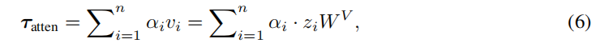

其中值 vi 是通过共享参数矩阵 WV ∈ R d×dv 对 zi 进行的线性变换。注意力权重 αi 计算状态嵌入 τ 与第 i 个智能体的角色表示 zi 之间的相关性，并通过应用 softmax 函数获得权重。

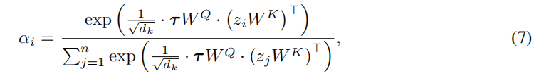

其中WQ和WK是维度为d×dk的共享参数矩阵，用于查询-键对的线性变换，1/√dk则是用于调整点积注意力权重的系数。我们采用多头注意力机制（MHA），使模型能够同时关注不同位置上来自不同表征子空间的信息，并将这些信息聚合为最终输出。

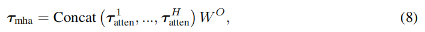

其中 τatten h（h ∈ {1,2 ，...，H}）是使用 Wh Q、Wh K 和 Wh V 的投影得到的注意力输出，WO ∈ R H·dv×d 是用于组合所有头输出的参数矩阵。最后，MHA 输出与全局状态结合，负责生成混合网络的权重，如图 1(d) 所示。通过这种方式，我们灵活利用角色表示，为价值分解提供更全面的信息。通过允许全局状态关注学习到的角色模式，注意力机制隐式地引导代理在熟练的角色空间中协调，从而随着角色的出现`产生更具表现力的信用分配`。


### 3.实验

我们评估 ACORM 以回答以下问题：

(i) ACORM 能否促进复杂多智能体领域的**学习效率**和**稳定性**？如果可以，不同模块对性能提升的贡献分别是什么？（参见第3.1节）。

（ii）ACORM 能否**学习与智能体行为模式相关的有意义的角色表征**，并实现有效的动态团队组成？（参见第3.2节）。

（iii）ACORM 能否成功**关注学到的角色表征**，实现熟练的角色协调和更有效的**信用分配**？（参见第3.3节）。


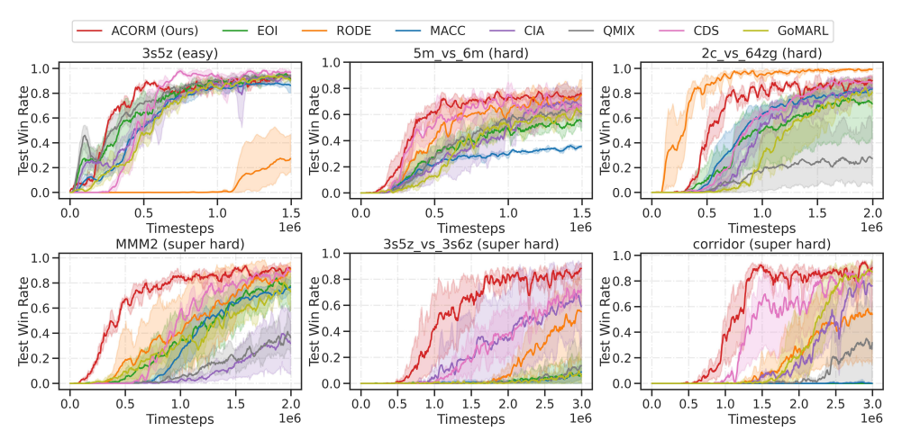

图2： ACORM 与基线在6幅代表性地图上的性能比较。

**实现**。我们选择 SMAC（StarCraft Multi-Agent Challenge）作为首个测试平台，因其丰富的地图和便捷的可视化工具，并基于流行的 QMIX 算法实现 ACORM 。为了可视化，我们渲染游戏场景，并使用t-SNE展示智能体嵌入和角色表征。附录C提供了GRF基准的评估结果，附录D展示了基于 MAPPO 的 ACORM 的算法架构、实验设置和结果。

**基线**。我们将 ACORM 与 QMIX 及六个基线方法进行比较：1) RODE（Wang等人，2021）采用动作空间分解；2) EOI（Jiang和Lu，2021）通过训练观察到身份的分类器鼓励多样化的个体性；3) MACC（Yuan等人，2022）利用注意力机制集中于最相关的子任务；4) CDS（Li等人，2021）在优化和表示中引入多样性；5) CIA（Liu等人，2023）通过对比学习增强信用级别的可区分性；6) GoMARL（Zang等人，2023）具有自动分组机制。


### 3.1性能与消融研究

为进行评估，所有实验均采用五种不同的随机种子进行，测试胜率的平均值以粗体线表示，并标注95%的自助法置信区间（阴影部分）。附录B详细描述了超参数的设置。

**性能**。 SMAC 包含三种地图类型：简单、困难和超级困难。**超级困难地图通常是需要深入探索多样化行为和更熟练协调的复杂任务**。由于 ACORM 的设计旨在促进这些特性，因此在这些地图上的表现对于验证我们的研究动机和优势尤为重要。图 2 展示了 ACORM 在六个代表性任务上的表现，更多地图的表现可以在附录 B 中找到。 ACORM 在所有超级困难地图和其他大多数地图上都取得了最佳表现。值得注意的是， ACORM 在需要显著更高程度**行为多样性**和**协调性**的超级困难地图上，如 MMM2、 3s5z_vs_3s6z 和corridor，以最大优势超越所有基线方法。在这些地图中， ACORM 在前一百万训练步骤中测试胜率的增长趋势明显更快，这得益于我们通过**判别性角色分配**高效探索合作异质行为的优势。此外， **ACORM 在学习曲线中表现出最低的方差，不仅表明其学习效率更优，还意味着训练稳定性更强**。

-------

**消融实验**。我们进行消融研究以测试对比学习和注意力机制各自的贡献。我们将 ACORM 与四个消融模型进行比较：

i) ACORM_w/o_CL，仅排除对比学习；

ii) ACORM_w/o_MHA，仅移除注意力模块；

iii) ACORM_w/o_MHA（原版），同时移除注意力和状态编码，并直接将当前状态输入混合网络，类似于 QMIX ；

iv) QMIX ，移除所有组件。在消融实验中，其他所有结构模块均严格保持与完整 ACORM 一致。


图3展示了在三个超难地图上的消融结果，更多其他地图的消融结果可参见附录F。**当两个组件中的任何一个被移除时， ACORM 的表现有所下降，但仍优于 QMIX 。这表明两个组件对于 ACORM 的能力都是必不可少的，并且彼此互补**。特别是，**ACORM_w/o_CL和ACORM_w/o_MHA相比 QMIX 都取得了显著的性能提升，进一步验证了它们在处理复杂任务中的有效性**。具体来说，**ACORM_w/o_MHA（原版）与ACORM_w/o_MHA的表现非常接近，这表明其有效性来自于注意力模块，而非通过GRU编码状态轨迹**。


### 3.2对比角色表征

为了回答第二个问题，我们通过在MMM2任务示例上的可视化，深入了解了学习到的角色表征。在这个任务中，智能体控制一个单位团队（1辆医疗车、2辆掠夺者和7名海军陆战队员）与敌方军队（1辆医疗车、3辆掠夺者和8名海军陆战队员）作战。**图4展示了训练好的 ACORM 策略 评估轨迹中的示例渲染场景**。初始阶段（t=1,12），所有智能体嵌入都聚集在一起，区分度有限，K均值算法将它们适度地分成了几个簇。**通过对比学习，同一簇内的角色表征被推得更靠近，而不同簇的角色表征则显著分开**。在后期阶段（t=40），智能体嵌入已经广泛分散在空间中，**目前的聚类效果良好**。**这一现象表明系统已经学会了有效分配具有不同行为模式的角色**。随后，角色编码器将这些智能体嵌入转换为更具区分度的角色表征。

团队组成会随着时间自然演变。**在 t = 1 时，掠夺者 {0,1} 形成一个小组，而海军陆战队 {2,3,4,5,6,7} 因其固有的智能体异质性形成另一个小组**。**在战斗中期 t = 12 时，掠夺者 {0,1} 加入海军陆战队 {2,4,7,6,8} 的同一小组，集中火力攻击敌人，而海军陆战队 {3,5} 由于严重受伤，从进攻小组中分离**。**在战斗后期 t = 40 时，海军陆战队 {2,3,4,6,7} 仍留在进攻小组中，而掠夺者 {0,1} 和海军陆战队 5 落入同一死亡小组**。总之，可以明确验证 ACROM 学习了与智能体行为模式相关的有意义的角色表征，并实现了有效的动态团队组成。更多见解和解释可参见附录 G。


### 3.3注意力引导的角色协调

为回答最后一个问题，我们使用热力图在等式(6)中可视化注意力权重 α ，如图5所示。智能体集群（簇）的数量为K = 4。在大多数注意力头中，同一簇中的角色具有相似的注意力权重，而不同簇则表现出显著不同的权重（例如，在t = 10时所有四个注意力头中，四个簇的权重分布分别为：{0,1,2,3}、{5}、{4,6,7,8}、{9}）。**这一现象表明全局状态已成功关注到所学的角色模式**。

注意力机制为这场战役提供了一些引人深思的见解：

i) 注意力头2明显地关注**伤员救援模式**，因为最大权重来自医疗直升机9号和低血量单位（突击队员1号在t=4、海军陆战队员5号在t=10、海军陆战队员{3,4,5,6,7}在t=36）。

ii) 在大多数注意力头中，突击队员{0,1}的注意力权重通常在初期较高，但会随时间显著降低。这对应于突击队员发挥重要作用的行为模式。

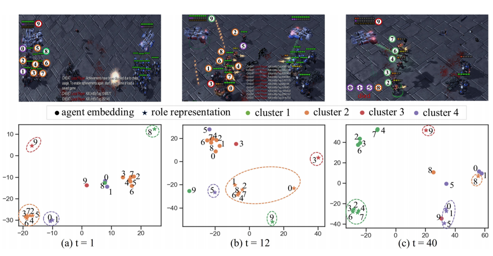

图4：训练好的 ACORM 策略在MMM2上生成的评估轨迹中三个时间步的渲染场景示例。上排显示包含位置、生命值、护盾点、盟友和敌方单位状态等信息的战斗场景截图。下排通过t-SNE将这些向量投影到二维空间，以定性分析的方式可视化相应的智能体嵌入（用圆点‘•’表示）和角色表示（用星号‘⋆’表示），其中同一簇内的智能体使用相同颜色表示。


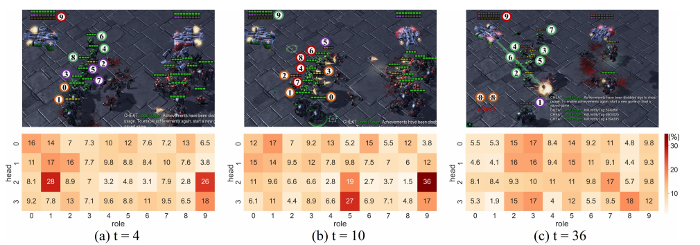

图5：在由训练好的 ACORM 策略在MMM2上生成的评估轨迹中渲染场景的示例。下排可视化了所有四个注意力头的注意力权重（等式(6)中的 α），**解释了全局状态如何关注每个角色以指导角色空间中的熟练协调**。**更高的权重意味着相应角色在价值分解中做出的贡献更大**。


在初期进攻阶段，进攻任务将逐步移交海军陆战队。

iii) 在t=36时刻即将取得胜利时，核心策略是让海军陆战队{2,3,5}执行最终攻击，而血量较低的海军陆战队{4,6,7}则提供辅助支援。显然，头部指标{0,1}直观体现了这一战略——海军陆战队{2,3,5}的权重最高，其次是海军陆战队{4,6,7}，其余单位则相对次要。此外，我们的注意力模块能力可能远超这些表面可视化示例所展现的深度。


### 5.总结

本文提出了一种通用框架，通过学习对比性角色表征来促进行为异质性与跨智能体知识迁移，并借助注意力机制在复杂角色空间中实现高效协作。实验结果与消融实验验证了该方法的优越性，可视化分析揭示了有意义的角色表征与智能协作的达成机制。尽管本方法未考虑利用历史探索轨迹提取角色特征，且需要预先设定行为模式总数的显式聚类组件，但这些方向仍作为未来研究重点。此外，将框架拓展至离线场景具有重要价值——在需要耗费大量资源甚至无法实现实时交互的场景中，这种方案展现出广阔的应用前景。


## 复现ACORM

### 完全解决autodl的磁盘管理的问题

到这里的时候，我意识到必须要弄清楚autodl的磁盘管理的一些基本方法，要不然以后必然寸步难行！

在 AutoDL 上将模型的默认下载路径更改到数据盘，是管理存储空间和避免系统盘爆满的关键操作。下面为清晰、可操作的完整指南。

#### 核心方法：修改环境变量 🛠️

最直接有效的方法是通过设置环境变量，将不同模型库的缓存路径指向数据盘（通常是 `/root/autodl-tmp`）。下表汇总了常用工具的环境变量设置

。

| 模型库 / 工具    | 关键环境变量       | 默认缓存路径 (Linux)    | 修改后的目标路径示例           |
| :--------------- | :----------------- | :---------------------- | :----------------------------- |
| **Hugging Face** | `HF_HOME`          | `~/.cache/huggingface/` | `/root/autodl-tmp/huggingface` |
| **PyTorch**      | `TORCH_HOME`       | `~/.cache/torch/`       | `/root/autodl-tmp/torch`       |
| **ModelScope**   | `MODELSCOPE_CACHE` | 未明确指定              | `/root/autodl-tmp/modelscope`  |

**操作步骤（以 Hugging Face 为例）**

1. **打开配置文件**：通过终端（JupyterLab 或 SSH）登录你的 AutoDL 实例，使用以下命令编辑用户配置文件：

   ```
   vim ~/.bashrc
   ```

2. **添加环境变量**：在文件末尾添加如下行（你可以将 `/root/autodl-tmp/huggingface`替换为你喜欢的任何位于数据盘上的路径）：

   ```
   # 设置 Hugging Face 缓存路径
   export HF_HOME="/root/autodl-tmp/huggingface"
   # 设置 PyTorch 模型缓存路径
   export TORCH_HOME="/root/autodl-tmp/torch"
   # 设置 ModelScope 模型缓存路径
   export MODELSCOPE_CACHE="/root/autodl-tmp/modelscope"
   ```

   同时，强烈建议设置 Hugging Face 镜像以加速下载（本项目不推荐设置这个，会遇到新问题）：

   ```
   export HF_ENDPOINT="https://hf-mirror.com"
   ```

3. **保存并生效**：

   - 在 vim 编辑器中，按 `Esc`键后，输入 `:wq`并按回车来保存并退出。

   - 让配置立即生效：

     ```
     source ~/.bashrc
     ```

   - 你可以通过以下命令检查环境变量是否设置成功：

     ```
     echo $HF_HOME
     ```

     如果终端显示出你设置的路径，说明配置成功。


## 实现步骤(踩坑过程)

网络速率问题，利用autodl自带的学术资源加速指令（解决git不下来的问题）：

可以开学术加速功能，文档里有，命令source /etc/network_turbo

```
git clone https://github.com/NJU-RL/ACORM.git
```

```
conda create -n acorm python=3.9.16 -y
conda activate acorm
pip install -r requirements.txt
```


```
export SC2PATH=/root/autodl-tmp/ACORM/StarCraftII
```


### 远程服务器网络报错问题（顺便把防火墙关了）

灵感来源CSDN：

```
https://blog.csdn.net/qq_45689158/article/details/145057798?fromshare=blogdetail&sharetype=blogdetail&sharerId=145057798&sharerefer=PC&sharesource=qq_57945409&sharefrom=from_link
```

和另一篇CSDN：

```
https://blog.csdn.net/weixin_44576482/article/details/128667675?fromshare=blogdetail&sharetype=blogdetail&sharerId=128667675&sharerefer=PC&sharesource=qq_57945409&sharefrom=from_link
```

要先按照第二篇的CSDN用CLASH的LAN，端口默认7890


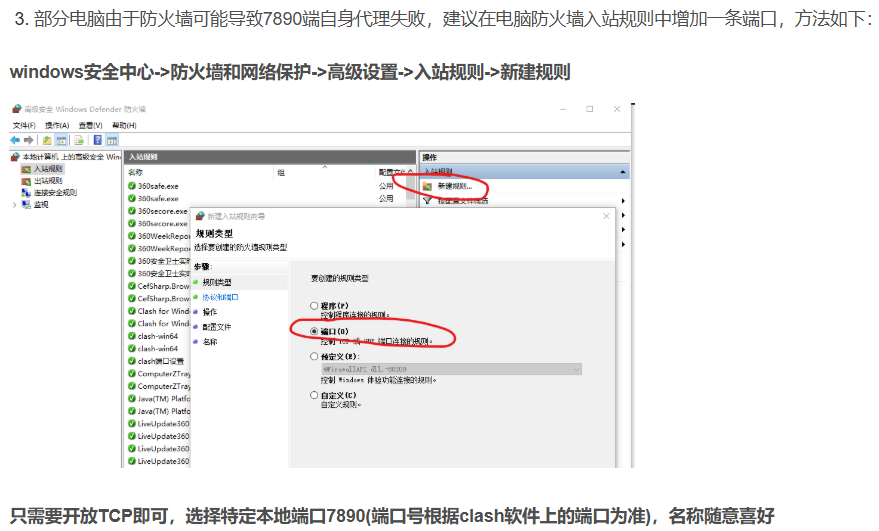


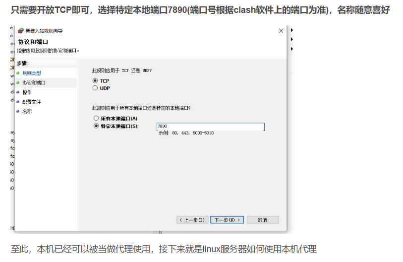

远程服务器使用本机的代理进行转发，从而可以访问外网

具体步骤如下：

1.打开你电脑的windows powershell输入：

1️⃣ 本地（开隧道）

```
ssh -p 13035 -R 7890:127.0.0.1:7890 litong@9.tcp.vip.cpolar.cn
```

2️⃣ 服务器（测试 HTTP）

```
curl https://www.google.com
```

✔ 成功 = 一切 OK


`到这里基本上就能够pip requirements.txt文件里的github的地址了`


### certifi报错

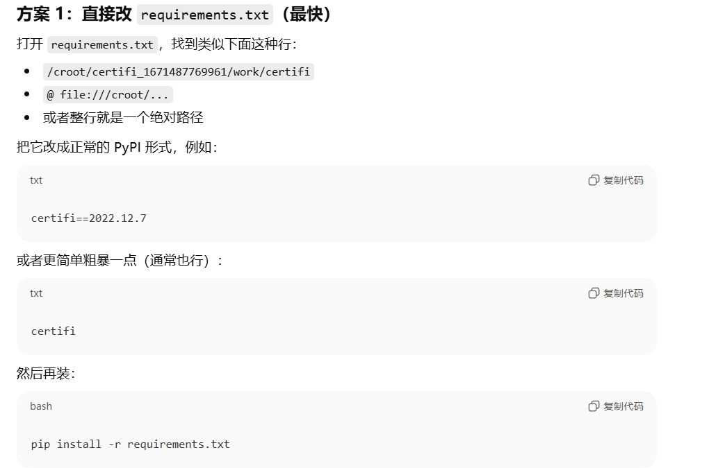

### sklearn报错

✅正确解决办法（推荐）

`requirements.txt` 里第 79 行现在是类似：

```
sklearn==0.0.post1
```

把它改成：

```
scikit-learn
```

（如果你想固定版本也可以：`scikit-learn==1.3.2` 之类）

然后重新安装：

```
python -m pip install -U pip setuptools wheel
pip install -r requirements.txt
```

> 注意：即使包名换成 `scikit-learn`，代码里 `import sklearn` **仍然是对的**，不用改代码。


### tensorboardX报错

如果项目允许，可以升级 tensorboardX 到与 3.19.5 兼容的版本：

```
# 查看有哪些 tensorboardX 版本与 3.19.5 兼容
pip install tensorboardX==2.5.0
```


### SMAC多智能体环境压缩包解压

SC2.4.10的解压密码是：

```
iagreetotheeula
```


### 给执行权限

```
chmod +x /root/StarCraftII/Versions/Base75689/SC2_x64
```

```
chmod +x /home/litong/StarCraftII/Versions/Base75689/SC2_x64
```


如果 SC2PATH 未设置或设置错误

```
export SC2PATH="/home/litong/StarCraftII"

echo 'export SC2PATH="/home/litong/StarCraftII"' >> ~/.bashrc

source
```


### 找不到地图问题

报错截图：

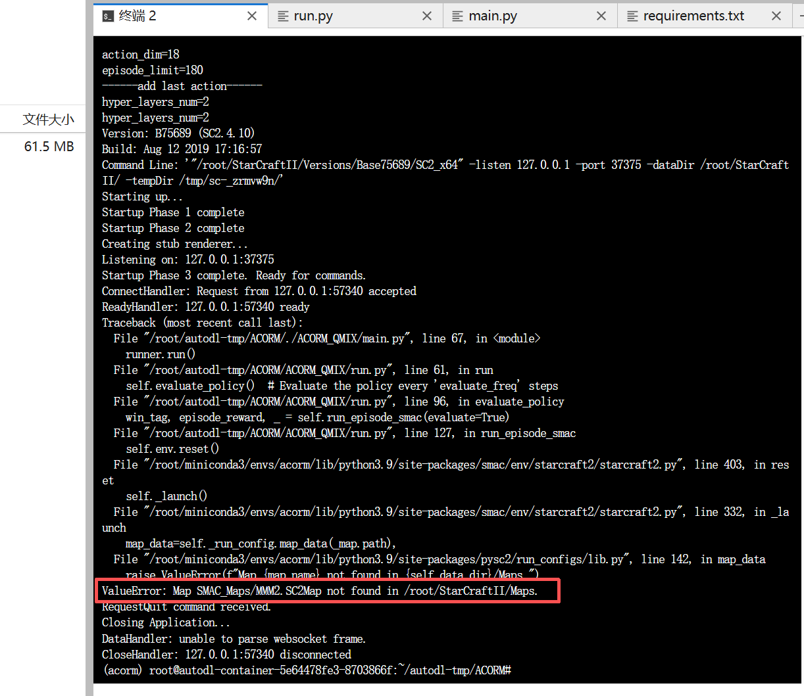

他这个因为前面linux版本的SMAC的包里地图并没有这个地图，询问ai之后，提供了下面的网址：


```
https://github.com/oxwhirl/smac/tree/master
```

这个网址里

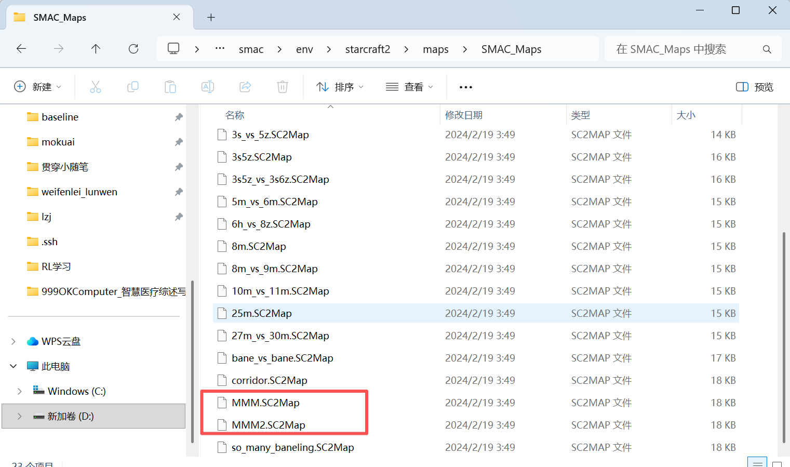


## 结果效果

执行以下命令，基于QMIX运行ACORM，并配置地图，例如：`MMM2`

跑了一个训练三十万步数的结果

```
python ./ACORM_QMIX/main.py --algorithm ACORM --env_name MMM2 --cluster_num 3 --max_train_steps 305000
```

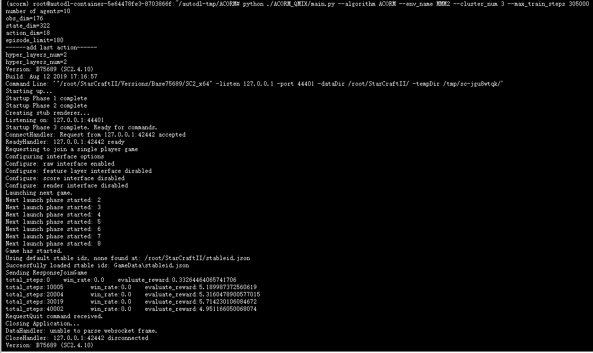

绘制基于QMIX运行ACORM的实验的可视化曲线图：

```
python plot.py --algorithm 'ACORM_QMIX'
```

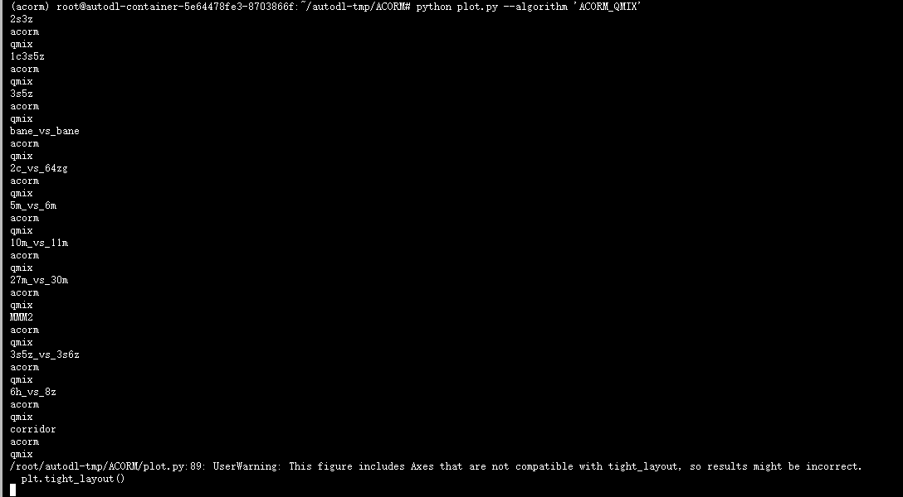

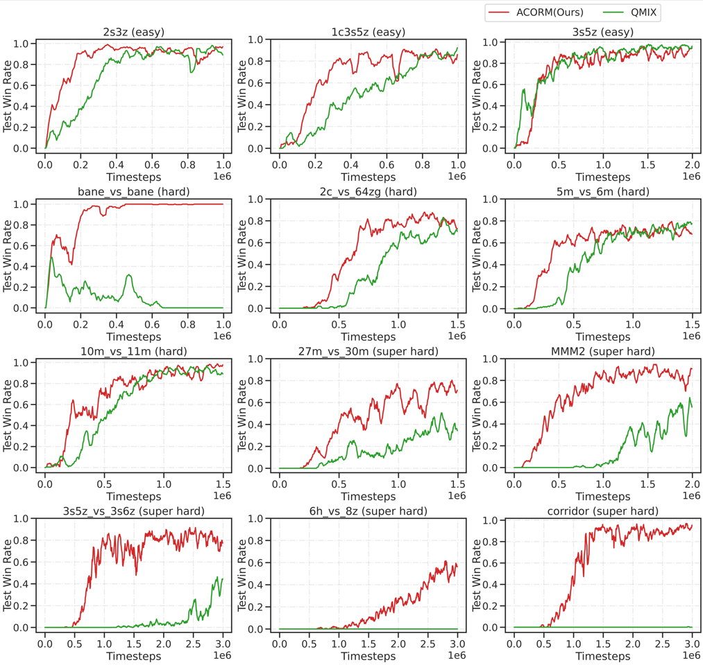


