## MORE-3S

### 理解任务（做什么）

1.我们提出了一种创新方法，将多模态模型与预训练序列模型相融合以应用于序列强化学习，从而提升强化学习的训练性能。

2.MORE-3S通过将**状态和动作表征**与**预训练语言模型**（PLM）的潜在空间对齐，显著提升了离线强化学习算法的性能。该算法的表现进一步证实了在强化学习中引入自然语言处理模型可促进高层规划能力的突破性发现。

3.我们提出将**收益目标**(return-to-go)集成到基于决策transformer的强化学习模型注意力机制中，以**增强其对收益目标的利用效率**。

概述MORE-3S方法。该方法通过`融合多模态`与`预训练序列模型`来增强离线强化学习。图1展示了整体流程，包括状态与动作的语义解析及动作预测。

图1:提出的MORE-3S方法架构图。多模态编码器组件通过LXMERT模型融合动作(文本)和状态(图像)输入。"Embed."表示嵌入处理过程。轨迹的自回归建模通过将轨迹建模为元组序列来捕捉系统动态。LPM根据编码序列Ot预测后续动作，对应图中"MixedEmbed."部分。

该方法将多模态模型与预训练序列模型整合进强化学习框架中:多模态模型借助预训练参数解析图像中的状态信息和文本中的动作信息，其输出作为LPM的输入以预测后续动作。

在训练阶段，主要目标是利用多模态编码器结合序列模型来准确预测下一个时间步的输出Oit1。值得注意的是，多模态编码器本身不参与训练

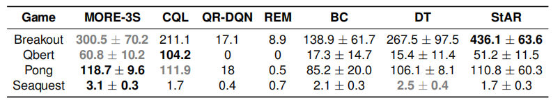

表1:MORE-3S与CQL、QR-DQN、REM、BC、DT、StAR等模型在四款Atar游戏中使用三种随机种子的性能对比。MORE-3S通过多模态信息与GPT风格预训练技术的结合获得高分，凸显其在游戏领域的强大潜力。最佳平均得分以粗体标注，次佳平均得分以灰色粗体标注。

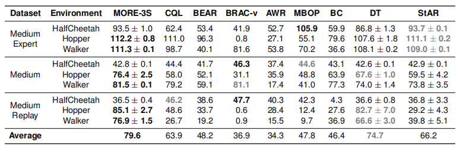

表2:D4RL数据集的结果显示了三次种子实验的平均值和方差。最佳平均得分以粗体突出显示，次佳得分以灰色粗体标注。

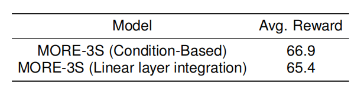

表3:基于条件与线性层整合的回报累积值对比

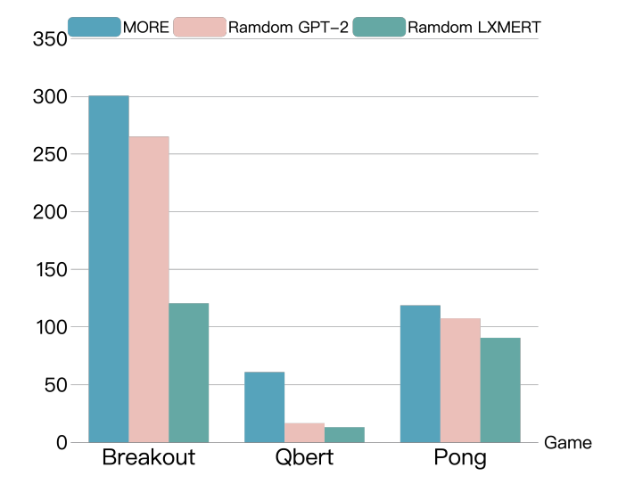

图3:在OpenAIGym上随机化模型权重与微调模型权重的实验对比

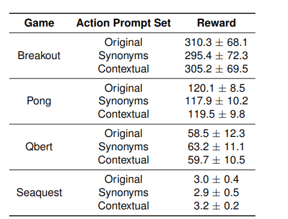

表5:不同动作提示集实验的结果

### 动机（为什么做这个）

**如何将“未来回报期望”有效地输入给模型**，这是该模型的一个关键创新点。

当前持续存在的挑战在于如何实现模型中高层规划与底层表征的解耦(Correia与Alexandre，2022)。虽然初步尝试(Lee等人，2022)基于解耦方法已显示出积极改进，但仍亟需进一步研究以揭示现象背后的机制，并开发更有效的实现方法。

本研究认为，离线强化学习训练中从图像提取的潜在状态表征，结合离散符号化动作空间应当与其对应的文本描述相关联。Chen等人(2021)和Reid等人(2022)直接利用潜在状态表示和离散符号动作空间，而未建立与文本描述的对应关系。

值得注意的是，潜在状态表征、动作空间及其文本描述的协同对齐，使基于LPM参数初始化的智能体能更有效地解析状态与动作。因此，我们提出一种创新方法一-将多模态与预训练序列模型整合至序列化强化学习框架(如图1所示)

1.**离线强化学习**：我们的方法创新性地将多模态与预训练序列模型整合到序列RL中，旨在突破固定数据集策略优化的固有局限。

2.**强化学习的序列建模**：我们提出的方法通过将收益目标(return-to-go)整合到注意力机制中，改进了基于决策Transformer的强化学习模型，提升了数据处理效率，并为现有序列建模技术提供了独特的改进。

3.**多模态数据与规划**：研究显示，语言处理、局部序列关系与跨模态高层规划之间存在密切关联；我们的研究在一个关键维度上独树一帜:**隐式模态对齐**。尽管先前研究曾显式采用CLIP等预训练模型(Radford等，2021;Lee等，2022)处理强化学习中的视觉与语言任务，但我们的方法通过将**图像衍生**的**潜在状态表征**与其在**动作空间中的对应文本描述**相耦合，实现了隐式模态对齐。这使得模型能更细腻地理解状态与动作，最终提升强化学习性能。与传统方法中显式且孤立地对齐模态的方式不同(Jiang等，2020;Zeng等，2020)，`我们的方法通过训练过程实现了模态的内在对齐`。这种新颖的**隐式对齐机制**允许更灵活地整合视觉与文本信息，从而更有效地应对现实世界强化学习应用的复杂性。

### 方法原理（怎么做的）

#### 一、模型架构

1.模型架构：

MORE-3S通过协同**多模态**和**预训练序列模型**来增强离线强化学习（RL）。(如图1所示)，设计了共享语义空间的多模态离线强化学习系统(MORE-3S)。该系统在多种基准环境中展现出强劲性能，并对现有离线强化学习方法实现显著提升。

其中，多模态模型通过预训练参数解析图像数据中的状态信息与文本中的动作信息，其输出结果作为LPM的输入，用于预测后续动作。

2.多模态编码器

t时刻两个主要输入：状态和动作。这些输入随后被转换为各自的表现形式，动作转化为文本，状态转化为图像。利用LXMERT对文本和图像进行编码，注意：MORE-3S的优势在于是一个采用多模态transformer模型的通用方法，而非特定依赖LXMERT。

经过编码后，动作与状态被融合为单一序列Ot：

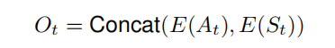

其中E(At)和E(St)分别表示时刻t的动作和状态编码形式，作为我们模型后续组件的输入。

3.轨迹的自回归建模

通过自回归方式对轨迹进行建模。这需要将轨迹描述为元组序列，其形式化表示为:

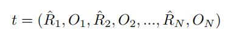

该序列中的每个元组都封装了在总时间步数N的情况下，特定时间步i处的剩余回报(Ri)以及与状态和动作相关的解耦信息(Oi)。

通过将经过处理的状态与动作信息(ON)及期望回报量(RN)整合到模型中，有效捕捉了所研究系统的动态特性。这种方法能够构建一个全面模型，可精准表征系统随时间演化的行为特征。

#### 二、记忆机制

为提升模型处理长序列的能力，在GPT风格的注意力架构中引入了受Wu等人(2022)启发的记忆机制。该方法通过增强序列早期信息的存储与读取能力，有效提升了模型对长期依赖关系的处理效能。

利用每个时间步t的注意力权重来维持对早期输入的"记忆"，从而**增强了模型处理需要长期依赖关系的任务能力**。

把回报期望值塞到 **K/V** 里，比塞到**位置嵌入**`（相当于给序列里的每个元素 “贴页码标签”（比如轨迹第 1 步贴 “1”、第 2 步贴 “2”），让模型知道 “谁在前谁在后”）`里更好。

这里在对比两种把回报期望值放进transformer的方式：

**以前的做法**：把回报期望值R直接塞到“位置嵌入阶段”相当于 “贴页码标签的时候，顺便把这步的后续收益写在标签旁边”。但模型会觉得 “这只是页码的附属信息”，不会重点关注。

**现在的做法**：把回报期望值R整合到 “键 (K) 和值 (V)” 里 —— 相当于 “把这步的后续收益，直接变成‘得分点（K）’和‘答案内容（V）’的一部分”。这样模型在算 “注意力权重” 时，会直接把R当成核心信息来考虑。

**把每一步的 “后续累积奖励R” 放进 Transformer 注意力的 “键 / 值” 里，比塞到 “位置嵌入” 里更有效 —— 这样模型能记住早期的高回报，更好地处理轨迹里 “前后步骤的长期关联”**。

记忆机制的实际实现方式是将当前步骤t的键K和值V扩展至包含先前步骤t'的K (t’)和V(t’):

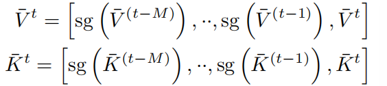

该机制使得查询不仅能关注当前时间步t的信息，还能追溯至M个历史步长的信息，从而提供更广阔的视野(参见图2)。训练与推理成本的增加主要源于内存缓存和扩展注意力层的计算, 但仍比传统扩展方式更高效。

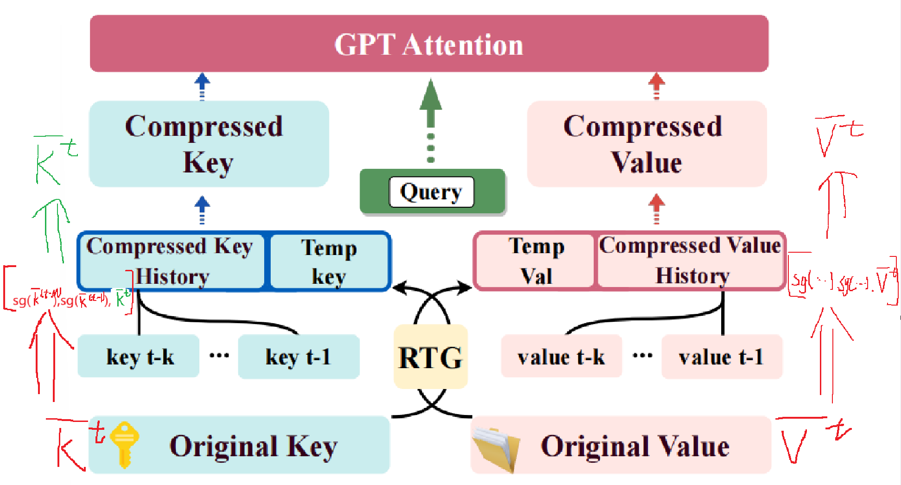

#### 三、训练细节

1.对象级状态嵌入

我们的方法涉及利用基于图像获取的位置特征和感兴趣区域(ROI)（region-of

interest）特征，通过Fast R-CNN(Girshick，2015)网络提取状态特征作为模型输入。该方法有别于使用传统卷积神经网络生成特征图的常规做法，转而采用基于物体特征的嵌入表示。通过`融合`**物体特征**与**位置特征**，我们的方法能够促进对图像状态更全面的理解，从而获得性能提升。

2.动作的语义嵌入

为增强多模态模型LXMERT对动作的语义理解，我们采用离散与连续文本描述相结合的方式表征动作。这些表征形式有助于更清晰地理解动作，既提升模型的理解能力，又便于人类进行解释。

以Atari 2600游戏《Breakout》中的动作为例:
**行动0**:不执行任何操作，允许游戏保持原样继续。
**动作一**:朝砖块发射球体，旨在击碎它们。

在mujoko环境中提供将动作向量特定维度映射到关节扭矩或力的文本提示。

#### 四、训练流程

目标是利用多模态编码器结合序列模型来准确预测下一个时间步的输出Oi+1。值得注意的是，多模态编码器本身不参与训练，其参数在此阶段保持固定。多模态编码器会在每个时间步i处理分别以图像和文本形式呈现的状态与动作数据，生成编码输出Oi。该输出与对应的累计回报值hatRi共同作为GPT风格序列模型的输入。

该模型的核心任务是以均方误差(MSE)损失函数为目标，预测下一时间步的输出Oi+1。MSE损失函数在此监督学习任务中具有天然适用性，因其能最小化预测值与实际值的平方误差。具体而言，通过比较预测输出分布Oi+1(pred)与实际输出分布Oi+1，按如下公式计算预测误差:

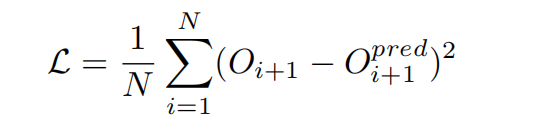

通过反复最小化损失函数*L*，可以逐步提升模型的预测能力。

### 实验

对于受GPT启发的模型，我们仅采用12层GPT-2模型的前六层，以便与决策变换器(DT)进行直接对比，并充分发挥其在强化学习任务序列建模中的优势(Chen等人，2021)。MORE-3S的预训练采用潜在空间128维、单注意力头与六层结构的模型。训练过程使用3e-4的学习率，每批次包含65,536个标记，并在初始10,000步采用预热调度策略。我们沿用GPT-2(Radford等人，2019)采用的字节对编码(Sennrich等人，2016)，并完全遵循(Chen等人，2021)中给出的所有超参数设置。

以评估模型处理高维视觉输入和复杂信用分配的能力

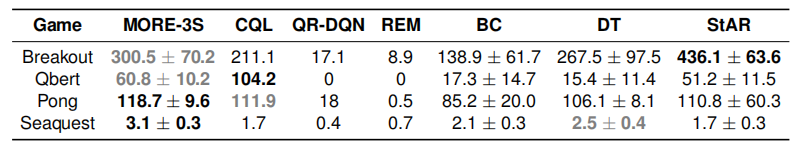

MORE-3S与CQL、QR-DQN、REM、BC、DT及StAR的性能对比详见表1。值得注意的是，MORE-3S在《Breakout》和《Qbert》游戏中超越所有其他模型，并在《Pong》和《Seaquest》中取得具有竞争力的成绩。

这表明MORE-3S通过训练阶段融合多模态数据，并采用多模态模型处理视觉与文本信息的有效性。

以比较在不同环境中比较强化学习算法，

采用OpenAIGym这一权威平台，该平台有助于在不同环境中开发和比较强化学习算法。我们选取了三个标准环境(猎豹、跳虫、步行者)，这些环境因其具有挑战性的控制和决策特性而被选中，并通过中等规模、中等回放和中等专家三种数据集配置进行评估。

该基准通过标准化评分实现公平比较，其中100分代表专家级策略。

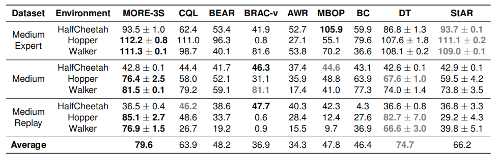

将提出的MORE-3S模型与多种先进算法进行对比评估，以基准测试其性能。对比对象包括无模型方法(CQL、BEAR、BRAC-V、AWR)、基于模型的方法(MBOP)以及模仿学习算法(DT、StARformer)。性能指标源自原始论文或D4RL数据集论文。

实验方案包含：训练模型10万时间步长，并每5千时间步长进行10轮次评估。采用公式

100x(得分-随机得分）/（专家得分-随机得分)

计算归一化回报分数，用以衡量MORE-3S在连续控制任务中的效率及其相对于领先算法的性能表现。

**得分**：指**当前要评估的模型（比如这里的 MORE-3S），在环境中执行自己的策略后，得到的「总累积收益」**（也就是你之前学的 “Return-to-go 的总和”）。

**专家得分**：指 **“最优策略（专家策略）” 在同样环境下得到的总累积收益 **

**随机得分**：指 **“完全随机选动作” 的策略，在同样环境下得到的总累积收益 **

论文里的公式`100×(得分-随机得分)/(专家得分-随机得分)`，是把模型得分**归一化成 0~100 之间的数**（方便不同算法/环境之间对比）

表2展示了MORE-3S在D4RL各类环境中的有效性。该算法在多数任务上表现出优越性能，在其他任务中与最先进算法结果相当。

### 讨论（消融实验）

#### 评估了待执行策略、集成预训练GPT风格参数的应用

#### 采用LXMERT预训练参数进行状态与动作数据预处理的效果。

#### 同时研究了长期注意力机制的作用

#### 并分析了上下文长度和模型规模对整体性能的影响。

研究结果表明，将上下文长度和模型规模扩展至特定阈值以上，并不能显著提升性能表现。

#### 此外在多款游戏中针对同义词和语境表述的使用开展消融实验，以探究不同动作提示的影响。实验结果表明，改变动作提示对MORE-3S的性能影响甚微，这验证了MORE-3S的鲁棒性。

#### 【另外】基于条件的RTG

研究了两种将**RTG**指标整合到模型中的不同策略:**条件型**与**线性层整合**。

在**条件型**方法中，每个时间步t通过线性层处理**RTG**指标，随后将其整合到Transformer原生键K和值V中。

而**线性层**方法则相反，直接将**RTG**指标整合到模型的初始位置嵌入阶段。

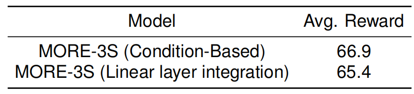

研究表明基于条件的整合方法相较于线性层方法具有适度的性能优势。这一微小优势表明，虽然基于条件的方法在管理长期依赖关系方面更优越，但并未产生显著改进的结果。因此，两种方法的选择应基于具体强化学习任务的实际需求。

#### 【另外】随机化训练参数

以检验随机化GPT风格模型和LXMERT模型预训练参数对性能的影响：

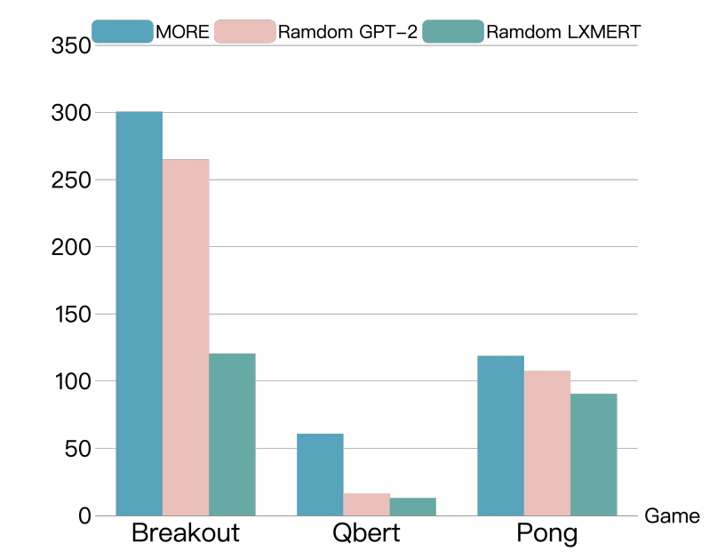

如图3所示（在OpenAIGym上随机化模型权重与微调的实验对比），当LXMERT的预训练参数被冻结时（**保留它原本的图文理解技能**）时，模型在离线 RL 任务中的表现更好。

与DT模型(Chen等，2021)的情况相似。通过持续训练，GPT风格的性能虽未超越，但会逐渐趋近于我们完全预训练的模型。**GPT 预训练参数能让模型 “起步就会”，但就算没这个 “起步 buff”，模型也能 “慢慢学懂”；这证明他们把预训练模型和序列 RL 结合的方法，在各种训练条件下都好用（鲁棒）**。

#### 【另外】长期注意力机制

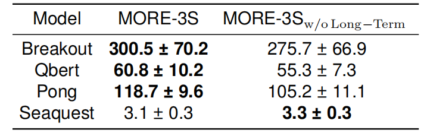

表4（长期注意力机制组件在不同强化学习任务中的影响）中展示了消融研究的结果，通过比较不含长期注意力机制（without long-term attention）的MORE-3S与完整版MORE-3S的性能表现，表明，在没有长期注意力机制的情况下，该模型在众多Atari游戏中的表现通常不如MORE-3S，这证实了记忆机制和长期注意力在管理强化学习任务序列数据中的作用。

另外，在《Seaquest》游戏中，没有长期注意力机制组件的MORE-3S表现更好，这表明在某些情况下长期注意力可能并非关键因素。这一发现需要进一步研究。

#### 【另外】在游戏环境中变换行动提示

为了探究模型对语言理解的能力，在每个游戏中采用了不同的行动提示集进行实验，如表5（不同动作提示集实验的结果）所示。每个游戏对应三种不同的行动提示类别:

原文:按原始定义的动作提示。
同义词:提示语包含对关键动作术语的同义替换。
语境化:带有深层上下文或采用疑问句表述的提示词。

例如：

原文:"发射球体击向砖块，旨在将其击碎。"

同义词:“发射一个球体撞击方块，意图将其粉碎。
情境化:“如果将球射向砖块以击碎它们，会发生什么?”

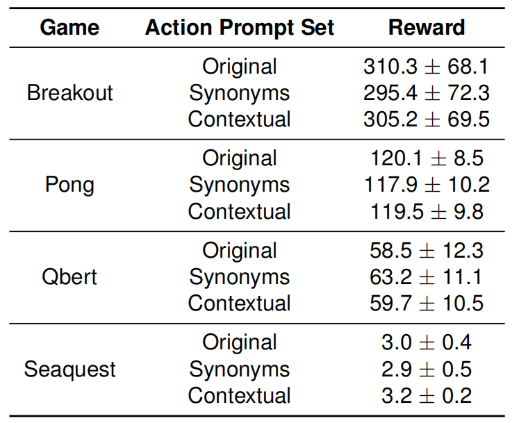

表5：不同动作提示集实验的结果

可以明显看出不同提示集之间的性能差异极小。突显了模型的语言精通度及其在游戏化环境中对微妙语言变化的适应能力。这些发现进一步印证了我们实验方法的可靠性与稳健性，表明模型在多样化场景中具有卓越的语言解析能力。

## 名称解释

### **Return-to-go（待累积收益）**

是智能体做当前决策的 “唯一参考”，是 Q 函数的直接估计对象，也是离线 RL 所有算法的核心优化目标**—— 它只关注 “选这个动作后，未来能拿多少总收益”，而离线 RL 的痛点，本质就是**无法准确获取分布外动作的真实 Return-to-go**。

### bootstrapping

：通过目标条件策略生成预期动作序列，从而将离线强化学习转化为监督学习问题。此类方法突破马尔可夫决策过程的假设框架，利用历史信息预测动作，能有效处理长序列数据并确保稳定性，成功规避了自举法（bootstrapping）相关的问题(Kumar等人，2020)。

### **轨迹的自回归建模**

（Autoregressive Modeling of Trajectories）：本质是把离线 RL 的 “轨迹学习” 变成了和 GPT 写句子一样的 “序列预测任务”。**轨迹（Trajectory）**：还是你熟悉的「状态 - 动作 - 收益三元组序列」，文档里记为 D={(st,at,rt)}t=0T，比如 “打怪的第 1 步（s1 = 小怪兽满血，a1 = 普攻，r1=+1）→ 第 2 步（s2 = 小怪兽残血，a2 = 补刀，r2=+5）→ ... → 第 T 步通关”。**自回归（Autoregressive）**：核心逻辑是「用 “过去的信息” 预测 “下一个信息”，一步接一步递进」—— 就像 GPT 写句子：先看前 10 个词，预测第 11 个词；再用前 11 个词，预测第 12 个词，直到句子结束。**建模（Modeling）**：把轨迹的 “学习目标”，从 “直接学最优策略” 改成了 “学轨迹的序列规律”—— 让模型像 “模仿历史轨迹的写法” 一样，预测下一个该出现的 “状态 - 动作相关信息”。

轨迹的自回归建模 = 把离线 RL 的历史轨迹（s₁,a₁,r₁→s₂,a₂,r₂→...→s_T,a_T,r_T），当成「按时间步排列的序列」，让模型用 “前 t 步的轨迹信息”，预测 “第 t+1 步的关键信息（比如动作编码、状态 - 动作联合编码）”，本质是把离线 RL 变成了「序列预测的监督学习任务」

 “自回归” 的 “自”（自己用自己的历史）和 “回归”（逐步递进预测）

### **LXMERT**

：这是一个基于大规模图文对语料库预训练的强健多模态transformer模型

### **键 (K)/ 值 (V)**：

是 Transformer “注意力机制” 的核心：

- 键 (K)：相当于每个元素的 “特征标识”（比如作业里的 “这道题的得分点”）；

- 值 (V)：相当于每个元素的 “实际内容”（比如作业里的 “这道题的答案”）；

模型会通过 “比较当前元素的查询 (Q) 和其他元素的 K”，算出 “注意力权重”（比如 “这道题的得分点很重要，我多关注它的答案”）。

### **中等规模、中等回放、完整数据集**：

三个词是**离线强化学习（Offline RL）中 “回放数据集” 的不同配置方式**，核心是描述 “用来训练模型的历史数据” 在**规模、覆盖程度**上的差异（因为离线 RL 完全依赖历史数据集，数据集的配置会直接影响模型效果）

### 字节对编码（Byte Pair Encoding，简称 BPE）

假设我们有文本：`low lower newest widest`

继续合并直到词汇表大小达标，最终能生成`low`、`er`、`new`、`est`、`wid`等子词。
